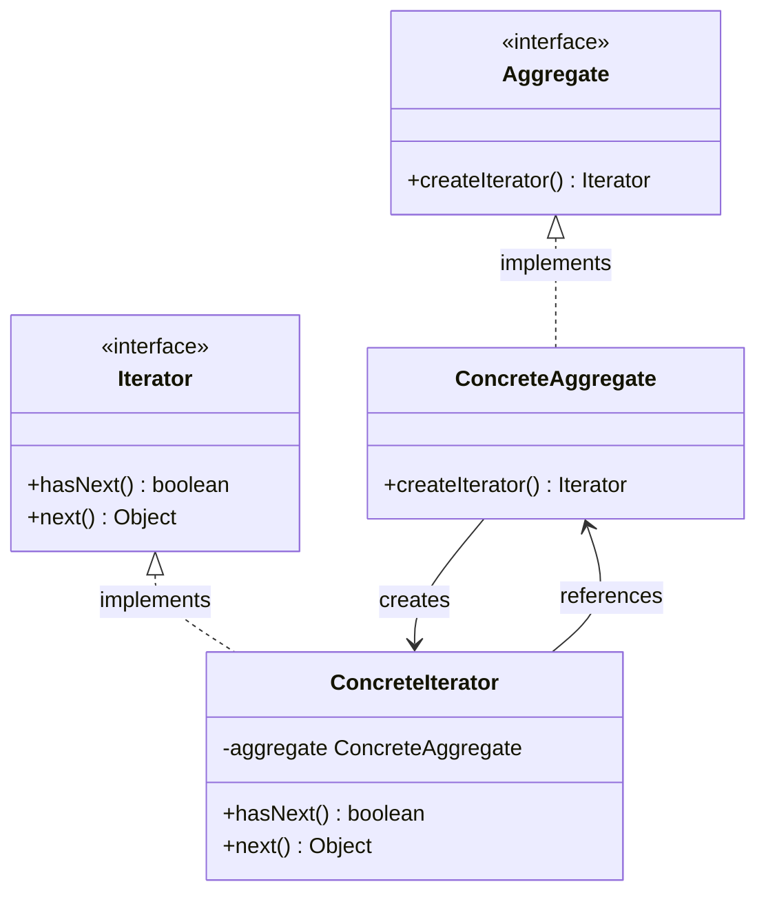

# Iteratorパターン とは？
## 一言で言うと、
コレクションの要素に順番にアクセスする方法です

## 詳しく言うと、
Iterator(イテレーター)とは、反復子と訳され、「繰り返す」という意味があります。
Iteratorパターンとは、各要素に順番にアクセスする方法を提供するためのパターンです。
つまり、**「次の要素はこれ！」** と順番を決める方法のことです。

振る舞いに関するデザインパターンの一つで、 リスト、 スタック、 ツリーなどの実際のデータ構造を表に出さずにコレクションの要素を探索することができます。

# 日常での具体例

**音楽プレイリスト**

シャッフル再生、リピート再生など、再生の順序や条件に応じて次の曲が変わります。


# Iteratorパターンのメリット

## 1. コレクションの内部構造を隠蔽できる
Iteratorパターンでは、コレクションの内部構造を公開する必要がありません。

メリット: コレクションがどのように実装されているか（配列、リスト、ツリーなど）に関わらず、Iteratorを通じて**一貫した方法で要素にアクセス** できます。
効果: コレクションの変更（例えば、内部構造を配列からリンクリストに変更しても）によって、外部のコードに影響を与えません。

## 2. 一貫したインターフェースを提供
Iteratorパターンを使うと、異なる種類のコレクションでも同じインターフェースを使用して要素を反復処理できます。

メリット: 例えば、リスト、セット、ツリーのような異なるコレクション型に対しても、同じ形式でループ処理を行うことができます。
効果: 異なるデータ構造間の一貫性が保たれるため、**コードがシンプルで理解しやすくなります。**

# Iteratorパターンをコードで説明

## クラス図




```typescript:book.ts
// Iteratorインターフェース
// コレクションの要素に順番にアクセスするためのインターフェース。
// hasNext(): 次の要素が存在するかを確認するメソッド。
// next(): 次の要素を取得するメソッド。
interface Iterator<T> {
  hasNext(): boolean;  // 次の要素がある場合はtrueを返す
  next(): T;           // 次の要素を返し、内部的に次の要素へ進む
}

// Aggregateインターフェース
// コレクションを表すインターフェース。
// createIterator(): コレクション用のIteratorを生成するメソッド。
interface Aggregate<T> {
  createIterator(): Iterator<T>;  // このコレクションを走査するためのIteratorを返す
}

// 本を表すクラス
// 本のタイトルと著者を格納するシンプルなデータクラス。
class Book {
  constructor(public title: string, public author: string) {}  // titleとauthorはパブリックフィールド
}

// 本のコレクションを表すクラス（ConcreteAggregate）
// Aggregateインターフェースを実装し、複数の本を格納するコレクションを提供。
class BookCollection implements Aggregate<Book> {
  private books: Book[] = [];  // Bookオブジェクトを格納する配列

  // 新しい本をコレクションに追加するメソッド
  addBook(book: Book): void {
    this.books.push(book);
  }

  // Iteratorを生成するメソッド
  createIterator(): Iterator<Book> {
    return new BookIterator(this.books);  // BookIteratorインスタンスを返す
  }
}

// 本のコレクションのIterator（ConcreteIterator）
// Iteratorインターフェースを実装し、BookCollection内の本を順番に走査する。
class BookIterator implements Iterator<Book> {
  private currentIndex: number = 0;  // 現在の走査位置を保持する

  constructor(private books: Book[]) {}  // コレクションの参照を受け取る

  // 次の要素があるかを確認するメソッド
  hasNext(): boolean {
    return this.currentIndex < this.books.length;  // 現在のインデックスがコレクションの長さ未満か
  }

  // 次の要素を取得するメソッド
  next(): Book {
    if (this.hasNext()) {
      return this.books[this.currentIndex++];  // 現在の要素を返し、インデックスをインクリメント
    }
    throw new Error("No more books in the collection");  // 要素がない場合はエラーをスロー
  }
}

// 使用例
// 本のコレクションを作成し、複数の本を追加する
const bookCollection = new BookCollection();
bookCollection.addBook(new Book("TypeScript入門", "John Doe"));
bookCollection.addBook(new Book("デザインパターン解説", "Jane Smith"));
bookCollection.addBook(new Book("アルゴリズムとデータ構造", "Bob Johnson"));

// コレクションに対してIteratorを生成
const iterator = bookCollection.createIterator();

// Iteratorを使用してコレクション内の本を順番に取得して表示
while (iterator.hasNext()) {
  const book = iterator.next();  // 次の本を取得
  console.log(`${book.title} by ${book.author}`);  // 本のタイトルと著者を出力
}

```

### コードの解説

#### インターフェースの定義

```typescript
interface Iterator<T> {
  hasNext(): boolean;
  next(): T;
}

interface Aggregate<T> {
  createIterator(): Iterator<T>;
}
```

Iterator<T>インターフェースは、コレクションの要素を順次取得するためのメソッドを定義します。
`hasNext()`: 次の要素が存在するかを確認します。
`next()`: 次の要素を返します。
Aggregate<T>インターフェースは、イテレータを作成するためのメソッドを定義します。
`createIterator()`: 新しいイテレータオブジェクトを返します。


#### Bookクラス

```typescript
class Book {
  constructor(public title: string, public author: string) {}
}
```

Bookクラスは本を表現し、タイトルと著者を属性として持ちます。
コンストラクタでpublic修飾子を使用することで、自動的にクラスのプロパティとして設定されます。

#### BookCollectionクラス

```typescript
class BookCollection implements Aggregate<Book> {
  private books: Book[] = [];

  addBook(book: Book): void {
    this.books.push(book);
  }

  createIterator(): Iterator<Book> {
    return new BookIterator(this.books);
  }
}
```

BookCollectionクラスはAggregate<Book>インターフェースを実装します。
books配列にBookオブジェクトを格納します。
addBookメソッドで新しい本をコレクションに追加します。
createIteratorメソッドでBookIteratorのインスタンスを返します。

#### BookIteratorクラス

```typescript
class BookIterator implements Iterator<Book> {
  private currentIndex: number = 0;

  constructor(private books: Book[]) {}

  hasNext(): boolean {
    return this.currentIndex < this.books.length;
  }

  next(): Book {
    if (this.hasNext()) {
      return this.books[this.currentIndex++];
    }
    throw new Error("No more books in the collection");
  }
}
```

BookIteratorクラスはIterator<Book>インターフェースを実装します。
`currentIndex`で現在の位置を追跡します。
`hasNext`メソッドは次の要素が存在するかをチェックします。
`next`メソッドは次の本を返し、インデックスを進めます。要素がない場合はエラーをスローします。

#### 使用例

```typescript
const bookCollection = new BookCollection();
bookCollection.addBook(new Book("TypeScript入門", "John Doe"));
bookCollection.addBook(new Book("デザインパターン解説", "Jane Smith"));
bookCollection.addBook(new Book("アルゴリズムとデータ構造", "Bob Johnson"));

const iterator = bookCollection.createIterator();

while (iterator.hasNext()) {
  const book = iterator.next();
  console.log(`${book.title} by ${book.author}`);
}
```

BookCollectionのインスタンスを作成し、複数のBookオブジェクトを追加します。
createIteratorメソッドでイテレータを取得します。
whileループを使用して、コレクション内のすべての本を順番に処理し、タイトルと著者を出力します。
このコードは、イテレータパターンを使用してコレクションの要素に順次アクセスする方法を示しています。これにより、**コレクションの内部構造を隠蔽しつつ、要素に効率的にアクセスすることができます。**


# 参考サイト
https://refactoring.guru/ja/design-patterns/iterator

https://www.techscore.com/tech/DesignPattern/Iterator/Iterator1

https://www.udemy.com/course/typescript-solid-design-patterns/

# 参考図書

- [Java言語で学ぶデザインパターン入門第3版](https://amzn.asia/d/3TFMEJG)

- [Head Firstデザインパターン 第2版 ―頭とからだで覚えるデザインパターンの基本](https://amzn.asia/d/10IWhdO)

