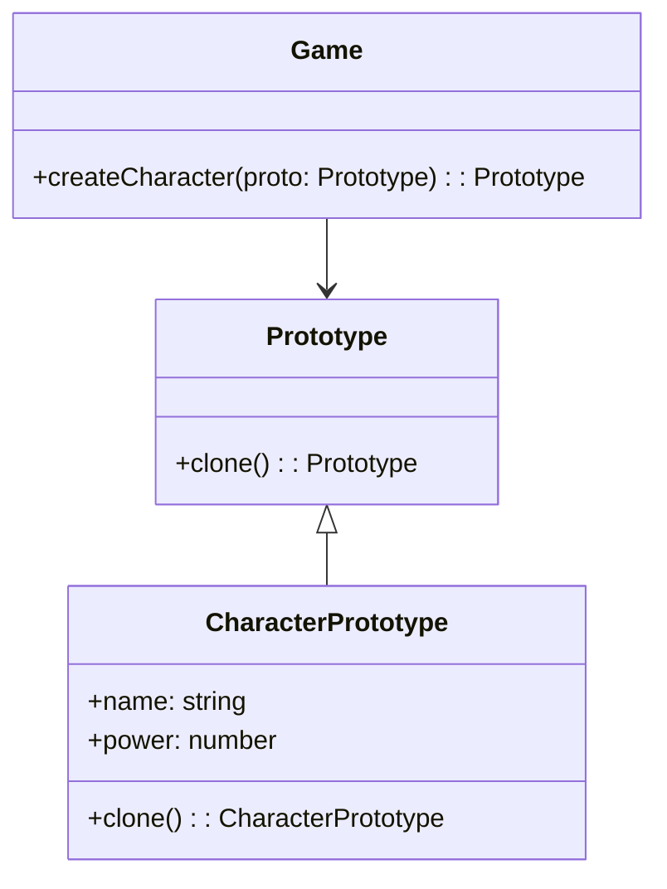

# **Prototypeパターン とは？**

## **一言で言うと、**  
既存のオブジェクトをコピーして新しいオブジェクトを作る仕組みです。

## **詳しく言うと、**  
Prototypeパターンは、あるオブジェクトをもとにして新しいオブジェクトを効率的に作成するためのパターンです。この方法では、直接インスタンスを生成する代わりに、既存のオブジェクトを複製（クローン）して使用します。これにより、オブジェクトの初期化コストを削減したり、設定済みのオブジェクトを簡単に複製したりできます。

# **日常での具体例**  

**クッキーの型抜き**

同じ型（プロトタイプ）を使って、複数のクッキーを作成します。型をそのまま再利用して効率的に作業が進む。
型抜きの型がプロトタイプとして機能し、型から作られるクッキーが複製されたオブジェクトです。


# **Prototypeパターンのメリット**

1. **オブジェクト作成の効率化**  
   初期化コストがかかるオブジェクトでも簡単に複製できる。  
2. **柔軟性の向上**  
   実行時に設定済みのプロトタイプを利用することで、動的なオブジェクト作成が可能。

# **Prototypeパターンのデメリット**

1. **ディープコピーの管理が難しい**  
   オブジェクト内に複雑な構造がある場合、コピー方法が複雑になる。 
   ※ディープコピーの詳細に関しては、[Shallow Clone と Deep Clone](https://qiita.com/hato_code/items/2723d1bb241700c9f0e2#shallow-clone-%E3%81%A8-deep-clone)で解説します！
2. **クローンメソッドの実装が必要**  
   各クラスで適切なコピー処理を実装する必要がある。


## **Shallow Clone と Deep Clone**
TypeScriptのクラスやオブジェクトにおいて、複製処理には**Shallow Clone**と**Deep Clone**の2種類のアプローチがあります。
- **Shallow Clone**（浅いコピー）：オブジェクトの参照先（プロパティ）が共有される。
- **Deep Clone**（深いコピー）：オブジェクトとそのネストされたプロパティ全てが新たに複製され、元のオブジェクトとは独立する。

## **Lodash**
**Lodash**はTypeScript/JavaScriptで非常に人気のあるユーティリティライブラリで、`_.cloneDeep()`を使うことで手軽にDeep Cloneが実現できます。

### **Shallow Cloneの問題点**
- `Object.assign` やスプレッド演算子（`...`）を用いるとShallow Cloneが行われます。
- ネストされたオブジェクトや配列は**参照がコピー**されるため、変更が元のオブジェクトに影響します。

```typescript
shallowClonedProduct.details.features[0] = "Heavy";
// これによりoriginalProductのfeatures[0]も変更される
```

### **Deep CloneをLodashで実現**
Lodashの`_.cloneDeep`はオブジェクトを再帰的に複製し、ネストされたオブジェクトも含めて独立したコピーを作成します。

```typescript
const deepClonedProduct = originalProduct.clone();
deepClonedProduct.details.features[0] = "Ultra Lightweight";
// originalProductは影響を受けない
```

### **Prototypeパターンにおけるcloneメソッド**
Prototypeパターンでは、`clone`メソッドを用意し、新しいオブジェクトを生成する仕組みを提供します。  
この際、**shallow clone**ではなく、**deep clone**を採用すると、複雑なオブジェクト構造でも安全にコピーできます。

## **Deep Cloneのポイントまとめ**
- **Prototypeパターン**では`clone()`メソッドを実装し、既存オブジェクトから新しいオブジェクトを生成します。
- **Shallow Clone**ではネストされたデータの参照が共有されるため、意図しない変更が発生する可能性があります。
- **Deep Clone**を実現するにはLodashの`_.cloneDeep()`を利用する。
- TypeScriptのクラス設計において、PrototypeパターンとDeep Cloneを組み合わせることで、安全かつ柔軟にオブジェクトの複製が可能になる。


# **Prototypeパターンをコードで説明**

### 今回、想定するケース  
- ゲーム開発でプレイヤーのキャラクターテンプレートを複製するケースを想定します。  
  キャラクターごとに名前や能力値を変更できますが、元のテンプレートを基に生成します。

## **クラス図**



## サンプルコード

```typescript
// Prototypeインターフェース
interface Prototype {
  clone(): Prototype;
}

// キャラクターの具体的なプロトタイプクラス
class CharacterPrototype implements Prototype {
  constructor(public name: string, public power: number) {}

  clone(): CharacterPrototype {
    return new CharacterPrototype(this.name, this.power);
  }
}

// ゲームクラス（クライアント）
class Game {
  createCharacter(proto: Prototype): Prototype {
    return proto.clone();
  }
}

// 使用例
const warrior = new CharacterPrototype("Warrior", 150);
console.log("Original Character:", warrior);

const game = new Game();
const clonedWarrior = game.createCharacter(warrior) as CharacterPrototype;
clonedWarrior.name = "Cloned Warrior";
clonedWarrior.power = 200;

console.log("Cloned Character:", clonedWarrior);
console.log("Original Character after cloning:", warrior);
```

## **コードの解説**  

### 1. **Prototype インターフェース**

```typescript
interface Prototype {
  clone(): Prototype;
}
```

- `Prototype` はインターフェースで、`clone()` メソッドを定義しています。
- `clone()` メソッドは自身のコピーを返すことを保証するものです。
- このインターフェースにより、異なる具体的なクラスでも統一された方法で複製が可能です。

---

### 2. **具体的なプロトタイプクラス**

```typescript
class CharacterPrototype implements Prototype {
  constructor(public name: string, public power: number) {}

  clone(): CharacterPrototype {
    return new CharacterPrototype(this.name, this.power);
  }
}
```

- `CharacterPrototype` は具体的なプロトタイプクラスです。
- このクラスはキャラクターを表現しており、`name`（名前）と `power`（能力値）という2つのプロパティを持っています。
- `clone()` メソッド:
  - 新しい `CharacterPrototype` オブジェクトを作成し、現在のオブジェクトの `name` と `power` をコピーして返します。
  - この方法により、オブジェクトのプロパティを1つずつ手動で設定する手間を省けます。

---

### 3. **クライアントクラス**

```typescript
class Game {
  createCharacter(proto: Prototype): Prototype {
    return proto.clone();
  }
}
```

- `Game` クラスはクライアントとして機能します。
- `createCharacter()` メソッド:
  - 引数として渡された `Prototype` オブジェクトを複製し、そのコピーを返します。
  - このメソッドによって、ゲーム内でキャラクターを簡単に複製する機能が提供されています。

---

### 4. **使用例とクローン動作**

```typescript
const warrior = new CharacterPrototype("Warrior", 150);
console.log("Original Character:", warrior);

const game = new Game();
const clonedWarrior = game.createCharacter(warrior) as CharacterPrototype;
clonedWarrior.name = "Cloned Warrior";
clonedWarrior.power = 200;

console.log("Cloned Character:", clonedWarrior);
console.log("Original Character after cloning:", warrior);
```

#### 実行の流れ
1. **元のキャラクターを作成**:
   - `new CharacterPrototype("Warrior", 150)` によって、名前が `"Warrior"`、能力値が `150` のキャラクターを作成します。
   - コンソールに表示される:  
     ```
     Original Character: CharacterPrototype { name: 'Warrior', power: 150 }
     ```

2. **クローンを作成**:
   - `Game` クラスの `createCharacter()` メソッドを使用して、元のキャラクターを複製します。
   - クローンは `CharacterPrototype` の `clone()` メソッドによって作られ、新しいインスタンスとして返されます。

3. **クローンの編集**:
   - クローンの `name` を `"Cloned Warrior"` に変更し、`power` を `200` に変更します。
   - クローンの状態をコンソールに表示:  
     ```
     Cloned Character: CharacterPrototype { name: 'Cloned Warrior', power: 200 }
     ```

4. **元のキャラクターの確認**:
   - 元のキャラクターには変更が加えられていないことを確認できます。
   - コンソールに表示される:  
     ```
     Original Character after cloning: CharacterPrototype { name: 'Warrior', power: 150 }
     ```

---

### **ポイントまとめ**

- **オブジェクトの複製**:
  - 新しいオブジェクトを生成する際に、元のオブジェクトをベースにしたコピーを簡単に作ることができます。
  - 同じプロパティを持つオブジェクトを複数生成する場合に便利です。

- **状態の独立性**:
  - クローンされたオブジェクトは元のオブジェクトとは独立したインスタンスです。
  - クローンに変更を加えても、元のオブジェクトには影響を与えません。

- **柔軟性**:
  - `Prototype` インターフェースを使うことで、異なる型のオブジェクトを一貫した方法で複製できます。

- **効率**:
  - 複雑な初期化処理が不要になり、既存のオブジェクトをそのままコピーすることで効率よくオブジェクトを作成できます。

# **Prototypeパターンが用いられるケース**

### 複雑なオブジェクトの初期化コストを削減したい場合
オブジェクトの生成にコストがかかる場合、Prototypeパターンで既存のオブジェクトを複製することで、時間やリソースを節約できます。
具体例:
- 3Dゲームにおける複雑なメッシュモデルやアニメーション設定済みのキャラクターを複製して利用。
- データベースクエリの結果をプロトタイプとして保持し、クエリの再実行を避ける。

# まとめ  

Prototypeパターンは、オブジェクト作成のコスト削減や柔軟性の向上を目的としたデザインパターンです。特に、複雑な初期化が必要なオブジェクトや、既存の設定を流用したい場合に便利です。しかし、ディープコピーが必要な場合や、クローンメソッドの実装が複雑になることもあるため、適切な設計が求められます。

# 参考サイト  

- [Refactoring Guru: Prototype Pattern](https://refactoring.guru/design-patterns/prototype)  
- [TypeScript Design Patterns](https://www.typescriptlang.org/docs/handbook/design-patterns.html)  
