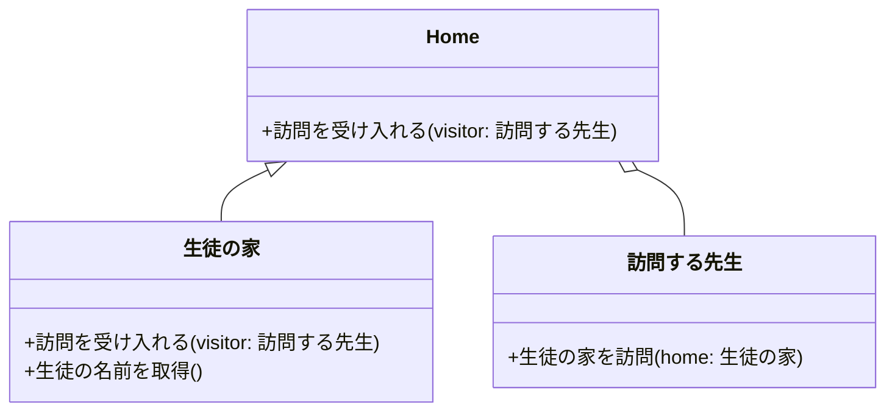
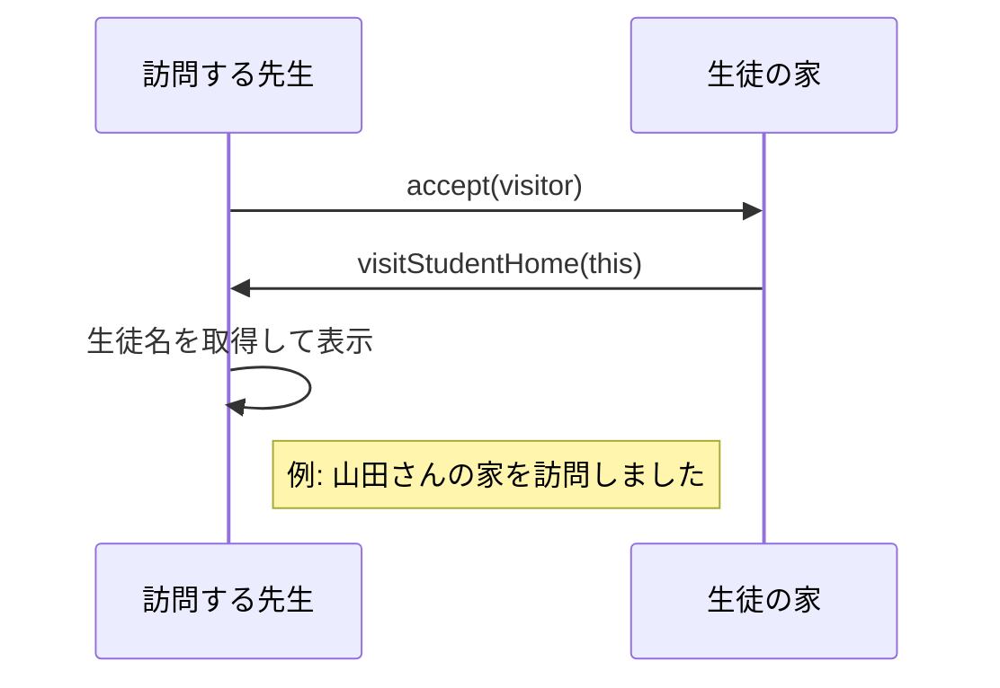

# Visitorパターン とは？

## 一言で言うと、

オブジェクトの構造を変えずに新しい操作（処理）を追加できるデザインパターンです

## 詳しく言うと、

Visitorパターンは、「訪問者（Visitor）」がさまざまな「場所（Element）」を訪れ、その**場所ごとに特別な仕事を行う**仕組みです。
たとえば、スタンプラリーを例にすると、参加者がいろいろな場所を回り、それぞれのポイントで「その場所に合った特別なスタンプ」を押してもらう、というイメージです。

# 日常での具体例

**家庭訪問の先生**
生徒の家を訪問して指導を行います。各家庭の状況に応じて、適切な指導方法を選びます。


# Visitorパターンのメリット

## 1. 新しい操作を簡単に追加
例: 動物園に新しい健康チェック方法が導入された場合、動物のクラスを変更せずに、新しい獣医（Visitor）を追加するだけで対応できます。

## 2. 関連する操作をひとつの場所にまとめられる
例: 家庭訪問の指導方法を、生徒のクラスではなく、先生（Visitor）のクラスにまとめて記述できます。

# Visitorパターンのデメリット

## 1. 新しい要素（クラス）を追加するのが難しくなる
例: 動物園に新しい種類の動物を追加する場合、すべての獣医（Visitor）クラスを更新する必要があります。

## 2. カプセル化が破られる可能性
例: 獣医が動物の内部状態を詳しく知る必要がある場合、動物クラスのプライベートデータを公開しなければならないことがあります。

# 他のデザインパターンとの関連性

- Compositeパターン：Visitorパターンは、複雑な構造を持つCompositeオブジェクトに対して操作を行う際によく使用されます。
- Iteratorパターン：Visitorパターンと組み合わせて、複雑なデータ構造を巡回しながら操作を行うことができます。

# Visitorパターンをコードで説明

### 今回、想定するケース

家庭訪問の先生が各生徒の家を訪問し、成績や家庭環境について確認するケースを例にします。

### 今回のコードのポイント
#### 1. オブジェクト構造と操作の分離
オブジェクト（HomeやStudentHome）の構造と、それに基づく操作（TeacherVisitorのvisitStudentHomeメソッド）を分離しています。
これにより、オブジェクト構造を変更せずに、新しい操作（例えば、別の種類の訪問者）を追加することが容易になります。

#### 2. 動作の追加が簡単
新しい動作を追加する場合、新しいVisitorクラスを作成するだけで対応可能です。
例えば、PrincipalVisitor（校長訪問）を追加する場合、既存のHomeクラスやStudentHomeクラスに変更を加える必要はありません。

## **クラス図**



## **サンプルコード**

```typescript
// ベースとなる「家」のクラス
class Home {
    accept(visitor: TeacherVisitor): void {
        // サブクラスで実装される
    }
}

// 生徒の家を表すクラス
class StudentHome extends Home {
    private studentName: string;

    constructor(name: string) {
        super();
        this.studentName = name;
    }

    getStudentName(): string {
        return this.studentName;
    }

    accept(visitor: TeacherVisitor): void {
        visitor.visitStudentHome(this);
    }
}

// 訪問する先生クラス（Visitor）
class TeacherVisitor {
    visitStudentHome(home: StudentHome): void {
        console.log(`${home.getStudentName()}さんの家を訪問しました。`);
    }
}

// 実行部分
const homes: Home[] = [
    new StudentHome("山田"),
    new StudentHome("鈴木"),
    new StudentHome("佐藤")
];

const teacher = new TeacherVisitor();

homes.forEach((home) => home.accept(teacher));
```

---

## **シーケンス図**



---

## **コードの解説**

1. **Homeクラス**
   - 家を表す抽象クラスで、`accept` メソッドを持ちます。
   - `accept` メソッドは、Visitorを受け入れる役割を持っています。

   ```typescript
   class Home {
       accept(visitor: TeacherVisitor): void {
           // サブクラスで実装される
       }
   }
   ```

2. **StudentHomeクラス**
   - `Home` クラスを継承した、生徒の家を表す具体的なクラスです。
   - 生徒名を保持し、`accept` メソッドでVisitorを受け入れる処理を実装します。

   ```typescript
   class StudentHome extends Home {
       private studentName: string;

       constructor(name: string) {
           super();
           this.studentName = name;
       }

       getStudentName(): string {
           return this.studentName;
       }

       accept(visitor: TeacherVisitor): void {
           visitor.visitStudentHome(this);
       }
   }
   ```

3. **TeacherVisitorクラス**
   - 家庭訪問を行う先生を表すクラスで、Visitorパターンのコア部分です。
   - 各`StudentHome` を訪問して、該当する生徒名を表示します。

   ```typescript
   class TeacherVisitor {
       visitStudentHome(home: StudentHome): void {
           console.log(`${home.getStudentName()}さんの家を訪問しました。`);
       }
   }
   ```

4. **実行部分**
   - 複数の`StudentHome`インスタンスを作成し、それぞれに`TeacherVisitor`を受け入れさせています。
   - このようにすることで、Visitorパターンを活用して柔軟に処理を実行できます。

   ```typescript
   const homes: Home[] = [
       new StudentHome("山田"),
       new StudentHome("鈴木"),
       new StudentHome("佐藤")
   ];

   const teacher = new TeacherVisitor();

   homes.forEach((home) => home.accept(teacher));
   ```


# Visitorパターンが用いられるケース

## 1. 複雑なオブジェクト構造に対して、様々な操作を行う必要がある場合
具体例: 文書オブジェクト（段落、表、画像など）に対して、印刷、エクスポート、文法チェックなど様々な操作を行う文書処理システム

## 2. 頻繁に新しい操作を追加する必要があるが、オブジェクト構造はあまり変化しない場合
具体例: 会計システムにおいて、固定の勘定科目構造に対して、新しい会計レポートや分析を追加する場合

# まとめ

Visitorパターンは、オブジェクト構造を変更せずに新しい操作を簡単に追加できる強力なデザインパターンです。複雑なオブジェクト構造に対して柔軟に操作を追加したい場合に特に有用ですが、新しい要素の追加が難しくなる点に注意が必要です。適切に使用することで、コードの拡張性と保守性を向上させることができます。

# 参考サイト
https://refactoring.guru/design-patterns/visitor

https://www.geeksforgeeks.org/visitor-design-pattern/

https://sourcemaking.com/design_patterns/visitor

