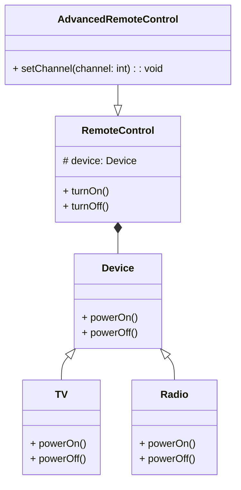
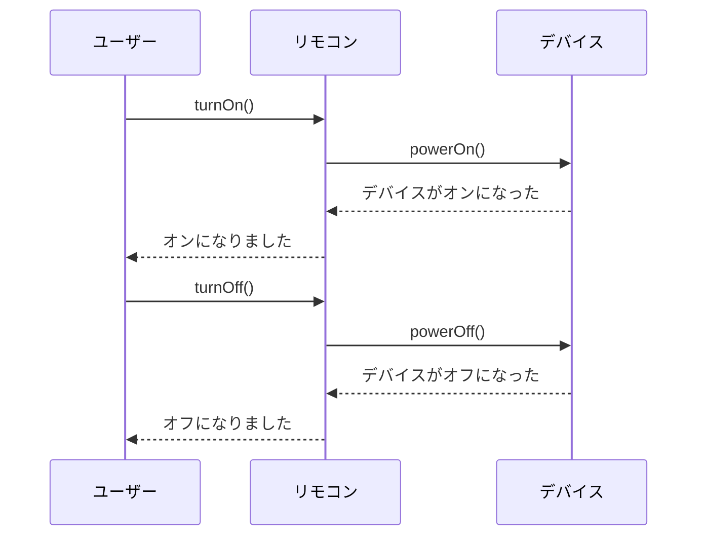

# **Bridgeパターン とは？**

## **一言で言うと、**
「機能」と「実装」を分けて、それぞれを独立して拡張できる仕組みです。

## **詳しく言うと、**
1つの機能を作るとき、その裏側の仕組み（実装）が複数ある場合に、機能と実装を直接つなげないで「橋（Bridge）」を渡してつなげる方法です。こうすることで、機能も実装もお互いに影響を受けずに変更や追加ができるようになります。


# **日常での具体例**

### **テレビとリモコン**
テレビ（機能）は、操作するリモコン（実装）が違っても動作します。例えば、赤外線リモコンやスマホアプリのリモコンがあっても、テレビ自体の仕組みは変わりません。
  


# **Bridgeパターンのメリット**

1. **機能と実装を分けて管理できる**
機能や実装の変更が他に影響しないため、メンテナンスがしやすくなります。
   - **例**: 新しい種類のリモコンを追加しても、テレビ自体の機能を変える必要がない。

2. **拡張性が高い**
機能と実装をそれぞれ自由に追加・変更できるため、柔軟な設計が可能です。
   - **例**: テレビの新モデルを作っても、既存のリモコンがそのまま使える。

# **Bridgeパターンのデメリット**

1. **設計が複雑になる**
機能と実装を分けるために、クラスやインターフェースの数が増えます。
小さいプロジェクトでは、シンプルな構造で十分な場合がある。

2. **初学者にはわかりにくい**
パターンの意図を理解するのに、少し慣れが必要です。
なぜ機能と実装をわざわざ分けるのか」が初心者にはピンとこないこともあります。

# **Bridgeパターンをコードで説明**

### **今回、想定するケース**
テレビ（機能）とリモコン（実装）を分け、テレビの種類やリモコンの種類を独立して拡張できるように設計します。

## **クラス図**



## サンプルコード

```typescript
// デバイス（実装側）
interface Device {
  powerOn(): void;
  powerOff(): void;
}

// テレビの実装
class TV implements Device {
  powerOn(): void {
    console.log("テレビがオンになりました");
  }
  powerOff(): void {
    console.log("テレビがオフになりました");
  }
}

// ラジオの実装
class Radio implements Device {
  powerOn(): void {
    console.log("ラジオがオンになりました");
  }
  powerOff(): void {
    console.log("ラジオがオフになりました");
  }
}

// リモコン（機能側）
class RemoteControl {
  protected device: Device;

  constructor(device: Device) {
    this.device = device;
  }

  turnOn(): void {
    console.log("リモコンを使用しています:");
    this.device.powerOn();
  }

  turnOff(): void {
    console.log("リモコンを使用しています:");
    this.device.powerOff();
  }
}

// 高機能リモコン（機能の拡張）
class AdvancedRemoteControl extends RemoteControl {
  setChannel(channel: number): void {
    console.log(`チャンネルを${channel}に設定しています`);
  }
}

// 使用例
const tv = new TV();
const radio = new Radio();

const basicRemote = new RemoteControl(tv);
basicRemote.turnOn(); // リモコンを使用しています: テレビがオンになりました
basicRemote.turnOff(); // リモコンを使用しています: テレビがオフになりました

const advancedRemote = new AdvancedRemoteControl(radio);
advancedRemote.turnOn(); // リモコンを使用しています: ラジオがオンになりました
advancedRemote.setChannel(5); // チャンネルを5に設定しています
advancedRemote.turnOff(); // リモコンを使用しています: ラジオがオフになりました

```

## シーケンス図



## **コードの解説**

#### 1. **Deviceインターフェース**
```typescript
interface Device {
  powerOn(): void;
  powerOff(): void;
}
```
- **目的**: デバイス（テレビやラジオなど）の基本的な操作（電源オン/オフ）を定義するインターフェース。
- **利点**: これにより、具体的なデバイスの実装を抽象化し、リモコン側がどんなデバイスでも操作できるようになります。

#### 2. **TVクラスとRadioクラス**
```typescript
class TV implements Device {
  powerOn(): void {
    console.log("テレビがオンになりました");
  }
  powerOff(): void {
    console.log("テレビがオフになりました");
  }
}

class Radio implements Device {
  powerOn(): void {
    console.log("ラジオがオンになりました");
  }
  powerOff(): void {
    console.log("ラジオがオフになりました");
  }
}
```
- **TVクラス**と**Radioクラス**は、`Device`インターフェースを実装しています。
- **役割**: 各デバイスごとの動作を具体的に定義しています。

#### 3. **RemoteControlクラス**
```typescript
class RemoteControl {
  protected device: Device;

  constructor(device: Device) {
    this.device = device;
  }

  turnOn(): void {
    console.log("リモコンを使用しています:");
    this.device.powerOn();
  }

  turnOff(): void {
    console.log("リモコンを使用しています:");
    this.device.powerOff();
  }
}
```
- **目的**: デバイスを操作する「リモコン」を定義しています。
- **コンストラクタ**: 操作対象の`Device`を受け取り、保持します。
- **機能**:
  - `turnOn()`: リモコンを使ってデバイスをオンにします。
  - `turnOff()`: リモコンを使ってデバイスをオフにします。
- **柔軟性**: リモコンはどんな`Device`（テレビやラジオ）でも操作可能です。

#### 4. **AdvancedRemoteControlクラス**
```typescript
class AdvancedRemoteControl extends RemoteControl {
  setChannel(channel: number): void {
    console.log(`チャンネルを${channel}に設定しています`);
  }
}
```
- **目的**: 基本リモコン（`RemoteControl`）の機能を拡張した「高機能リモコン」を定義します。
- **追加機能**: `setChannel()`メソッドを使い、デバイスのチャンネルを設定できます。
- **継承**: 基本リモコンの機能（オン/オフ）をそのまま利用できます。

#### 5. **使用例**
```typescript
const tv = new TV();
const radio = new Radio();

const basicRemote = new RemoteControl(tv);
basicRemote.turnOn(); // リモコンを使用しています: テレビがオンになりました
basicRemote.turnOff(); // リモコンを使用しています: テレビがオフになりました

const advancedRemote = new AdvancedRemoteControl(radio);
advancedRemote.turnOn(); // リモコンを使用しています: ラジオがオンになりました
advancedRemote.setChannel(5); // チャンネルを5に設定しています
advancedRemote.turnOff(); // リモコンを使用しています: ラジオがオフになりました
```
- **基本リモコン**: `RemoteControl`を使ってテレビをオン/オフ操作。
- **高機能リモコン**: `AdvancedRemoteControl`を使ってラジオを操作し、チャンネル設定機能を使用。

---

### ポイント
1. **抽象化（機能）と実装の分離**:
   - リモコン（`RemoteControl`）はデバイス（`Device`）の詳細に依存しません。
2. **柔軟性の向上**:
   - 新しいデバイス（例: スマートスピーカー）やリモコン機能（例: ボリューム調整）を追加する際に、それぞれを独立して拡張可能です。
3. **再利用性の向上**:
   - `RemoteControl`はどんな`Device`でも操作でき、コードの再利用性が向上します。

このような構造により、コードの変更に強く、拡張しやすい設計を実現しています。

# **Bridgeパターンが用いられるケース**

**UIのテーマ適用**
   - **ケース**: ボタンやウィンドウなどのUIコンポーネントの機能と、ダークテーマやライトテーマなどの実装を分けたい。
   - **具体例**: アプリケーションのボタンデザインをテーマごとに変更する。


# まとめ
Bridgeパターンは「機能」と「実装」を分けることで、両方を独立して変更や拡張できる仕組みを提供します。特に、複数の機能と実装の組み合わせが必要な場面で有効です。


# 参考サイト
- [Bridgeパターン - Wikipedia](https://ja.wikipedia.org/wiki/Bridgeパターン)
- [Design Patterns in TypeScript](https://refactoring.guru/design-patterns/bridge)
