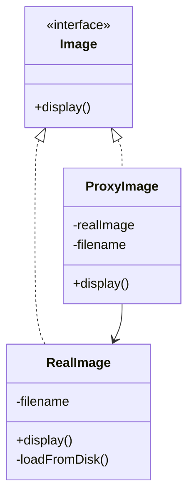
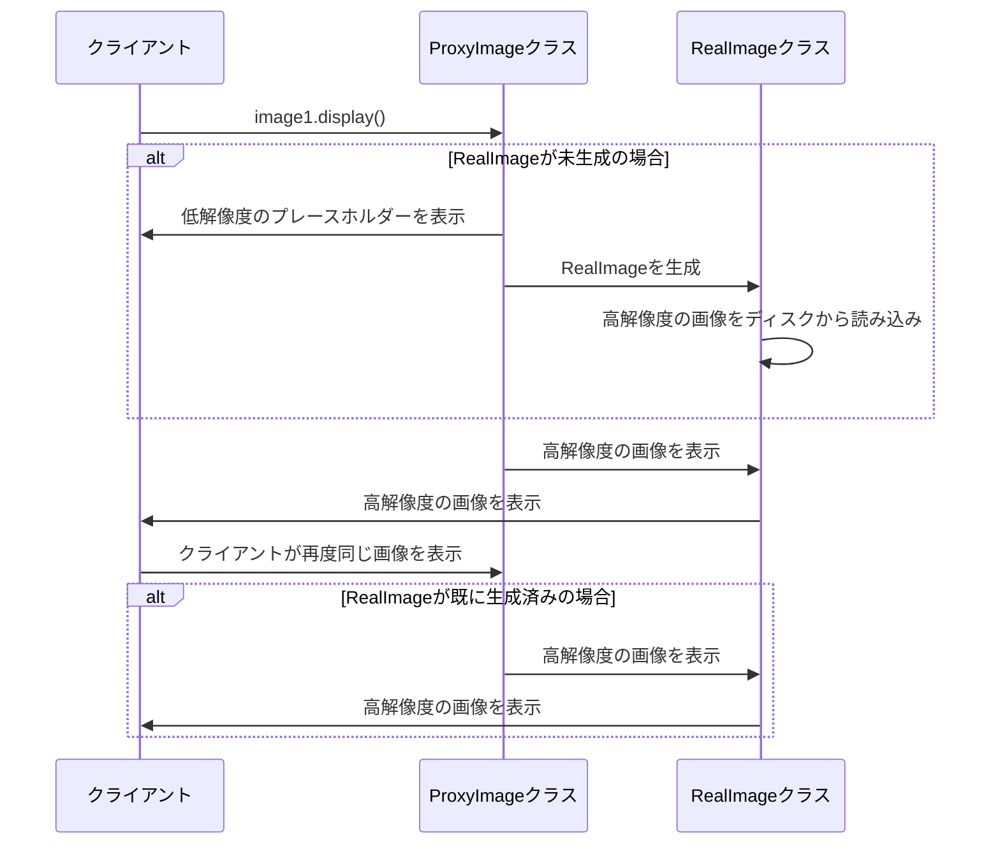

# **Proxyパターン とは？**

## **一言で言うと、**

オブジェクトへのアクセスを制御するための代理人を提供するパターンです。

## **詳しく言うと、**

Proxyパターンは、あるオブジェクトの代わりに別のオブジェクトを使って、元のオブジェクトへのアクセスを管理する方法です。代理人（Proxy）は、本物のオブジェクトと同じように振る舞いますが、アクセスを制御したり、追加の処理を行ったりすることができます。これにより、本物のオブジェクトを直接使うときには難しい機能を追加できます。

# **日常での具体例**


**ATM**

銀行の窓口の代わりに、お金の引き出しや預け入れなどの基本的な取引を行います。


# **Proxyパターンのメリット**

## 1. セキュリティの向上
説明: アクセス制御を行うことで、重要なオブジェクトを保護できます。
例: データベースへの接続を管理し、認証されたユーザーのみがアクセスできるようにする。

## 2. パフォーマンスの最適化
説明: 必要な時だけ本物のオブジェクトを生成したり、結果をキャッシュしたりできます。
例: 大きな画像ファイルを表示する際に、最初は小さなサムネイルだけを読み込み、必要な時に本物の画像を表示する。

# **Proxyパターンのデメリット**

## 1. 複雑性の増加
説明: 新しいクラスを追加することで、システムの構造が複雑になる可能性があります。
例: 単純な操作に対しても、Proxyを経由する必要があるため、コードが冗長になる。

## 2. レスポンスタイムの増加
説明: Proxyを介することで、処理に若干の遅延が生じる可能性があります。
例: ネットワークProxyを使用する場合、通信に追加の時間がかかる。

# 他のデザインパターンとの関連性

- Adapterパターン：両者とも別のオブジェクトをラップしますが、Adapterは異なるインターフェースを持つオブジェクトを適合させるのに対し、Proxyは同じインターフェースを維持します。

- Decoratorパターン：Decoratorはオブジェクトに新しい振る舞いを追加しますが、Proxyは主にアクセス制御を行います。

# **Proxyパターンをコードで説明**

### 今回、想定するケース

高解像度の画像を表示するシステムを考えます。画像の読み込みには時間がかかるため、最初は低解像度のプレースホルダーを表示し、必要な時に高解像度の画像を読み込むようにします。

## **クラス図**



## サンプルコード

```typescript
interface Image {
    display(): void;
}

class RealImage implements Image {
    private filename: string;

    constructor(filename: string) {
        this.filename = filename;
        this.loadFromDisk();
    }

    private loadFromDisk(): void {
        console.log(`高解像度の画像 ${this.filename} を読み込み中...`);
    }

    display(): void {
        console.log(`高解像度の画像 ${this.filename} を表示中`);
    }
}

class ProxyImage implements Image {
    private realImage: RealImage | null = null;
    private filename: string;

    constructor(filename: string) {
        this.filename = filename;
    }

    display(): void {
        if (this.realImage === null) {
            console.log(`低解像度のプレースホルダー ${this.filename} を表示中`);
            this.realImage = new RealImage(this.filename);
        }
        this.realImage.display();
    }
}

// クライアントコード
const image1 = new ProxyImage("photo1.jpg");
const image2 = new ProxyImage("photo2.jpg");

image1.display(); // 低解像度 → 高解像度
image1.display(); // 高解像度のみ
image2.display(); // 低解像度 → 高解像度
```

## シーケンス図




## **コードの解説**

### **コードの仕組み**

#### **1. インターフェース `Image`**
- `display()` メソッドを定義しています。
- このインターフェースを使うことで、`RealImage`（実際の画像）と `ProxyImage`（代理画像）を同じ方法で扱えるようにしています。

```typescript
interface Image {
    display(): void;
}
```

#### **2. `RealImage` クラス**
- **高解像度の画像**を読み込んで表示するクラス。
- コンストラクタで画像ファイルを読み込み（`loadFromDisk()`）、その後に表示（`display()`）を行います。

**重要なポイント**:
- **画像読み込み処理**は高コスト（時間やリソースがかかる）な処理として想定されています。
- 必要になるまで読み込むのを遅延させたい場合、Proxyパターンが有効です。

```typescript
class RealImage implements Image {
    private filename: string;

    constructor(filename: string) {
        this.filename = filename;
        this.loadFromDisk(); // 画像をディスクから読み込む
    }

    private loadFromDisk(): void {
        console.log(`高解像度の画像 ${this.filename} を読み込み中...`);
    }

    display(): void {
        console.log(`高解像度の画像 ${this.filename} を表示中`);
    }
}
```

#### **3. `ProxyImage` クラス**
- **RealImageの代理**として動作します。
- 実際に`RealImage`を作成するのは、`display()`が初めて呼ばれたとき（遅延生成）。
- Proxyを使うことで、無駄なリソース消費を防ぎます。

**動作の流れ**:
1. 最初に `display()` を呼び出すとき:
   - `RealImage` がまだ作成されていない場合、`RealImage` を初期化します。
   - プレースホルダー画像を一時的に表示。
2. 2回目以降の `display()` 呼び出し:
   - 既に作成された `RealImage` をそのまま使用し、再読み込みを防ぎます。

```typescript
class ProxyImage implements Image {
    private realImage: RealImage | null = null;
    private filename: string;

    constructor(filename: string) {
        this.filename = filename;
    }

    display(): void {
        if (this.realImage === null) {
            console.log(`低解像度のプレースホルダー ${this.filename} を表示中`);
            this.realImage = new RealImage(this.filename);
        }
        this.realImage.display();
    }
}
```

### **4. クライアントコードの動作**

#### **コードの実行例**
```typescript
const image1 = new ProxyImage("photo1.jpg");
const image2 = new ProxyImage("photo2.jpg");

image1.display(); // 低解像度 → 高解像度
image1.display(); // 高解像度のみ
image2.display(); // 低解像度 → 高解像度
```

#### **詳細なフロー**
1. `image1.display()` を最初に呼び出すとき:
   - ProxyImageは「低解像度のプレースホルダー」を表示。
   - 初めて `RealImage` が生成され、画像がディスクから読み込まれる。
   - 最後に、高解像度の画像が表示される。
2. 再度 `image1.display()` を呼び出すとき:
   - `RealImage` が既に作成されているので、画像の再読み込みは不要。
   - 高解像度の画像をそのまま表示。
3. `image2.display()` を呼び出すとき:
   - `image2` 用の `RealImage` がまだ作成されていないので、同様にプレースホルダー → 画像読み込み → 高解像度表示の流れ。


### **コードの実行結果**
```
低解像度のプレースホルダー photo1.jpg を表示中
高解像度の画像 photo1.jpg を読み込み中...
高解像度の画像 photo1.jpg を表示中
高解像度の画像 photo1.jpg を表示中
低解像度のプレースホルダー photo2.jpg を表示中
高解像度の画像 photo2.jpg を読み込み中...
高解像度の画像 photo2.jpg を表示中
```

### **ポイント**
1. **遅延初期化**:
   - 高コストな処理（ここでは画像の読み込み）を、必要になるまで実行しない。
2. **リソース節約**:
   - 必要になるまで本物のオブジェクトを作成しないことで、リソース消費を抑えられる。
3. **アクセス制御**:
   - Proxyを通じて、本物のオブジェクトへのアクセスを制御できる。


### **適用例**
- **画像ビューア**:
  - 高解像度画像を読み込む前に、低解像度のプレースホルダーを表示。
- **仮想プロキシ**:
  - 動的なデータ読み込みを行うWebアプリで、データを必要になるまで読み込まない。
- **リモートプロキシ**:
  - リモートサーバー上のリソースにアクセスする際、プロキシで通信を最適化。


# **Proxyパターンが用いられるケース**

## 1. 遅延初期化
ケース: リソースを消費する重いオブジェクトの生成を遅らせたい場合
具体例: データベース接続やファイルシステムへのアクセスを、実際に必要になるまで遅延させる

## 2. アクセス制御
ケース: 特定のクライアントにのみオブジェクトへのアクセスを許可したい場合
具体例: 社内システムで、役職に応じて機密情報へのアクセスを制限する

# まとめ

Proxyパターンは、オブジェクトへのアクセスを制御するための強力なツールです。セキュリティの向上やパフォーマンスの最適化に役立ちますが、システムの複雑性が増す可能性があることに注意が必要です。適切に使用することで、柔軟で効率的なシステム設計が可能になります。

# 参考サイト

https://refactoring.guru/design-patterns/proxy/typescript/example

https://www.typescriptlang.org/docs/handbook/decorators.html

https://mermaid.js.org/syntax/classDiagram.html

