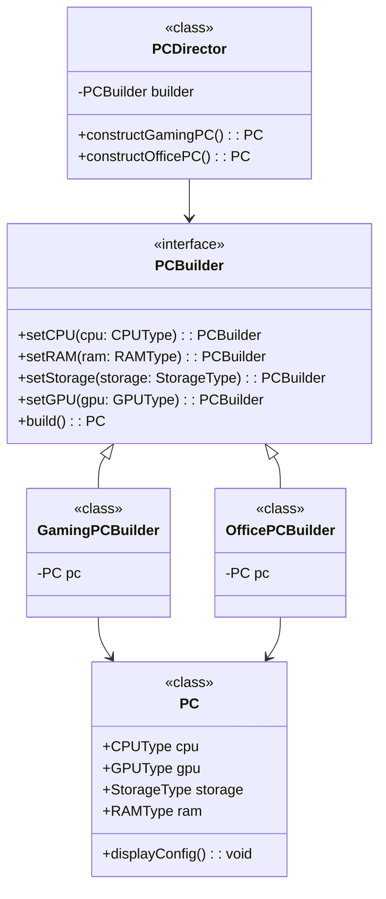

# **Builderパターン とは？**

## **一言で言うと、**

複雑な手順を分割する方法

## **詳しく言うと、**

複雑なオブジェクトの生成過程を分離し、その生成過程を統一的に扱えるようにするデザインパターンです。これにより、異なる種類のオブジェクトを同じ構造で生成できるようになります。特に、**オブジェクトの生成に多くのオプションや段階が必要な場合に便利です。**

# **日常での具体例**

**コンピュータのカスタマイズ**

カスタムPCを組み立てる時の流れは以下のような手順になります。

1. PCの構築を管理：
「ゲーミングPC」や「オフィス用PC」など、要件に応じた組み立て手順を指定します。

2. 部品を選択・組み立てる：
CPU、GPU、RAM、ストレージ、電源ユニットなどを1つずつ設定。

3. 設定を実際のPCに反映：
各部品を指定し、最終的にPCを構築。

4. PCの完成：
構築が完了したらPCが返され、すぐに使用可能。

PCを組み立てるという複雑な作業を一つ一つの簡単な作業に分解して段階的に進める仕組みがBuilderパターンです。


# **Builderパターンのメリット**

### 複雑なオブジェクトの生成を簡潔にできる
複雑なオブジェクトを段階的に構築することで、コードの可読性と保守性が向上します。
例: コンストラクタが多くの引数を持つ場合でも、一部のプロパティを指定しながらオブジェクトを構築できます。

### 柔軟性が高い
必要なプロパティや構造を柔軟に変更しながらオブジェクトを生成できます。
例: プロダクトの一部だけを異なるオプションに切り替えられます。

# **Builderパターンのデメリット**

### 実装が煩雑
クラス数が増えるため、単純なシナリオではオーバーヘッドになる可能性があります。
例: 簡単なオブジェクト生成の場合、Builderパターンを使用すると逆に冗長になります。

### 小規模なアプリケーションでは過剰設計になり得る
必ずしも全てのケースで必要とは限らず、場合によってはコードが複雑になります。
例: 数個の引数しかないオブジェクト生成では不要。

# **Builderパターンをコードで説明**

想定:
お客様からPCの要望を聞き、PCを組み立てる

## **クラス図**



## コード

```typescript
// PCパーツの型を表す列挙型
enum CPUType {
  IntelCoreI9 = "Intel Core i9",
  IntelCoreI5 = "Intel Core i5",
  AMDRyzen9 = "AMD Ryzen 9",
  AMDRyzen5 = "AMD Ryzen 5",
}

enum GPUType {
  NvidiaRTX4090 = "NVIDIA RTX 4090",
  NvidiaRTX3060 = "NVIDIA RTX 3060",
  IntegratedGraphics = "統合グラフィックス",
}

enum StorageType {
  SSD1TB = "1TB SSD",
  SSD512GB = "512GB SSD",
  HDD1TB = "1TB HDD",
}

enum RAMType {
  DDR4_32GB = "32GB DDR4",
  DDR4_16GB = "16GB DDR4",
  DDR4_8GB = "8GB DDR4",
}

// PCオブジェクトの設計
class PC {
  public cpu!: CPUType;
  public gpu!: GPUType;
  public storage!: StorageType;
  public ram!: RAMType;

  displayConfig(): void {
    console.log(`PC構成:
      CPU: ${this.cpu}
      メモリ: ${this.ram}
      ストレージ: ${this.storage}
      GPU: ${this.gpu}`);
  }
}

// Builderインターフェース
interface PCBuilder {
  setCPU(cpu: CPUType): PCBuilder;
  setRAM(ram: RAMType): PCBuilder;
  setStorage(storage: StorageType): PCBuilder;
  setGPU(gpu: GPUType): PCBuilder;
  build(): PC;
}

// 具体的なBuilderクラス
class GamingPCBuilder implements PCBuilder {
  private pc: PC;

  constructor() {
    this.pc = new PC();
  }

  setCPU(cpu: CPUType): PCBuilder {
    if (cpu !== CPUType.IntelCoreI9 && cpu !== CPUType.AMDRyzen9) {
      throw new Error("ゲーミングPCには高性能なCPUが必要です！");
    }
    this.pc.cpu = cpu;
    return this;
  }

  setRAM(ram: RAMType): PCBuilder {
    if (ram !== RAMType.DDR4_32GB) {
      throw new Error("ゲーミングPCには最低でも32GBのメモリが必要です！");
    }
    this.pc.ram = ram;
    return this;
  }

  setStorage(storage: StorageType): PCBuilder {
    this.pc.storage = storage;
    return this;
  }

  setGPU(gpu: GPUType): PCBuilder {
    if (gpu === GPUType.IntegratedGraphics) {
      throw new Error("ゲーミングPCには専用のGPUが必要です！");
    }
    this.pc.gpu = gpu;
    return this;
  }

  build(): PC {
    return this.pc;
  }
}

// 具体的なBuilderクラス（オフィス用PC）
class OfficePCBuilder implements PCBuilder {
  private pc: PC;

  constructor() {
    this.pc = new PC();
  }

  setCPU(cpu: CPUType): PCBuilder {
    if (cpu !== CPUType.IntelCoreI5 && cpu !== CPUType.AMDRyzen5) {
      throw new Error("オフィス用PCにはコスト効率の良いCPUが必要です！");
    }
    this.pc.cpu = cpu;
    return this;
  }

  setRAM(ram: RAMType): PCBuilder {
    if (ram !== RAMType.DDR4_16GB && ram !== RAMType.DDR4_8GB) {
      throw new Error("オフィス用PCには最大16GBのメモリが適しています！");
    }
    this.pc.ram = ram;
    return this;
  }

  setStorage(storage: StorageType): PCBuilder {
    this.pc.storage = storage;
    return this;
  }

  setGPU(gpu: GPUType): PCBuilder {
    this.pc.gpu = gpu; // オフィス用PCは統合グラフィックスも許容
    return this;
  }

  build(): PC {
    return this.pc;
  }
}

// ディレクタークラス
class PCDirector {
  private builder: PCBuilder;

  constructor(builder: PCBuilder) {
    this.builder = builder;
  }

  constructGamingPC(): PC {
    return this.builder
      .setCPU(CPUType.IntelCoreI9)
      .setRAM(RAMType.DDR4_32GB)
      .setStorage(StorageType.SSD1TB)
      .setGPU(GPUType.NvidiaRTX4090)
      .build();
  }

  constructOfficePC(): PC {
    return this.builder
      .setCPU(CPUType.IntelCoreI5)
      .setRAM(RAMType.DDR4_8GB)
      .setStorage(StorageType.SSD512GB)
      .setGPU(GPUType.IntegratedGraphics)
      .build();
  }
}

// 使用例
try {
  console.log("=== ゲーミングPC ===");
  const gamingBuilder = new GamingPCBuilder();
  const gamingDirector = new PCDirector(gamingBuilder);
  const gamingPC = gamingDirector.constructGamingPC();
  gamingPC.displayConfig();

  console.log("\n=== オフィス用PC ===");
  const officeBuilder = new OfficePCBuilder();
  const officeDirector = new PCDirector(officeBuilder);
  const officePC = officeDirector.constructOfficePC();
  officePC.displayConfig();

  console.log("\n=== 無効な構成の試み ===");
  const invalidBuilder = new GamingPCBuilder();
  invalidBuilder
    .setCPU(CPUType.IntelCoreI5) // 規格外のCPU
    .setRAM(RAMType.DDR4_32GB)
    .setStorage(StorageType.SSD1TB)
    .setGPU(GPUType.NvidiaRTX3060)
    .build();
} catch (error) {
  console.error("エラー:", error.message);
}


```

## **コードの解説**

このコードは **Builderパターン** を利用して、PCを構築するプロセスをカプセル化したものです。以下に詳細に解説します。


### 1. **PCパーツの型定義**

```typescript
enum CPUType { ... }
enum GPUType { ... }
enum StorageType { ... }
enum RAMType { ... }
```

- **列挙型（`enum`）** を使って、PCの構成要素（CPU、GPU、ストレージ、RAM）の選択肢を定義しています。
  - `CPUType`: PCのCPUの種類（例: Intel Core i9）。
  - `GPUType`: グラフィックカードの種類（例: NVIDIA RTX 4090）。
  - `StorageType`: ストレージの種類（例: 1TB SSD）。
  - `RAMType`: メモリ容量と規格（例: 32GB DDR4）。
- 列挙型にすることで、型安全性が向上し、無効な値の使用を防げます。


### 2. **PCクラス**

```typescript
class PC {
  public cpu!: CPUType;
  public gpu!: GPUType;
  public storage!: StorageType;
  public ram!: RAMType;

  displayConfig(): void {
    console.log(`PC構成:
      CPU: ${this.cpu}
      メモリ: ${this.ram}
      ストレージ: ${this.storage}
      GPU: ${this.gpu}`);
  }
}
```

- **`PC`** は、構築されるPCのデータを表現するクラスです。
  - `cpu`, `gpu`, `storage`, `ram` がPCの構成要素。
  - `displayConfig` メソッドでPCの設定を表示できます。
- PCクラスはデータ保持のみを行い、ロジックは持たせていません。

### 3. **PCBuilderインターフェース**

```typescript
interface PCBuilder {
  setCPU(cpu: CPUType): PCBuilder;
  setRAM(ram: RAMType): PCBuilder;
  setStorage(storage: StorageType): PCBuilder;
  setGPU(gpu: GPUType): PCBuilder;
  build(): PC;
}
```

- **`PCBuilder`** はBuilderパターンのインターフェースです。
  - 各構成要素（CPU, RAM, Storage, GPU）を設定するメソッドを定義。
  - `build` メソッドで構築済みの`PC`オブジェクトを返します。
- このインターフェースにより、異なる構成要件（例: ゲーミングPC、オフィスPC）に対応可能。

### 4. **GamingPCBuilder と OfficePCBuilder**

#### `GamingPCBuilder`（ゲーミングPC用ビルダー）

```typescript
class GamingPCBuilder implements PCBuilder {
  private pc: PC;

  constructor() {
    this.pc = new PC();
  }

  setCPU(cpu: CPUType): PCBuilder {
    if (cpu !== CPUType.IntelCoreI9 && cpu !== CPUType.AMDRyzen9) {
      throw new Error("ゲーミングPCには高性能なCPUが必要です！");
    }
    this.pc.cpu = cpu;
    return this;
  }

  setRAM(ram: RAMType): PCBuilder {
    if (ram !== RAMType.DDR4_32GB) {
      throw new Error("ゲーミングPCには最低でも32GBのメモリが必要です！");
    }
    this.pc.ram = ram;
    return this;
  }

  setStorage(storage: StorageType): PCBuilder {
    this.pc.storage = storage;
    return this;
  }

  setGPU(gpu: GPUType): PCBuilder {
    if (gpu === GPUType.IntegratedGraphics) {
      throw new Error("ゲーミングPCには専用のGPUが必要です！");
    }
    this.pc.gpu = gpu;
    return this;
  }

  build(): PC {
    return this.pc;
  }
}
```

- ゲーミングPC用の構成を作成するビルダー。
- **特徴**:
  - 高性能なCPU（`IntelCoreI9` または `AMDRyzen9`）のみ許可。
  - 最低32GBのRAMが必須。
  - 統合型GPUは許可されず、専用GPUが必要。

#### `OfficePCBuilder`（オフィスPC用ビルダー）

```typescript
class OfficePCBuilder implements PCBuilder {
  private pc: PC;

  constructor() {
    this.pc = new PC();
  }

  setCPU(cpu: CPUType): PCBuilder {
    if (cpu !== CPUType.IntelCoreI5 && cpu !== CPUType.AMDRyzen5) {
      throw new Error("オフィス用PCにはコスト効率の良いCPUが必要です！");
    }
    this.pc.cpu = cpu;
    return this;
  }

  setRAM(ram: RAMType): PCBuilder {
    if (ram !== RAMType.DDR4_16GB && ram !== RAMType.DDR4_8GB) {
      throw new Error("オフィス用PCには最大16GBのメモリが適しています！");
    }
    this.pc.ram = ram;
    return this;
  }

  setStorage(storage: StorageType): PCBuilder {
    this.pc.storage = storage;
    return this;
  }

  setGPU(gpu: GPUType): PCBuilder {
    this.pc.gpu = gpu; // 統合グラフィックスも許容。
    return this;
  }

  build(): PC {
    return this.pc;
  }
}
```

- オフィスPC用の構成を作成するビルダー。
- **特徴**:
  - コスト効率の良いCPU（`IntelCoreI5` または `AMDRyzen5`）のみ許可。
  - 最大16GBまでのRAMが適切。
  - 統合型GPUも許可。

---

### 5. **PCDirectorクラス**

```typescript
class PCDirector {
  private builder: PCBuilder;

  constructor(builder: PCBuilder) {
    this.builder = builder;
  }

  constructGamingPC(): PC {
    return this.builder
      .setCPU(CPUType.IntelCoreI9)
      .setRAM(RAMType.DDR4_32GB)
      .setStorage(StorageType.SSD1TB)
      .setGPU(GPUType.NvidiaRTX4090)
      .build();
  }

  constructOfficePC(): PC {
    return this.builder
      .setCPU(CPUType.IntelCoreI5)
      .setRAM(RAMType.DDR4_8GB)
      .setStorage(StorageType.SSD512GB)
      .setGPU(GPUType.IntegratedGraphics)
      .build();
  }
}
```

- **`PCDirector`** は、構築の手順を管理するクラス。
  - ゲーミングPC、オフィスPCの構築手順を定義（`constructGamingPC` と `constructOfficePC`）。
  - 実際の構築は `PCBuilder` インターフェースを通じて行われるため、構築プロセスと具体的な構成要件が分離されています。

### 6. **実行結果**

```yaml
=== ゲーミングPC ===
PC構成:
  CPU: Intel Core i9
  メモリ: 32GB DDR4
  ストレージ: 1TB SSD
  GPU: NVIDIA RTX 4090

=== オフィス用PC ===
PC構成:
  CPU: Intel Core i5
  メモリ: 8GB DDR4
  ストレージ: 512GB SSD
  GPU: 統合グラフィックス

=== 無効な構成の試み ===
エラー: ゲーミングPCには高性能なCPUが必要です！

```


### 全体のポイント

1. **再利用性**:
   - 複雑なオブジェクト（PC）の構築をステップごとに分離。
   - 構築手順（Director）と構成要件（Builder）を分離し、柔軟性と再利用性を向上。

2. **構成の柔軟性**:
   - ゲーミングPCとオフィスPCの異なる構成要件を簡単に管理。

3. **エラー処理**:
   - 不正な構成を事前にチェックし、安全な構築を保証。


# Builderパターンが用いられるケース

### 設定や構成が複雑なオブジェクトを生成する場合
多数のオプションやパラメータを持つオブジェクトの生成する時に用いられる。

具体例:
- カスタマイズ可能なPC構築システム: CPU、GPU、RAMなど複数の部品を選択してPCを構築する場合（今回の例）。
- UIウィジェットやコンポーネント: ボタンやフォームなど、スタイルや動作を細かく設定できるオブジェクト。
- ネットワークリクエスト: HTTPリクエストのURL、ヘッダー、ボディ、クエリパラメータなどを段階的に設定。


# まとめ
Builderパターンは、複雑なオブジェクトを段階的かつ柔軟に構築するためのデザインパターンです。特に、設定が多い場合や柔軟性が必要な場合に便利ですが、シンプルなケースでは使用しない方がよい場合もあります。
