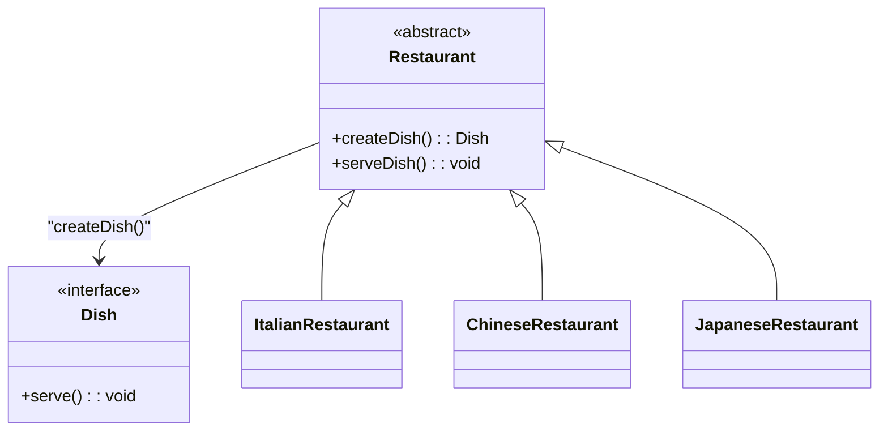

# **Factory Methodパターン とは？**

## **一言で言うと、**
どのオブジェクトを生成するかの決定をサブクラスに委ねる方法

## **詳しく言うと、**
通常、クラスのインスタンスを生成する際には、newを用いて直接オブジェクトを作ります。しかし、これでは生成されるオブジェクトの種類が固定化され、コードの拡張性が低くなります。

Factory Methodパターンでは、**オブジェクト生成の部分をメソッドとして抽象化**し、そのメソッドをオーバーライド（上書き）することで、生成される具体的なオブジェクトを切り替えることができます。


# **日常での具体例**
レストランでの注文


和食や中華、イタリアンなどいろんな料理を注文できますが、具体的な料理のレシピや調理方法を伝える必要はありません。
あなたは「注文する」という同じ行動をしますが、出てくる料理はレストランによって変わります。

つまり、Factory Methodパターンとは、「どんな料理を作るか（生成するか）」という具体的な決定はレストラン側に任せて、注文する人は共通の方法で料理を頼むだけでよい仕組みです。


# **Factory Methodパターンのメリット**

Factory Methodパターンの最大の魅力は、「生成されるオブジェクトを動的に変更できる柔軟性」と「コードの変更箇所を局所化できる保守性」にあります。

### 1. 生成するオブジェクトの種類を変更しやすい
クラスの変更なしに、生成されるオブジェクト（Concrete Product）を簡単に切り替えられます。
新しい種類のオブジェクトを作成する場合、既存コードを変更せず、新しいサブクラスを追加するだけで対応可能。
### 2. 生成ロジックの変更が限定的
生成方法を変更したい場合でも、特定のサブクラスのみに変更を加えれば済みます。クライアントコードや他の生成者クラスへの影響はありません。

# **Factory Methodパターンのデメリット**

### 1. 抽象クラスやインターフェースが増える
Factory Methodパターンでは、抽象クラスやインターフェースを設計する必要があるため、クラスの数が増加します。シンプルな処理に対しては**オーバーエンジニアリング**になる可能性があります。

# **Factory Methodパターンをコードで説明**

イタリアンレストランではピザやパスタ、中華料理店では餃子やチャーハン、日本料理店では寿司や味噌汁が提供されます。

レストランでの、お客さんが料理を注文した際に料理が提供されるまでの流れをFactory Methodパターンを使って解説します。

## **クラス図**



## コード

```typescript
// ① Product（製品インターフェース）
interface Dish {
  serve(): void; // 提供する共通のメソッド
}

// ② Concrete Product（具体的製品クラス）
class Pizza implements Dish {
  serve() {
    console.log("ピザが溶けたチーズとともに提供されます！");
  }
}

class Dumplings implements Dish {
  serve() {
    console.log("餃子が醤油とともに提供されます！");
  }
}

class Sushi implements Dish {
  serve() {
    console.log("寿司が新鮮なわさびとともに提供されます！");
  }
}

// ③ Creator（生成者クラス）
abstract class Restaurant {
  // Factory Method
  abstract createDish(): Dish;

  // 共通処理（料理を提供する）
  serveDish() {
    const dish = this.createDish(); // Factory Methodで料理を生成
    dish.serve(); // 生成された料理を提供
  }
}

// ④ Concrete Creator（具体的生成者クラス）
class ItalianRestaurant extends Restaurant {
  createDish(): Dish {
    return new Pizza();
  }
}

class ChineseRestaurant extends Restaurant {
  createDish(): Dish {
    return new Dumplings();
  }
}

class JapaneseRestaurant extends Restaurant {
  createDish(): Dish {
    return new Sushi();
  }
}

// 使用例
const italianRestaurant = new ItalianRestaurant();
italianRestaurant.serveDish(); // => "ピザが溶けたチーズとともに提供されます！"

const chineseRestaurant = new ChineseRestaurant();
chineseRestaurant.serveDish(); // => "餃子が醤油とともに提供されます！"

const japaneseRestaurant = new JapaneseRestaurant();
japaneseRestaurant.serveDish(); // => "寿司が新鮮なわさびとともに提供されます！"

```

## **コードの解説**

### ① Product（製品インターフェース）
```typescript
interface Dish {
  serve(): void; // 提供する共通のメソッド
}
```
Dish は「料理」を表す抽象的な概念（インターフェース）。
料理に共通する機能（この場合は serve() メソッド）が定義されています。
serve() メソッドは、料理を「提供する」という処理を表します。
具体的な料理（Pizza、Dumplings、Sushi）はこのインターフェースを実装し、各料理固有の振る舞いを実装します。

### ② Concrete Product（具体的製品クラス）

```typescript
class Pizza implements Dish {
  serve() {
    console.log("ピザが溶けたチーズとともに提供されます！");
  }
}

class Dumplings implements Dish {
  serve() {
    console.log("餃子が醤油とともに提供されます！");
  }
}

class Sushi implements Dish {
  serve() {
    console.log("寿司が新鮮なわさびとともに提供されます！");
  }
}
```

具体的な料理を表すクラス。
各クラスが Dish インターフェースを実装しています。
それぞれの serve() メソッドは、料理が提供される際に出力されるメッセージを定義しています。
例えば：
Pizza は「溶けたチーズが特徴」。
Dumplings は「醤油が特徴」。
Sushi は「わさびが特徴」。

### ③ Creator（生成者クラス）
```typescript
abstract class Restaurant {
  // Factory Method
  abstract createDish(): Dish;

  // 共通処理（料理を提供する）
  serveDish() {
    const dish = this.createDish(); // Factory Methodで料理を生成
    dish.serve(); // 生成された料理を提供
  }
}
```

Restaurant は「レストラン」という抽象的な概念を表すクラス。
Factory Method（createDish()）を定義しています。
このメソッドは抽象的であり、具体的な料理の生成ロジックはサブクラスに委ねられます。
serveDish() メソッドに共通処理を定義しています。
createDish() を使って料理を生成。
生成された料理の serve() メソッドを呼び出して提供します。
これにより、どの種類の料理が生成されるかを気にせず、料理を提供する処理を共通化しています。

### ④ Concrete Creator（具体的生成者クラス）
```typescript
class ItalianRestaurant extends Restaurant {
  createDish(): Dish {
    return new Pizza();
  }
}

class ChineseRestaurant extends Restaurant {
  createDish(): Dish {
    return new Dumplings();
  }
}

class JapaneseRestaurant extends Restaurant {
  createDish(): Dish {
    return new Sushi();
  }
}
```

具体的なレストランを表すクラス。
各クラスが Restaurant を継承し、createDish() を具体的に実装しています。
それぞれのレストランが自分の特徴に応じた料理を生成します：
ItalianRestaurant は Pizza を生成。
ChineseRestaurant は Dumplings を生成。
JapaneseRestaurant は Sushi を生成。
このようにして、どの種類の料理を提供するかを制御しています。


### ⑤ 使用例
```typescript
const italianRestaurant = new ItalianRestaurant();
italianRestaurant.serveDish(); // => "ピザが溶けたチーズとともに提供されます！"
const chineseRestaurant = new ChineseRestaurant();
chineseRestaurant.serveDish(); // => "餃子が醤油とともに提供されます！"

const japaneseRestaurant = new JapaneseRestaurant();
japaneseRestaurant.serveDish(); // => "寿司が新鮮なわさびとともに提供されます！"
```

serveDish() の呼び出しによって、各レストランが自分の料理を生成し、提供します。
ItalianRestaurant は Pizza を生成し、Pizza の serve() を実行します。
ChineseRestaurant は Dumplings を生成し、Dumplings の serve() を実行します。
JapaneseRestaurant は Sushi を生成し、Sushi の serve() を実行します。


以上のように、
Factory Methodパターンでは、「料理の生成方法」をサブクラスに委ね、クライアントコードは一貫した方法（serveDish()）で料理を提供できる仕組みを実現しています。

# Factory Methodパターンが用いられるケース
最後に実際の開発現場でFactory Methodパターンがよく用いられるケースを紹介します！

- データベース接続の管理
複数のデータベース（MySQL、PostgreSQL、SQLiteなど）に対応するアプリケーションで、接続オブジェクトを動的に切り替えたい場合。

- ログ出力の制御
ログの出力先を（ファイル、コンソール、リモートサーバーなど）状況に応じて動的に切り替える必要がある場合。

- 支払い処理システムの切り替え
クレジットカード、PayPal、銀行振込など支払い方法が複数存在し、支払い手段ごとに処理のロジックが異なる場合。
