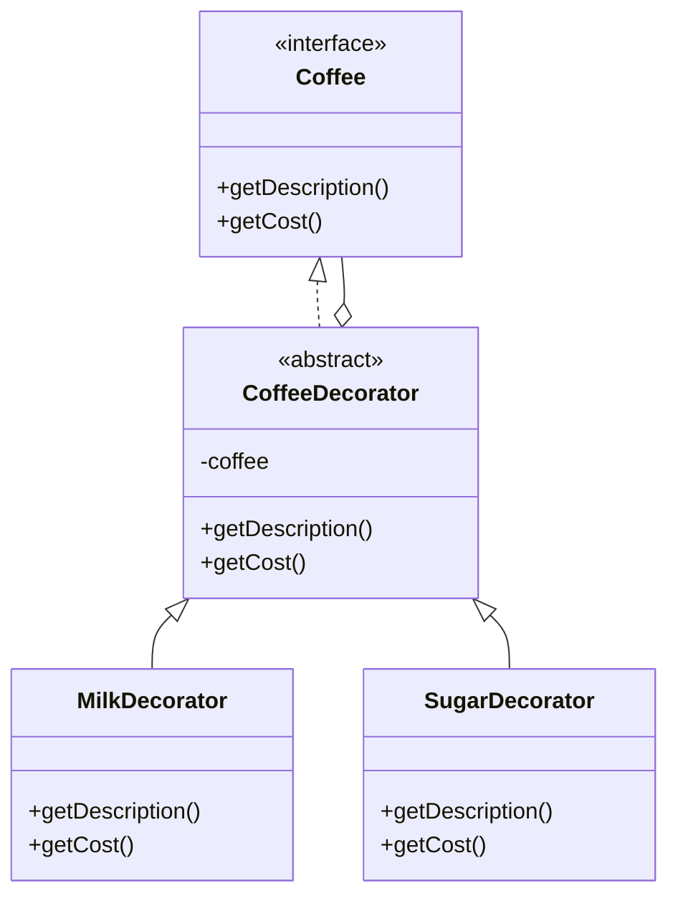
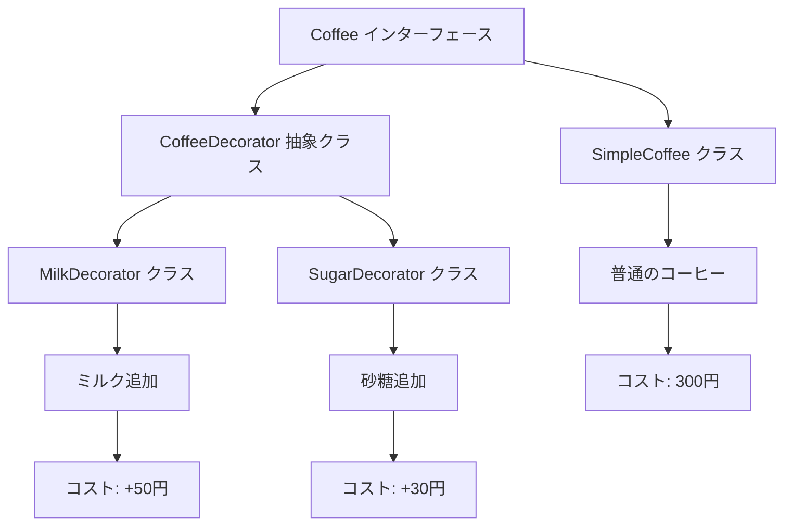

# **Decoratorパターン とは？**

## **一言で言うと、**

既存のオブジェクトに新しい機能を動的に追加するパターンです。

## **詳しく言うと、**

Decoratorパターンは、オブジェクトにいろいろな飾りをつけるようなものです。例えば、クリスマスツリーを飾るときに、最初は普通の木だけど、電球やオーナメントを追加していくことで、どんどんきれいになっていくイメージです。同じように、プログラムでも基本的な機能を持つオブジェクトに、新しい機能を次々と追加していくことができます。

# **日常での具体例**

**クリスマスツリーの飾り付け**

クリスマスツリーの基本構成は以下のような形式になります。
- 基本コンポーネント: 飾りが何もついていないシンプルなクリスマスツリー。
- 装飾（デコレーター）: ライトやオーナメント、リボン、星などの飾り。
- 装飾の組み合わせ: 飾りを一つずつ追加していくことで、ツリーの見た目や機能を動的に変化させることができる。

このようにクリスマスツリーは「基本のオブジェクトに対して、柔軟で独立した形で新しい機能を追加する」というDecoratorパターンの考え方が適用できます。


   

# **Decoratorパターンのメリット**

## 1. 柔軟性が高い
新しい機能を簡単に追加できるため、システムの拡張が容易です。
例: コーヒーショップのアプリで、新しいトッピングを追加する際に、既存のコードを変更せずに新しいDecoratorクラスを作成するだけで対応できます。

## 2. 単一責任の原則を守れる
各Decoratorクラスが特定の機能に集中するため、コードの管理がしやすくなります。
例: ログ機能、暗号化機能、圧縮機能など、それぞれを別々のDecoratorクラスとして実装できます。

# **Decoratorパターンのデメリット**

## 1. 小さなクラスが多くなる
機能ごとに新しいクラスを作成するため、クラスの数が増えてしまいます。
例: コーヒーショップのアプリで、ミルク、砂糖、シロップなど、トッピングの種類が増えるたびに新しいクラスが必要になります。

## 2. コードが複雑になる可能性がある
Decoratorを重ねすぎると、オブジェクトの構造が分かりにくくなることがあります。
例: `new MilkDecorator(new SugarDecorator(new SyrupDecorator(new SimpleCoffee())))` のように、多くのDecoratorを組み合わせると可読性が低下します。


# typescriptの`@` (デコレーター)との関係
TypeScriptのデコレーターは、クラスやメソッド、プロパティ、パラメーターに付与して、それらの動作を修飾するための構文です。
デコレーターパターンを簡略化して提供する機能です。


デコレーター構文の例
```typescript
function Log(target: any, propertyKey?: string, descriptor?: PropertyDescriptor) {
    console.log(`Log: ${propertyKey}`);
}

class Example {
    @Log
    sayHello() {
        console.log("Hello, world!");
    }
}

const example = new Example();
example.sayHello();
// Output:
// Log: sayHello
// Hello, world!

```

# デコレーターパターンとの関係性

### 1. 目的の共通点
デコレーターパターン: オブジェクトに新しい振る舞いを動的に追加。
TypeScriptのデコレーター: クラスやそのメンバーに動的に機能を追加。

### 2. 適用方法の違い
デコレーターパターン: 明示的にデコレータークラスや関数を使用して対象を修飾。
TypeScriptのデコレーター: @デコレーター構文を使い、シンプルに適用可能。

### 3. 拡張性
TypeScriptのデコレーターは、メタプログラミング的な操作（クラスやメソッドのメタデータを操作するなど）にも対応可能で、さらに柔軟です。


# **Decoratorパターンをコードで説明**

### 今回、想定するケース

コーヒーショップで、基本のコーヒーにトッピングを追加していくシステムを考えます。

## **クラス図**



## サンプルコード

```typescript
interface Coffee {
  getDescription(): string;
  getCost(): number;
}

class SimpleCoffee implements Coffee {
  getDescription(): string {
    return "普通のコーヒー";
  }
  getCost(): number {
    return 300;
  }
}

abstract class CoffeeDecorator implements Coffee {
  protected coffee: Coffee;

  constructor(coffee: Coffee) {
    this.coffee = coffee;
  }

  getDescription(): string {
    return this.coffee.getDescription();
  }

  getCost(): number {
    return this.coffee.getCost();
  }
}

class MilkDecorator extends CoffeeDecorator {
  getDescription(): string {
    return this.coffee.getDescription() + "、ミルク追加";
  }
  getCost(): number {
    return this.coffee.getCost() + 50;
  }
}

class SugarDecorator extends CoffeeDecorator {
  getDescription(): string {
    return this.coffee.getDescription() + "、砂糖追加";
  }
  getCost(): number {
    return this.coffee.getCost() + 30;
  }
}

// 使用例
const simpleCoffee = new SimpleCoffee();
console.log(simpleCoffee.getDescription() + ": " + simpleCoffee.getCost() + "円");

const milkCoffee = new MilkDecorator(simpleCoffee);
console.log(milkCoffee.getDescription() + ": " + milkCoffee.getCost() + "円");

const sweetMilkCoffee = new SugarDecorator(milkCoffee);
console.log(sweetMilkCoffee.getDescription() + ": " + sweetMilkCoffee.getCost() + "円");
```

# フローチャート



## **コードの解説**

### 1. **`Coffee`インターフェース**
```typescript
interface Coffee {
  getDescription(): string;
  getCost(): number;
}
```
- コーヒーを表す基本的なインターフェースです。
- 2つのメソッドを定義しています：
  - `getDescription`: コーヒーの説明（例えば「普通のコーヒー」など）を返す。
  - `getCost`: コーヒーの価格を返す。

### 2. **`SimpleCoffee`クラス**
```typescript
class SimpleCoffee implements Coffee {
  getDescription(): string {
    return "普通のコーヒー";
  }
  getCost(): number {
    return 300;
  }
}
```
- `Coffee`インターフェースを実装した具体的なコーヒーのクラスです。
- シンプルなコーヒー（何も追加していない状態）の説明と価格を提供します。

### 3. **`CoffeeDecorator` 抽象クラス**
```typescript
abstract class CoffeeDecorator implements Coffee {
  protected coffee: Coffee;

  constructor(coffee: Coffee) {
    this.coffee = coffee;
  }

  getDescription(): string {
    return this.coffee.getDescription();
  }

  getCost(): number {
    return this.coffee.getCost();
  }
}
```
- デコレーターパターンの基底クラスです。
- 他のデコレーター（追加機能を持つクラス）を作る際に共通のロジックを提供します。
- このクラス自体は直接使われず、サブクラスとして機能を追加します。
- **重要ポイント**：
  - `protected coffee: Coffee` により、デコレーターは他の`Coffee`オブジェクトをラップ（包む）します。
  - デフォルトでラップしているオブジェクト（`coffee`）のメソッドをそのまま呼び出します。

### 4. **`MilkDecorator` クラス**
```typescript
class MilkDecorator extends CoffeeDecorator {
  getDescription(): string {
    return this.coffee.getDescription() + "、ミルク追加";
  }
  getCost(): number {
    return this.coffee.getCost() + 50;
  }
}
```
- デコレーターパターンの1つの実装です。
- コーヒーに「ミルク追加」の説明を付加し、価格に50円を加算します。

### 5. **`SugarDecorator` クラス**
```typescript
class SugarDecorator extends CoffeeDecorator {
  getDescription(): string {
    return this.coffee.getDescription() + "、砂糖追加";
  }
  getCost(): number {
    return this.coffee.getCost() + 30;
  }
}
```
- もう1つのデコレーターパターンの実装です。
- コーヒーに「砂糖追加」の説明を付加し、価格に30円を加算します。

### 6. **使用例**
```typescript
const simpleCoffee = new SimpleCoffee();
console.log(simpleCoffee.getDescription() + ": " + simpleCoffee.getCost() + "円");

const milkCoffee = new MilkDecorator(simpleCoffee);
console.log(milkCoffee.getDescription() + ": " + milkCoffee.getCost() + "円");

const sweetMilkCoffee = new SugarDecorator(milkCoffee);
console.log(sweetMilkCoffee.getDescription() + ": " + sweetMilkCoffee.getCost() + "円");
```

- **`SimpleCoffee` オブジェクトの作成**:
  ```typescript
  const simpleCoffee = new SimpleCoffee();
  console.log(simpleCoffee.getDescription() + ": " + simpleCoffee.getCost() + "円");
  ```
  - 結果:  
    ```
    普通のコーヒー: 300円
    ```

- **ミルク追加のデコレーターを使用**:
  ```typescript
  const milkCoffee = new MilkDecorator(simpleCoffee);
  console.log(milkCoffee.getDescription() + ": " + milkCoffee.getCost() + "円");
  ```
  - `SimpleCoffee`に「ミルク」を追加。
  - 結果:
    ```
    普通のコーヒー、ミルク追加: 350円
    ```

- **さらに砂糖を追加**:
  ```typescript
  const sweetMilkCoffee = new SugarDecorator(milkCoffee);
  console.log(sweetMilkCoffee.getDescription() + ": " + sweetMilkCoffee.getCost() + "円");
  ```
  - ミルク付きコーヒーに「砂糖」を追加。
  - 結果:
    ```
    普通のコーヒー、ミルク追加、砂糖追加: 380円
    ```

### **ポイント**
1. **柔軟性**: デコレーターパターンにより、既存のコードを変更せずに動的に新しい機能を追加可能。
2. **組み合わせ自由**: 複数のデコレーターを順に適用することで、複雑な組み合わせを作れる。
3. **オープン/クローズド原則に従う**: 新しいデコレーターを作ることで機能を拡張できるが、既存のクラスには手を加えない。


# **Decoratorパターンが用いられるケース**

 
### 機能の動的な追加が必要な場合
具体例: テキストエディタで、基本的なテキスト編集機能に加えて、スペルチェック、自動保存、行番号表示などの機能を必要に応じて追加できるようにする。


### 継承を使わずに機能拡張をしたい場合
具体例: JavaのI/Oストリームクラス。`FileInputStream`に`BufferedInputStream`や`DataInputStream`などのデコレータを重ねることで、様々な機能を持つストリームを作成できる。

# まとめ

Decoratorパターンは、オブジェクトに新しい機能を柔軟に追加するための強力なツールです。基本的な機能を持つクラスを作成し、それに様々な「装飾」を加えていくことで、複雑な機能を持つオブジェクトを作り上げることができます。このパターンを使うことで、コードの再利用性が高まり、新しい機能の追加が容易になります。ただし、デコレータを過剰に使用すると、コードが複雑になる可能性があるので注意が必要です。

# 参考サイト

https://refactoring.guru/ja/design-patterns/decorator

https://www.techscore.com/tech/DesignPattern/Decorator.html/

