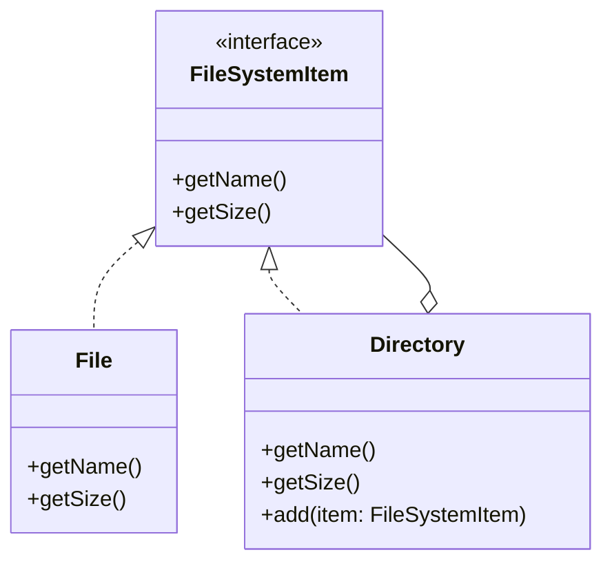

# **Compositeパターン とは？**

## **一言で言うと、**

木構造のオブジェクトを統一的に扱うためのパターンです。

## **詳しく言うと、**

Compositeパターンは、大きな箱の中に小さな箱や物を入れるような構造を作るときに使います。大きな箱も小さな箱も同じように扱えるので、中身を気にせずに操作できます。例えば、フォルダの中にファイルやフォルダを入れるような仕組みを簡単に作れます。

# **日常での具体例**

**組織図**
会社の組織図では、部署の中に小さな部署や個人が含まれています。どの階層でも同じように「人数を数える」といった操作ができます。


# **Compositeパターンのメリット**

## 1. 統一的な扱い
説明: 枝（複合オブジェクト）も葉（単一オブジェクト）も同じように扱えます。
例: フォルダもファイルも同じように「名前を取得する」「サイズを計算する」といった操作ができます。

## 2. 拡張性が高い
説明: 新しい種類のオブジェクトを追加しやすいです。
例: ファイルシステムに新しい種類のファイル（例：ショートカット）を追加する際、既存のコードを変更せずに追加できます。

# **Compositeパターンのデメリット**

## 1. 設計が複雑になる可能性
説明: 共通のインターフェースを設計するのが難しい場合があります。
例: ファイルとフォルダで共通の操作を定義するのが難しい場合があります。

## 2. パフォーマンスの問題
説明: 深い階層構造の場合、処理に時間がかかる可能性があります。
例: フォルダの中に多数のフォルダが入れ子になっている場合、サイズ計算に時間がかかります。

# **Compositeパターンをコードで説明**

### 今回、想定するケース
ファイルシステムを模したシンプルな構造を作ります。ファイルとディレクトリを同じように扱えるようにします。

最終的に以下のようなディレクトリ構成が出来上がります。
```plaintext
ルート/
├── ドキュメント/
│   └── レポート.txt (100バイト)
└── 写真.jpg (2000バイト)
```

## **クラス図**



## サンプルコード

```typescript
interface FileSystemItem {
  getName(): string;
  getSize(): number;
}

class File implements FileSystemItem {
  constructor(private name: string, private size: number) {}

  getName(): string {
    return this.name;
  }

  getSize(): number {
    return this.size;
  }
}

class Directory implements FileSystemItem {
  private children: FileSystemItem[] = [];

  constructor(private name: string) {}

  getName(): string {
    return this.name;
  }

  getSize(): number {
    return this.children.reduce((total, item) => total + item.getSize(), 0);
  }

  add(item: FileSystemItem): void {
    this.children.push(item);
  }
}

// 使用例
const root = new Directory("ルート");
const docs = new Directory("ドキュメント");
const file1 = new File("レポート.txt", 100);
const file2 = new File("写真.jpg", 2000);

root.add(docs);
root.add(file2);
docs.add(file1);

console.log(`${root.getName()}のサイズ: ${root.getSize()}バイト`);
console.log(`${docs.getName()}のサイズ: ${docs.getSize()}バイト`);
```

## **コードの解説**

### 1. FileSystemItemインターフェース:
   ```typescript
   interface FileSystemItem {
     getName(): string;
     getSize(): number;
   }
   ```
   これはファイルとディレクトリの共通インターフェースです。名前とサイズを取得するメソッドを定義しています。

### 2. Fileクラス:
   ```typescript
   class File implements FileSystemItem {
     constructor(private name: string, private size: number) {}
     // ... メソッドの実装
   }
   ```
   ファイルを表すクラスです。名前とサイズを持ち、インターフェースのメソッドを実装しています。

### 3. Directoryクラス:
   ```typescript
   class Directory implements FileSystemItem {
     private children: FileSystemItem[] = [];
     // ... コンストラクタとメソッドの実装
   }
   ```
   ディレクトリを表すクラスです。子要素（ファイルやディレクトリ）を配列で持ちます。getSizeメソッドでは、すべての子要素のサイズを合計して返します。

# **Compositeパターンが用いられるケース**

**GUIのウィジェット設計**
具体例: ボタンや入力フィールドなどの単純な要素と、それらを含むパネルやウィンドウを同じように扱えるようにする。


# まとめ

Compositeパターンは、木構造を持つオブジェクトを扱う際に非常に便利です。単純なオブジェクトと複合オブジェクトを同じように扱えるため、コードがシンプルになり、拡張性も高くなります。ただし、共通インターフェースの設計には注意が必要で、適切な使用場面を見極めることが大切です。

# 参考サイト

https://note.com/kokemori_trip/n/n2947ab922fe2

https://xexeq.jp/blogs/media/it-glossary983#google_vignette
