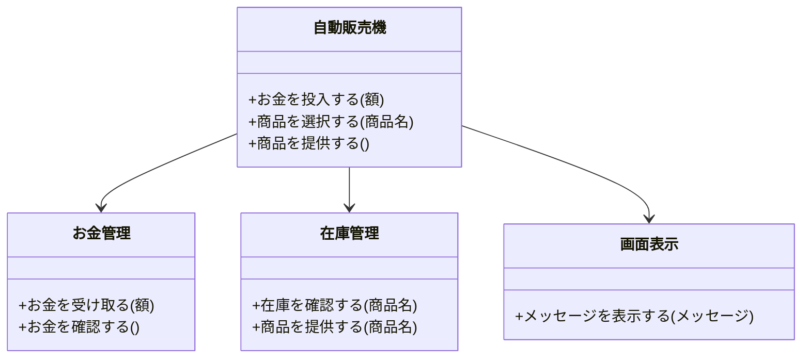
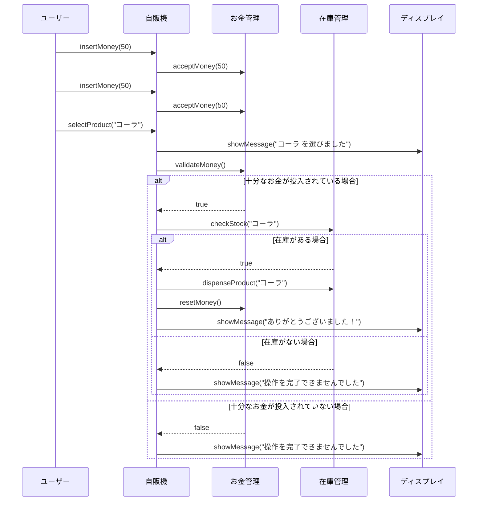

# **Facadeパターンとは？**

## **一言で言うと、**

複雑な仕組みをシンプルな窓口(インターフェース)で扱えるようにするデザインパターンです。

## **詳しく言うと、**
Facade（ファサード）とは、フランス語で「正面」「窓口」という意味の単語です。
たくさんの部品がある複雑なシステムを、簡単な操作で動かせるようにする仕組みです。難しいことは裏でやってくれて、表側は「これを押せば全部動くよ！」みたいな感じです。

# **日常での具体例**
 **自動販売機**
お金を入れてボタンを押すだけで飲み物が出てきますが、内部ではお金を数えたり、在庫を確認したりしています。


# **Facadeパターンのメリット**

1. **使いやすくなる**
ユーザーが複雑な仕組みを意識せずに使えるようになります。
   - 例: テレビのリモコンで「音量を上げる」ボタンを押すだけで音量が上がる。

2. **システムの変更に強い**
内部の部品を変更しても、窓口の仕組みを保てば影響が少ないです。
   - 例: テレビの内部パーツを最新モデルに変えても、リモコンの操作方法は同じ。


# **Facadeパターンのデメリット**

1. **シンプルさの裏で複雑さが隠れる**
表面が簡単になる代わりに、裏の仕組みが複雑になることがあります。
   - 例: 自動販売機が壊れた場合、内部の仕組みが理解できないと直せない。

2. **拡張性が落ちることがある**
窓口を作ることで、個別の部品を直接操作しにくくなる場合があります。
   - 例: テレビのリモコンでは細かい設定ができない場合がある。

# **Facadeパターンをコードで説明**

### 今回、想定するケース
以下は、自動販売機を題材にした **Facadeパターン** の例です。

## **クラス図**



## **サンプルコード**

```typescript
// お金の管理をするクラス
class MoneyHandler {
  private insertedAmount: number = 0;

  acceptMoney(amount: number) {
    this.insertedAmount += amount;
    console.log(`¥${amount} を受け取りました。現在の合計: ¥${this.insertedAmount}`);
  }

  validateMoney(): boolean {
    if (this.insertedAmount >= 100) {
      console.log("十分なお金が投入されています。");
      return true;
    } else {
      console.log("お金が不足しています。");
      return false;
    }
  }

  resetMoney() {
    this.insertedAmount = 0;
  }
}

// 在庫を管理するクラス
class InventoryManager {
  private inventory: { [key: string]: number } = {
    "コーラ": 5,
    "お茶": 3,
    "水": 2,
  };

  checkStock(productName: string): boolean {
    if (this.inventory[productName] && this.inventory[productName] > 0) {
      console.log(`${productName} の在庫があります。`);
      return true;
    } else {
      console.log(`${productName} は在庫切れです。`);
      return false;
    }
  }

  dispenseProduct(productName: string) {
    if (this.inventory[productName] > 0) {
      this.inventory[productName]--;
      console.log(`${productName} を出しました。残り在庫: ${this.inventory[productName]}`);
    }
  }
}

// ディスプレイ用のクラス
class Display {
  showMessage(message: string) {
    console.log(`ディスプレイ: ${message}`);
  }
}

// Facadeクラス
class VendingMachineFacade {
  private moneyHandler: MoneyHandler;
  private inventoryManager: InventoryManager;
  private display: Display;

  constructor() {
    this.moneyHandler = new MoneyHandler();
    this.inventoryManager = new InventoryManager();
    this.display = new Display();
  }

  insertMoney(amount: number) {
    this.moneyHandler.acceptMoney(amount);
  }

  selectProduct(productName: string) {
    this.display.showMessage(`${productName} を選びました。`);

    if (this.moneyHandler.validateMoney() && this.inventoryManager.checkStock(productName)) {
      this.inventoryManager.dispenseProduct(productName);
      this.moneyHandler.resetMoney();
      this.display.showMessage("ありがとうございました！");
    } else {
      this.display.showMessage("操作を完了できませんでした。");
    }
  }
}

// 使用例
const vendingMachine = new VendingMachineFacade();

// お金を入れて商品を購入する例
vendingMachine.insertMoney(50);
vendingMachine.insertMoney(50);
vendingMachine.selectProduct("コーラ");

vendingMachine.insertMoney(100);
vendingMachine.selectProduct("お茶");

vendingMachine.insertMoney(100);
vendingMachine.selectProduct("水");
```



## **コードの解説**

### **1. クラスごとの役割を解説**

#### **MoneyHandlerクラス**
お金の管理を担当します。
- `insertedAmount`:
  - 現在投入されているお金の合計金額を記録するプライベート変数。
- `acceptMoney(amount: number)`:
  - 投入された金額を`insertedAmount`に加算し、現在の合計金額を表示。
- `validateMoney()`:
  - `insertedAmount`が100円以上かどうかをチェックし、十分なら`true`、不足していれば`false`を返す。
- `resetMoney()`:
  - `insertedAmount`を0にリセット。

#### **InventoryManagerクラス**
在庫の管理を担当します。
- `inventory`:
  - 商品名をキー、在庫数を値とするオブジェクト。初期在庫は「コーラ: 5本、お茶: 3本、水: 2本」。
- `checkStock(productName: string)`:
  - 指定された商品が在庫に存在し、かつ在庫数が1以上なら`true`を返す。在庫切れの場合は`false`を返す。
- `dispenseProduct(productName: string)`:
  - 指定された商品の在庫数を1減らし、残り在庫数を表示。

#### **Displayクラス**
ディスプレイ表示を担当します。
- `showMessage(message: string)`:
  - 指定されたメッセージをコンソールに表示。

#### **VendingMachineFacadeクラス**
Facade（統一インターフェース）としての役割を担い、内部の複数のクラスを一元管理します。
- コンストラクタ:
  - `MoneyHandler`、`InventoryManager`、`Display`のインスタンスを生成。
- `insertMoney(amount: number)`:
  - MoneyHandlerの`acceptMoney`メソッドを呼び出してお金を投入。
- `selectProduct(productName: string)`:
  - 商品を選択し、次の手順を実行:
    1. Displayで選択した商品名を表示。
    2. `MoneyHandler`の`validateMoney`でお金が十分か確認。
    3. `InventoryManager`の`checkStock`で在庫があるか確認。
    4. 両方が`true`なら:
       - 商品を出す。
       - お金をリセット。
       - "ありがとうございました！"と表示。
    5. どちらかが`false`なら:
       - "操作を完了できませんでした。"と表示。

### **2. 使用例**

#### **ケース1: コーラ購入**
```typescript
vendingMachine.insertMoney(50); // ¥50 を投入
vendingMachine.insertMoney(50); // ¥50 を追加投入（合計¥100）
vendingMachine.selectProduct("コーラ"); // コーラを選択
```
1. 合計¥100が投入され、`validateMoney`は`true`。
2. コーラの在庫が確認され、在庫があるため`checkStock`は`true`。
3. コーラが出され、`insertedAmount`はリセットされる。
4. "ありがとうございました！"が表示。

#### **ケース2: お茶購入**
```typescript
vendingMachine.insertMoney(100); // ¥100 を投入
vendingMachine.selectProduct("お茶"); // お茶を選択
```
1. ¥100が投入され、`validateMoney`は`true`。
2. お茶の在庫が確認され、在庫があるため`checkStock`は`true`。
3. お茶が出され、`insertedAmount`はリセットされる。
4. "ありがとうございました！"が表示。

#### **ケース3: 水購入**
```typescript
vendingMachine.insertMoney(100); // ¥100 を投入
vendingMachine.selectProduct("水"); // 水を選択
```
1. ¥100が投入され、`validateMoney`は`true`。
2. 水の在庫が確認され、在庫があるため`checkStock`は`true`。
3. 水が出され、`insertedAmount`はリセットされる。
4. "ありがとうございました！"が表示。


# **Facadeパターンが用いられるケース**

1. **複雑なシステムを簡単に使いたい場合**
   - ケース: ソフトウェアの内部が複雑でも、ユーザーにはシンプルなインターフェースを提供したい。
   - 具体例: ゲームエンジンで、「キャラクターを動かす」という簡単なコマンドで内部の物理演算を隠す。

2. **複数の部品を一括管理したい場合**
   - ケース: 複数のコンポーネントをまとめて扱いたい。
   - 具体例: 家のスマートデバイスをアプリで一括操作する。

# まとめ

Facadeパターンは、「複雑なものをシンプルに操作する」ための便利な仕組みです。ただし、内部の複雑さが隠れるので、仕組みを理解しておくことも大切です。

# 参考サイト

- [Zenn - Pythonでデザインパターンを学ぼう (Facade)](https://zenn.dev/shimakaze_soft/articles/dfff44831193c8)
- [TECHSCORE - Facadeパターン](https://www.techscore.com/tech/DesignPattern/Facade)
- [Qiita - 知っておいたほうが良いデザインパターン5つin TypeScript](https://qiita.com/miruon/items/b735ec146a6c68597e8f)
- [Refactoring.Guru - Facade](https://refactoring.guru/design-patterns/facade)
