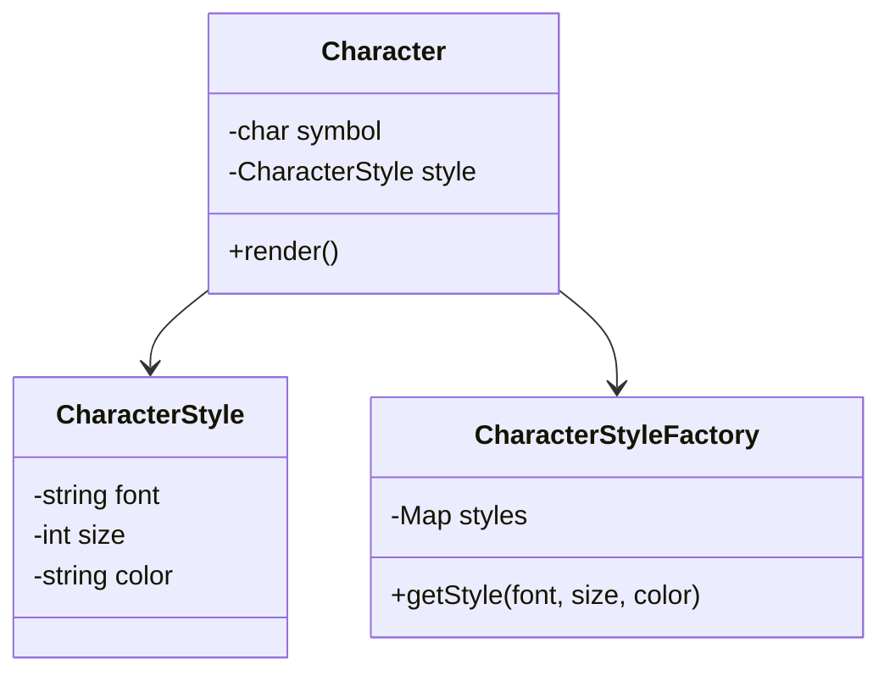

# **Flyweightパターン とは？**

## **一言で言うと、**

オブジェクトを共有して、**メモリ使用量を減らす**パターンです。

## **詳しく言うと、**

たくさんの似たようなものを作るとき、同じ部分は一つだけ作って、みんなで共有することで、メモリを節約するやり方です。例えば、同じ絵本をたくさんの子供たちで共有するようなイメージです。

# **日常での具体例**

**図書館**

同じ本を複数の人が借りて読むことができます。本自体は1冊しかありませんが、多くの人が共有して使用します。


# **Flyweightパターンのメリット**

1. メモリ使用量の削減
同じデータを共有することで、全体のメモリ使用量を減らすことができます。
例: 1000人のユーザーが同じアイコン画像を使う場合、1つの画像データを共有することで、1000個分のメモリを節約できます。

2. パフォーマンスの向上
オブジェクトの作成回数が減るため、システム全体の速度が向上します。
例: ゲームで同じ木のオブジェクトを100回作る代わりに1回だけ作って共有すると、ゲームの動作が速くなります。

# **Flyweightパターンのデメリット**

1. 実装の複雑さ
共有オブジェクトを管理するための仕組みが必要になり、コードが複雑になる可能性があります。
例: 共有オブジェクトを管理するためのFactoryクラスを作成する必要があり、初心者には理解しづらくなることがあります。

2. 状態管理の難しさ
共有オブジェクトの状態を変更すると、それを使用しているすべての箇所に影響が出る可能性があります。
例: 共有している木のオブジェクトの色を変更すると、ゲーム内のすべての木の色が変わってしまいます。

# 他のデザインパターンとの関連性

- Factoryパターン：Flyweightオブジェクトを作成・管理するのによく使われます。
- Singletonパターン：Flyweightファクトリー自体をSingletonとして実装することがあります。
- Compositeパターン：複雑なオブジェクト構造の中で、Flyweightを使って部分的に最適化することがあります。

Flyweightパターンが「時代遅れ」と言われるかどうかは文脈によります。このパターンは、オブジェクトのメモリ使用量を抑え、大量のオブジェクトを効率的に管理するためのデザインパターンです。以下に、その現状について解説します。

---

### **Flyweightパターンの基本的な役割**
1. **共有可能な状態（Intrinsic State）**: オブジェクト間で共有される不変のデータ。
2. **個別の状態（Extrinsic State）**: オブジェクトごとに異なる一時的なデータ。

これにより、同じようなデータを繰り返し作成することなく、同じインスタンスを共有してメモリ効率を高める設計を実現します。

### **Flyweightパターンは時代遅れ？**

以下の理由でFlyweightパターンは時代遅れだと批判されることがよくあります。

1. **モダンなハードウェアの進化**
   - メモリ容量や処理速度の劇的な向上により、Flyweightパターンを使うことで節約できるリソースが以前ほど重要視されなくなった。
   - メモリ効率を最大化することよりも、シンプルなコードや開発スピードが重視される場合が多い。

2. **新しい技術とデータ管理の登場**
   - Flyweightが特に役立つのは、大量の類似オブジェクトを効率的に管理する場合ですが、モダンなデータ処理フレームワークやキャッシュ戦略（Redisなど）の台頭により、Flyweightの必要性が薄れる場面がある。

### **Flyweightパターンが依然として有用な場合**

1. **ゲーム開発**
   - ゲームでのパーティクルシステム、地形のタイルデータ、NPCのステータス共有など、大量の同じようなデータを持つオブジェクトに適用可能。
   - 例: 森の中の「木」オブジェクトを共有する。

2. **Webアプリケーションの最適化**
   - Flyweightの概念は、ReactやVue.jsのようなライブラリにおける仮想DOMの差分更新に近い形で利用されることもある。

### **Flyweightパターンの現代的な代替案**

1. **キャッシュ**
   - RedisやMemcachedのような分散キャッシュシステムを活用することで、同じデータを効率的に再利用できる。

2. **関数型プログラミング**
   - 関数型プログラミングの不変性の特性は、Flyweightが求める「共有可能な状態」に近い設計を提供する。

Flyweightパターンそのものは時代遅れではありませんが、適用されるケースが限定的になっているのは事実です。現代の開発環境では、より効率的でメンテナンス性の高い方法が選ばれることが多いため、Flyweightパターンが以前ほど広く使われなくなったという見方もできます。

ただし、メモリ効率が重要な特殊なシナリオでは、Flyweightパターンが依然として有用であり、他の設計手法では得られない効果を発揮する場面もあります。

# **Flyweightパターンをコードで説明**

### 今回、想定するケース

文字のスタイル（フォント、サイズ、色）を共有して、テキストエディタのメモリ使用量を最適化する場合を考えます。

## **クラス図**



## サンプルコード

```typescript
class CharacterStyle {
    constructor(
        private font: string,
        private size: number,
        private color: string
    ) {}

    render() {
        console.log(`文字スタイル: ${this.font}, ${this.size}pt, ${this.color}`);
    }
}

class CharacterStyleFactory {
    private styles: Map<string, CharacterStyle> = new Map();

    getStyle(font: string, size: number, color: string): CharacterStyle {
        const key = `${font}-${size}-${color}`;
        if (!this.styles.has(key)) {
            this.styles.set(key, new CharacterStyle(font, size, color));
        }
        return this.styles.get(key)!;
    }
}

class Character {
    constructor(
        private symbol: string,
        private style: CharacterStyle
    ) {}

    render() {
        console.log(`文字: ${this.symbol}`);
        this.style.render();
    }
}

// 使用例
const factory = new CharacterStyleFactory();
const style1 = factory.getStyle("Arial", 12, "black");
const style2 = factory.getStyle("Arial", 12, "black");

const char1 = new Character("A", style1);
const char2 = new Character("B", style2);

char1.render();
char2.render();

console.log("style1とstyle2は同じオブジェクトか:", style1 === style2);
```

## **コードの解説**

1. CharacterStyle クラス
   - 文字のスタイル（フォント、サイズ、色）を表現します。
   - `render` メソッドでスタイル情報を表示します。

2. CharacterStyleFactory クラス
   - Flyweightオブジェクト（CharacterStyle）を管理します。
   - `getStyle` メソッドで既存のスタイルを返すか、新しいスタイルを作成します。

3. Character クラス
   - 実際の文字とそのスタイルを組み合わせたクラスです。
   - CharacterStyleを共有することで、メモリを節約します。

4. 使用例
   - 同じスタイルの文字を2つ作成し、スタイルオブジェクトが共有されていることを確認します。

# **Flyweightパターンが用いられるケース**

1. 大量のオブジェクトを扱う場合
ケース: テキストエディタやワードプロセッサ
具体例: 文書内の各文字に対して、フォントやスタイルの情報を効率的に管理する。

2. グラフィックス処理
ケース: ゲームや3Dモデリングソフトウェア
具体例: 同じテクスチャや3Dモデルを多数のオブジェクトで共有して、メモリ使用量を削減する。

# まとめ

Flyweightパターンは、同じデータを共有することでメモリ使用量を減らし、システムのパフォーマンスを向上させる強力なツールです。大量のオブジェクトを扱う場合に特に有効ですが、実装の複雑さや状態管理の難しさにも注意が必要です。適切な場面で使用することで、効率的なプログラム設計が可能になります。

# 参考サイト

- [Refactoring Guru - Flyweight](https://refactoring.guru/design-patterns/flyweight)
- [SourceMaking - Flyweight Pattern](https://sourcemaking.com/design_patterns/flyweight)
- [Wikipedia - Flyweight pattern](https://en.wikipedia.org/wiki/Flyweight_pattern)
