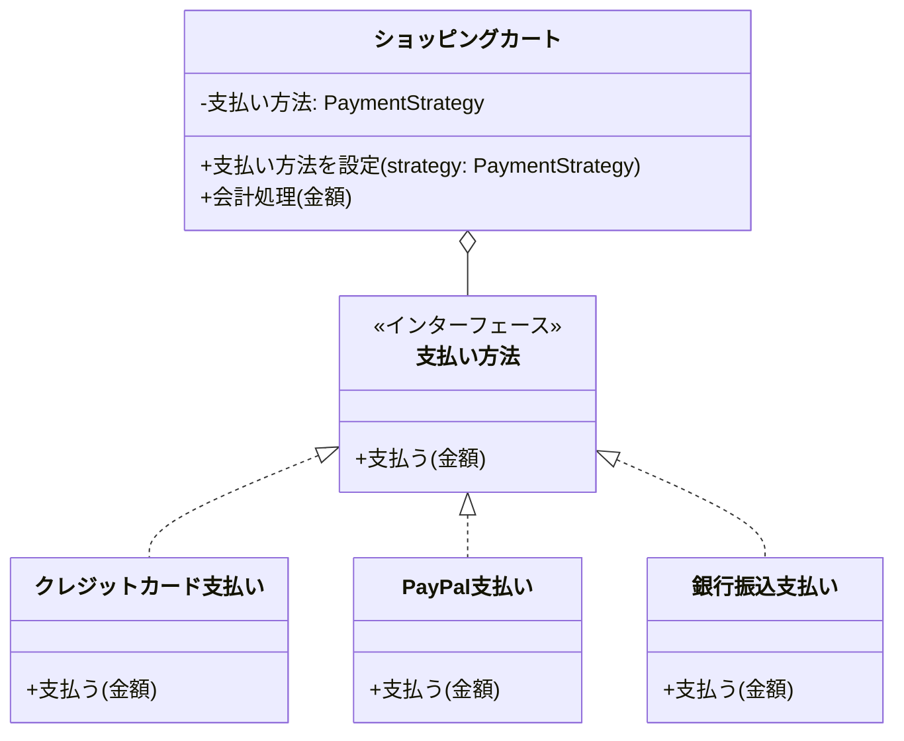
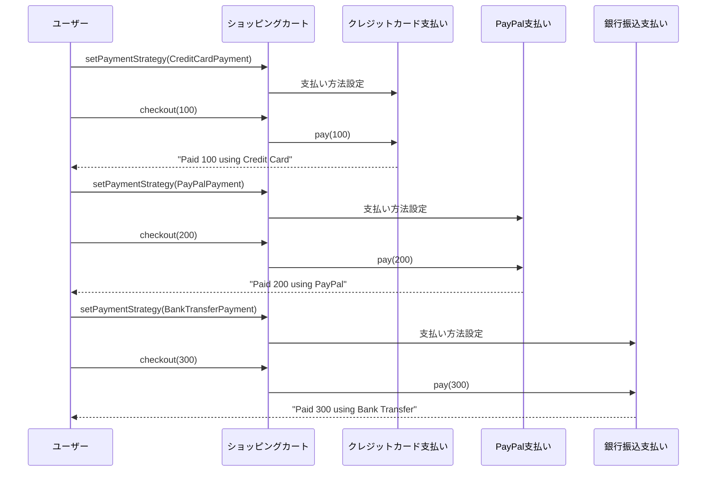

# **Strategyパターン とは？**

## **一言で言うと、**

アルゴリズムを簡単に切り替えられるようにするパターン

## **詳しく言うと、**

Strategyパターンは、似たような動作をするけど少しずつ違う方法（アルゴリズム）を、簡単に切り替えられるようにする方法です。例えば、同じ目的地に行くのに、車で行くか電車で行くか歩いて行くかを簡単に選べるようにするようなものです。これにより、プログラムの一部を変更したいときに、他の部分に影響を与えずに変更できるようになります。

# **日常での具体例**

**スマートフォンのナビゲーションアプリ**
目的地までの経路を計算するとき、「最短距離」「最短時間」「徒歩ルート」など、様々な方法（Strategy）があります。ユーザーは自分の好みや状況に応じて、これらの方法を簡単に切り替えることができます。これがStrategyパターンの考え方と同じです。


# **Strategyパターンのメリット**

## 1. 柔軟性の向上
アルゴリズムを簡単に追加・変更できるため、プログラムの柔軟性が高まります。
例: ナビアプリに「自転車ルート」という新しい経路計算方法を追加する場合、既存のコードを変更せずに新しいStrategyを追加するだけで済みます。

## 2. コードの再利用性の向上
同じアルゴリズム(Strategy)を異なる場面で再利用できます。
例: 「最短距離」の計算アルゴリズムを、車のナビゲーションだけでなく、配送ルートの最適化にも使用できます。

# **Strategyパターンのデメリット**

## 1. クラス数の増加
各Strategyごとに新しいクラスを作成するため、全体的なクラス数が増えます。
例: 経路計算の方法が10種類あれば、少なくとも10個のStrategyクラスが必要になります。

## 2. クライアントの複雑化
クライアント（Strategyを使う側）が、適切なStrategyを選択・設定する責任を負うため、クライアントのコードが複雑になる可能性があります。
例: ユーザーの設定や現在の交通状況に応じて、適切な経路計算方法を選択する処理が必要になります。

# **Strategyパターンをコードで説明**

### 今回、想定するケース

オンラインショッピングサイトの支払い方法を実装します。クレジットカード支払い、PayPal支払い、銀行振込の3つの支払い方法をStrategyパターンを使って実装します。

## **クラス図**



## サンプルコード

```typescript
interface PaymentStrategy {
  pay(amount: number): void;
}

class CreditCardPayment implements PaymentStrategy {
  pay(amount: number): void {
    console.log(`Paid ${amount} using Credit Card`);
  }
}

class PayPalPayment implements PaymentStrategy {
  pay(amount: number): void {
    console.log(`Paid ${amount} using PayPal`);
  }
}

class BankTransferPayment implements PaymentStrategy {
  pay(amount: number): void {
    console.log(`Paid ${amount} using Bank Transfer`);
  }
}

class ShoppingCart {
  private paymentStrategy: PaymentStrategy;

  setPaymentStrategy(strategy: PaymentStrategy): void {
    this.paymentStrategy = strategy;
  }

  checkout(amount: number): void {
    this.paymentStrategy.pay(amount);
  }
}

// 使用例
const cart = new ShoppingCart();

cart.setPaymentStrategy(new CreditCardPayment());
cart.checkout(100);

cart.setPaymentStrategy(new PayPalPayment());
cart.checkout(200);

cart.setPaymentStrategy(new BankTransferPayment());
cart.checkout(300);
```

## シーケンス図



## **コードの解説**

1. PaymentStrategy インターフェース:
   ```typescript
   interface PaymentStrategy {
     pay(amount: number): void;
   }
   ```
   これは支払い方法の共通インターフェースです。すべての具体的な支払い方法はこのインターフェースを実装します。

2. 具体的な支払い方法クラス:
   ```typescript
   class CreditCardPayment implements PaymentStrategy {
     pay(amount: number): void {
       console.log(`Paid ${amount} using Credit Card`);
     }
   }
   ```
   CreditCardPayment, PayPalPayment, BankTransferPaymentはそれぞれ具体的な支払い方法を実装しています。

3. ShoppingCart クラス:
   ```typescript
   class ShoppingCart {
     private paymentStrategy: PaymentStrategy;

     setPaymentStrategy(strategy: PaymentStrategy): void {
       this.paymentStrategy = strategy;
     }

     checkout(amount: number): void {
       this.paymentStrategy.pay(amount);
     }
   }
   ```
   ShoppingCartは支払い処理を行うクラスです。setPaymentStrategyメソッドで支払い方法を設定し、checkoutメソッドで実際の支払いを行います。

4. 使用例:
   ```typescript
   const cart = new ShoppingCart();
   cart.setPaymentStrategy(new CreditCardPayment());
   cart.checkout(100);
   ```
   ShoppingCartのインスタンスを作成し、支払い方法を設定してから、checkoutを呼び出しています。支払い方法を変更したい場合は、setPaymentStrategyで別の方法を設定するだけです。

# **Strategyパターンが用いられるケース**

## 1. アルゴリズムの切り替えが必要な場合
ケース: 同じ問題に対して複数の解決方法がある場合
具体例: 画像圧縮アルゴリズムの選択（高速だが品質が低い方法、遅いが高品質な方法など）

## 2. 条件分岐を減らしたい場合
ケース: 多くのif-else文やswitch文がある場合
具体例: ゲームのキャラクターの移動方法（歩く、走る、飛ぶなど）を実装する際に、各移動方法をStrategyとして実装することで、条件分岐を減らせます。

# まとめ

Strategyパターンは、アルゴリズムを簡単に切り替えられるようにするデザインパターンです。これにより、プログラムの柔軟性と再利用性が向上します。ただし、クラス数が増えるというデメリットもあります。適切な場面で使用することで、より保守性の高いコードを書くことができます。

# 参考サイト

https://refactoring.guru/ja/design-patterns/strategy

https://www.typescriptlang.org/docs/handbook/2/classes.html
