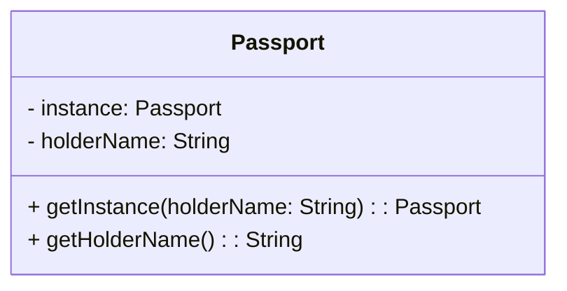
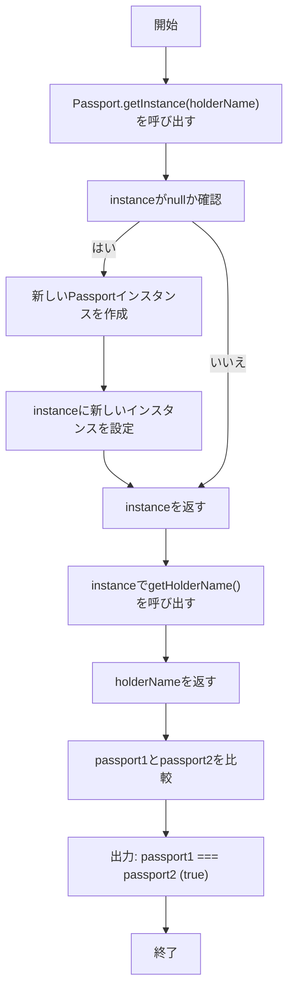

# **Singleton パターン とは？**

## **一言で言うと、**
「1つだけ存在する」ことを保証する仕組みです。

## **詳しく言うと、**
プログラムの中で「1つだけ存在してほしいもの（例えば設定情報やログ管理）」がある場合、その1つのインスタンスだけを使い回すための仕組みです。同じものを何度も作ると無駄が多くなるので、1つだけ作って、それをみんなで使うようにします。

# **日常での具体例**

**パスポート**

「必ず1人1冊だけ所有する」というルールにより、だれでも「あなたが誰なのか？」ということがパスポートを見るだけでわかるようになります


# **Singleton パターンのメリット**

1. **無駄なインスタンスを作らない**
   - 1つのインスタンスだけを使い続けるので、メモリや処理が効率的になります。
   - 例: ログを管理するクラスを毎回新しく作るのではなく、1つのログクラスを共有して使う。

2. **グローバルアクセスが可能**
   - 必要な場所から簡単に同じインスタンスにアクセスできます。
   - 例: アプリ全体で同じ設定情報を使いたい場合、毎回作らず、同じものを参照できる。

# **Singleton パターンのデメリット**

1. **テストが難しくなる**
   - インスタンスが固定されるため、テスト用に別のインスタンスを作ることが難しいです。
   - 例: テスト環境と本番環境で異なる設定を使いたい場合。

2. **不要な結合が生じる**
   - グローバルにアクセスできるため、依存関係が複雑になることがあります。
   - 例: 他のクラスがこのシングルトンに依存しすぎると、変更が難しくなる。

# **Singleton パターンをコードで説明**

### 今回、想定するケース

パスポートの情報を参照し、名前を取得する

## **クラス図**



## サンプルコード

```typescript
class Passport {
  private static instance: Passport | null = null;
  private holderName: string;

  private constructor(holderName: string) {
    this.holderName = holderName;
  }

  public static getInstance(holderName: string): Passport {
    if (this.instance === null) {
      this.instance = new Passport(holderName);
    }
    return this.instance;
  }

  public getHolderName(): string {
    return this.holderName;
  }
}

// パスポートの使用例
const passport1 = Passport.getInstance("Alice");
console.log(passport1.getHolderName()); // "Alice"

const passport2 = Passport.getInstance("Bob");
console.log(passport2.getHolderName()); // "Alice"

// passport1 と passport2 は同じインスタンス
console.log(passport1 === passport2); // true
```

## フローチャート図



## **コードの解説**

- `private static instance: Passport | null = null;`
Passport クラスの唯一のインスタンスを保存するための静的プロパティです。
静的なのでクラス全体で共有され、インスタンスが作られるのは最初の1回だけになります。

- `private constructor(holderName: string)`
コンストラクタを private にすることで、クラスの外部から new Passport() を直接呼び出してインスタンスを作ることを防ぎます。
インスタンスを作れるのはクラス内の getInstance メソッドだけになります。

- `public static getInstance(holderName: string): Passport`
Singleton パターンの中核となるメソッドです。このメソッドを使ってインスタンスを取得します。
ポイント:
初回呼び出し時に instance が null の場合、新しい Passport インスタンスを作成します。
2回目以降は既に作成済みの instance を返します。
holderName は最初の呼び出し時だけ使われ、その後は無視されます。

- `public getHolderName(): string`
インスタンスの所有者名（holderName）を返します。
holderName はインスタンス生成時に一度だけ設定されるため、その値が保持されます。

パスポートの使用例
- `const passport1 = Passport.getInstance("Alice");`
初めて getInstance を呼び出した時、instance が null なので、新しい Passport インスタンスが作成されます。
holderName が "Alice" に設定され、以降 instance に保存されます。

- `const passport2 = Passport.getInstance("Bob");`
2回目の getInstance 呼び出しでは、instance に既にインスタンスが存在しているため、新しいインスタンスは作られません。
holderName は最初に作成された "Alice" のままです。

- `console.log(passport1 === passport2);`
比較結果は true です。
passport1 と passport2 は同じ Passport インスタンスを参照しているため、完全に一致します。

# **Singleton パターンが用いられるケース**

1. **設定情報の管理**
   - ケース: アプリ全体で共有する設定情報を1か所にまとめたい。
   - 具体例: ゲームの設定画面でのテーマや音量。

2. **ログ管理**
   - ケース: アプリ全体でログを一元管理したい。
   - 具体例: サーバーへのエラーログ送信。

# まとめ
Singleton パターンは、「1つだけ存在するべきもの」を作るためのデザインパターンです。効率的ですが、テストや依存の管理には注意が必要です。

# 参考サイト
- [Singleton パターン - Wikipedia](https://ja.wikipedia.org/wiki/Singleton%E3%83%91%E3%82%BF%E3%83%BC%E3%83%B3)
- [Typescript Design Patterns](https://refactoring.guru/design-patterns/singleton)
