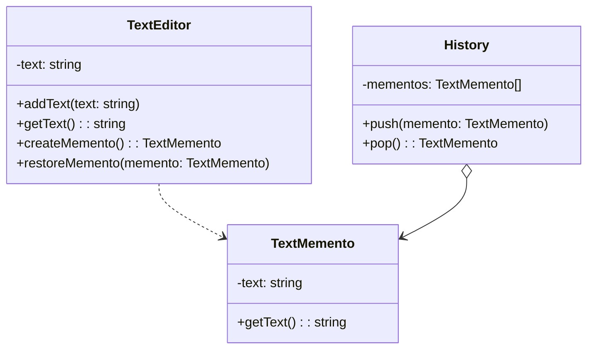
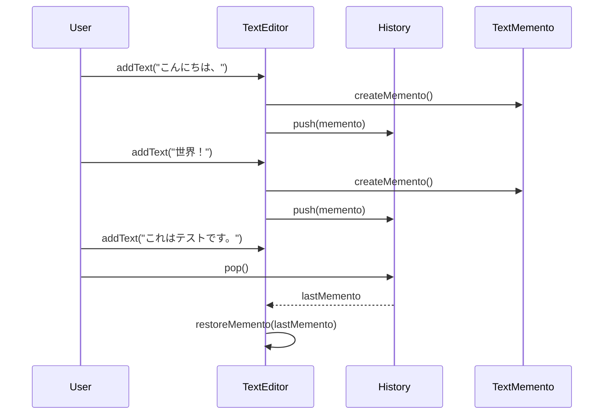

# Mementoパターン とは？

## 一言で言うと、

オブジェクトの状態を保存し、後で元に戻せるようにするパターンです。

## 詳しく言うと、

ゲームのセーブデータのように、あるものの今の状態を記録しておいて、後でその状態に戻せるようにする方法です。例えば、絵を描いているときに「今の絵の状態を覚えておきたい」と思ったら、その状態を記録しておき、後で「さっきの状態に戻したい」と思ったときに戻せるようにする仕組みです。

# 日常での具体例

**写真アルバム**
旅行中の様々な瞬間を写真に撮って保存し、後でその時の思い出を振り返ることができます。


# Mementoパターンのメリット

## 1. オブジェクトの内部構造を外部に公開せずに状態を保存
例: テキストエディタで、文書の内容だけでなく、カーソル位置やフォント設定なども含めて状態を保存できます。

## 2. 複数の状態を保存
例: グラフィックソフトで、作業の途中経過を複数保存しておき、好きな時点に戻って別の方向性で作業を進められます。

# Mementoパターンのデメリット

## 1. メモリ使用量が増加
例: ビデオ編集ソフトで、高解像度の動画の編集履歴を多数保存すると、大量のメモリを消費してしまいます。

## 2. 状態の保存と復元に時間がかかる
例: 大規模なデータベースの状態をバックアップする際、保存と復元に長時間かかることがあります。

# 他のデザインパターンとの関連性

- Commandパターン：Mementoパターンと組み合わせて、コマンドの実行履歴と状態の復元を実現できます。
- Iteratorパターン：Mementoの履歴をIteratorパターンで管理することで、効率的に状態を巡回できます。

# Mementoパターンをコードで説明

### 今回、想定するケース

テキストエディタの「元に戻す」機能を実装します。

## クラス図



## サンプルコード

```typescript
class TextEditor {
    private text: string = "";

    addText(text: string): void {
        this.text += text;
        console.log(`テキストを追加: ${this.text}`);
    }

    getText(): string {
        return this.text;
    }

    createMemento(): TextMemento {
        return new TextMemento(this.text);
    }

    restoreMemento(memento: TextMemento): void {
        this.text = memento.getText();
        console.log(`テキストを復元: ${this.text}`);
    }
}

class TextMemento {
    private text: string;

    constructor(text: string) {
        this.text = text;
    }

    getText(): string {
        return this.text;
    }
}

class History {
    private mementos: TextMemento[] = [];

    push(memento: TextMemento): void {
        this.mementos.push(memento);
    }

    pop(): TextMemento | undefined {
        return this.mementos.pop();
    }
}

// 使用例
const editor = new TextEditor();
const history = new History();

editor.addText("こんにちは、");
history.push(editor.createMemento());

editor.addText("世界！");
history.push(editor.createMemento());

editor.addText("これはテストです。");
console.log(`現在のテキスト: ${editor.getText()}`);

const lastMemento = history.pop();
if (lastMemento) {
    editor.restoreMemento(lastMemento);
}

console.log(`元に戻した後のテキスト: ${editor.getText()}`);
```

## シーケンス図



## コードの解説

1. **`TextEditor` クラス**
   - テキストの操作を行うクラス。
   - `addText` メソッドでテキストを追加。
   - `getText` メソッドで現在のテキストを取得。
   - `createMemento` メソッドで `TextMemento` を作成（現在の状態を保存）。
   - `restoreMemento` メソッドで保存された状態を復元。

2. **`TextMemento` クラス**
   - `TextEditor` の状態を保存するためのクラス。
   - コンストラクタで保存するテキストを受け取り、`getText` メソッドでそのテキストを取得可能。

3. **`History` クラス**
   - `TextMemento` を管理するクラス。
   - `push` メソッドで新しいメメントを保存。
   - `pop` メソッドで最後に保存されたメメントを取得して削除。

4. **使用例**
   - `editor` インスタンスでテキストを操作。
   - `history` インスタンスで状態を保存・復元。
   - テキストを段階的に追加し、保存された状態に戻す。

## **実行結果**

### ステップ1: テキスト追加と状態保存
```typescript
editor.addText("こんにちは、"); // "こんにちは、" を追加
history.push(editor.createMemento()); // 状態を保存

editor.addText("世界！"); // "世界！" を追加
history.push(editor.createMemento()); // 状態を保存
```

出力:
```
テキストを追加: こんにちは、
テキストを追加: こんにちは、世界！
```

### ステップ2: テキスト追加（保存せず）
```typescript
editor.addText("これはテストです。");
console.log(`現在のテキスト: ${editor.getText()}`);
```

出力:
```
テキストを追加: こんにちは、世界！これはテストです。
現在のテキスト: こんにちは、世界！これはテストです。
```

### ステップ3: 最後の保存状態に復元
```typescript
const lastMemento = history.pop(); // 最新の保存状態を取得
if (lastMemento) {
    editor.restoreMemento(lastMemento); // 状態を復元
}
console.log(`元に戻した後のテキスト: ${editor.getText()}`);
```

出力:
```
テキストを復元: こんにちは、世界！
元に戻した後のテキスト: こんにちは、世界！
```

---

## **まとめ**

このプログラムは、次の操作を実現します：

1. **状態の保存**: `createMemento` と `history.push` により、状態を保存。
2. **状態の復元**: `restoreMemento` と `history.pop` により、保存した状態に戻す。

このようなパターンは、テキストエディタの「元に戻す」や「やり直し」機能の実装に使われます。

# Mementoパターンが用いられるケース

## 1. 複雑な操作の取り消しが必要な場合
具体例: 画像編集ソフトで、複数のフィルタや効果を適用した後に、特定の時点まで戻したい場合

## 2. システムの状態のスナップショットが必要な場合
具体例: ゲームで、プレイヤーの進行状況や獲得アイテムなどの状態を定期的に保存し、後でロードできるようにする場合

# まとめ

Mementoパターンは、オブジェクトの状態を保存し、必要に応じて復元するための効果的な方法です。このパターンを使用することで、「元に戻す」機能やチェックポイントシステムなどを簡単に実装できます。ただし、メモリ使用量や性能への影響に注意が必要です。適切に使用することで、ユーザーフレンドリーで柔軟なアプリケーションを作成できます。

# 参考サイト

https://qiita.com/mitakaosamu/items/31d881ae14b28919e910

http://www.itsenka.com/contents/development/designpattern/memento.html

https://mohuneko.hatenadiary.com/entry/2021/02/22/074627

