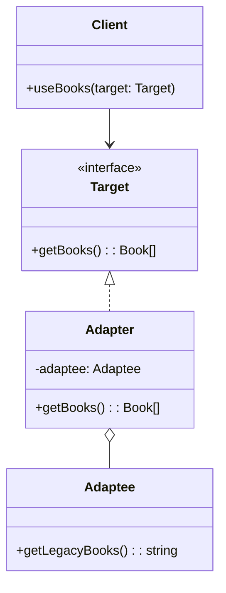

# **Adapterパターンとは？**

## **一言で言うと、**

使い方が自分の望む形と違う場合に、**使い方を変換して“使えるようにする”ための仕組み**です。

## **詳しく言うと、**

Adapterパターンは、互換性のない2つのインターフェースを橋渡しするデザインパターンです。既存のクラス（Adaptee）を変更せずに、新しいインターフェース（Target）に適合させるためのクラス（Adapter）を作成します。これにより、既存のコードを再利用しつつ、新しいシステムに統合することができます。

# **日常での具体例**

海外旅行で使う電源アダプターを想像してください。日本の電化製品のプラグは海外のコンセントに直接差し込めませんが、電源アダプターを使うことで、異なる規格のコンセントに接続できるようになります。この電源アダプターがAdapterパターンの役割を果たしています。


# **Adapterパターンのメリット**

1. 既存のコードを変更せずに再利用できる
2. 新旧のシステムを統合しやすくなる

# **Adapterパターンのデメリット**

1. 新たなクラス（Adapter）を追加する必要があるため、コードが若干複雑になる

# **Adapterパターンをコードで説明**

### 今回、想定するケース

古い形式のデータ（CSV形式）を扱うレガシーシステムと、新しい形式のデータ（JSON形式）を扱う新システムを統合する必要があるケースを考えます。

## **クラス図**



## サンプルコード

```typescript
interface Book {
  title: string;
  author: string;
}

// Target
interface ModernLibrary {
  getBooks(): Book[];
}

// Adaptee
class LegacyLibrary {
  getLegacyBooks(): string {
    return "title,author\nBook1,Author1\nBook2,Author2";
  }
}

// Adapter
class LibraryAdapter implements ModernLibrary {
  private legacyLibrary: LegacyLibrary;

  constructor(legacyLibrary: LegacyLibrary) {
    this.legacyLibrary = legacyLibrary;
  }

  getBooks(): Book[] {
    const csvData = this.legacyLibrary.getLegacyBooks();
    const lines = csvData.split("\n");
    return lines.slice(1).map(line => {
      const [title, author] = line.split(",");
      return { title, author };
    });
  }
}

// Client
class BookManager {
  useBooks(library: ModernLibrary) {
    const books = library.getBooks();
    books.forEach(book => {
      console.log(`${book.title} by ${book.author}`);
    });
  }
}

// 使用例
const legacyLib = new LegacyLibrary();
const adapter = new LibraryAdapter(legacyLib);
const manager = new BookManager();

manager.useBooks(adapter);
```

## **コードの解説**

このコードは **Adapterパターン** を用いて、互換性のないインターフェイスを橋渡ししている例です。以下に各ポイントを解説します。

### 1. **インターフェイスの定義**

```typescript
interface Book {
  title: string;
  author: string;
}

interface ModernLibrary {
  getBooks(): Book[];
}
```

- `Book` インターフェイスは、本のタイトルと著者を表します。
- `ModernLibrary` インターフェイスは、`getBooks()` メソッドを持ち、`Book[]`（本の配列）を返します。
- これがターゲット（目標）インターフェイスで、クライアントが利用する形式です。

### 2. **Adaptee（既存の非互換なクラス）**

```typescript
class LegacyLibrary {
  getLegacyBooks(): string {
    return "title,author\nBook1,Author1\nBook2,Author2";
  }
}
```

- `LegacyLibrary` は旧式のクラスで、CSV形式の文字列を返す `getLegacyBooks()` メソッドを持っています。
- クライアントの期待する形式（`Book[]`）と異なるため、そのままでは利用できません。

### 3. **Adapter（アダプター）**

```typescript
class LibraryAdapter implements ModernLibrary {
  private legacyLibrary: LegacyLibrary;

  constructor(legacyLibrary: LegacyLibrary) {
    this.legacyLibrary = legacyLibrary;
  }

  getBooks(): Book[] {
    const csvData = this.legacyLibrary.getLegacyBooks();
    const lines = csvData.split("\n");
    return lines.slice(1).map(line => {
      const [title, author] = line.split(",");
      return { title, author };
    });
  }
}
```

- `LibraryAdapter` は `ModernLibrary` インターフェイスを実装し、`LegacyLibrary` を内部で利用してそのデータを変換します。
- 具体的には、`getLegacyBooks()` のCSVデータをパースして、`Book[]` の形式に変換しています。

#### 変換の流れ
1. `getLegacyBooks()` が返す文字列（例: `"title,author\nBook1,Author1\nBook2,Author2"`）を取得。
2. 行ごとに分割し、1行目（ヘッダー行）をスキップ。
3. 残りの行をパースして、`Book` オブジェクトに変換。
4. `Book[]` 配列を返す。

### 4. **Client（クライアント）**

```typescript
class BookManager {
  useBooks(library: ModernLibrary) {
    const books = library.getBooks();
    books.forEach(book => {
      console.log(`${book.title} by ${book.author}`);
    });
  }
}
```

- `BookManager` は `ModernLibrary` インターフェイスに依存しています。
- `getBooks()` メソッドを使って本のリストを取得し、各本の情報をコンソールに出力します。
- このクライアントコードは `LegacyLibrary` を直接利用せず、`ModernLibrary` インターフェイスを通じてアクセスします。

### 5. **使用例（Adapterの適用）**

```typescript
const legacyLib = new LegacyLibrary();
const adapter = new LibraryAdapter(legacyLib);
const manager = new BookManager();

manager.useBooks(adapter);
```

- `LegacyLibrary` を直接 `BookManager` に渡すことはできません。なぜなら、`LegacyLibrary` はクライアントが期待する `ModernLibrary` インターフェイスを実装していないからです。
- `LibraryAdapter` がその橋渡しを行い、旧式の `LegacyLibrary` を新しい形式の `ModernLibrary` に適合させます。
- クライアントは `LibraryAdapter` を通じて旧式のライブラリを利用します。


### **ポイントまとめ**

- **目的**:
  - 互換性のないインターフェイス（`LegacyLibrary`）を、クライアントが利用可能な形式（`ModernLibrary`）に適合させる。

- **コードの分離**:
  - 既存のクラス（`LegacyLibrary`）に変更を加えず、`LibraryAdapter` を追加することで適応を実現。
  - クライアント（`BookManager`）は `ModernLibrary` に依存しており、柔軟でテストしやすい設計になっています。

- **拡張性**:
  - `LibraryAdapter` を拡張すれば、別のフォーマットの旧式ライブラリも適応可能。

# **Adapterパターンが用いられるケース**

1. レガシーシステムと新システムを統合する際
2. サードパーティのライブラリを既存のシステムに組み込む場合
3. 異なるデータ形式間の変換が必要な場合

# まとめ

Adapterパターンは、互換性のないインターフェース間のギャップを埋めるための強力なツールです。既存のコードを変更せずに新しいシステムに統合できるため、システムの柔軟性と再利用性を高めることができます。

# 参考サイト

- [PGLS株式会社 - デザインパターン入門](https://www.pgls-kl.com/article/article_77.html)
- [Refactoring.Guru - Adapter in TypeScript](https://refactoring.guru/design-patterns/adapter/typescript/example)
- [DEV Community - Adapter pattern in TypeScript](https://dev.to/jmalvarez/adapter-pattern-in-typescript-2ffl)
