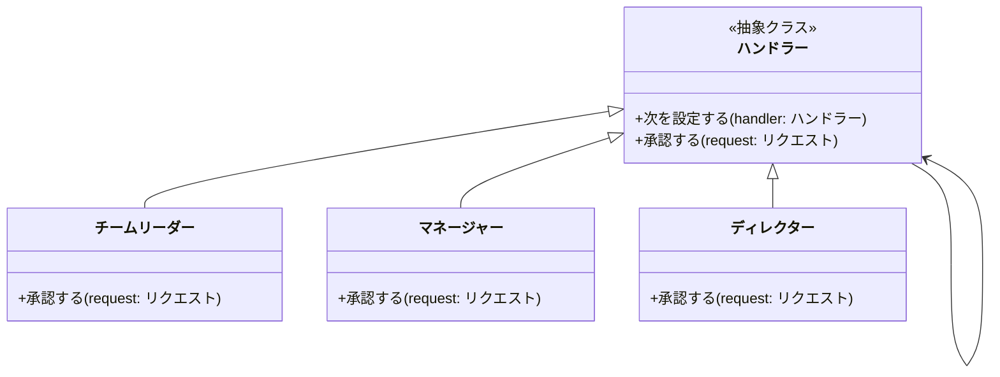
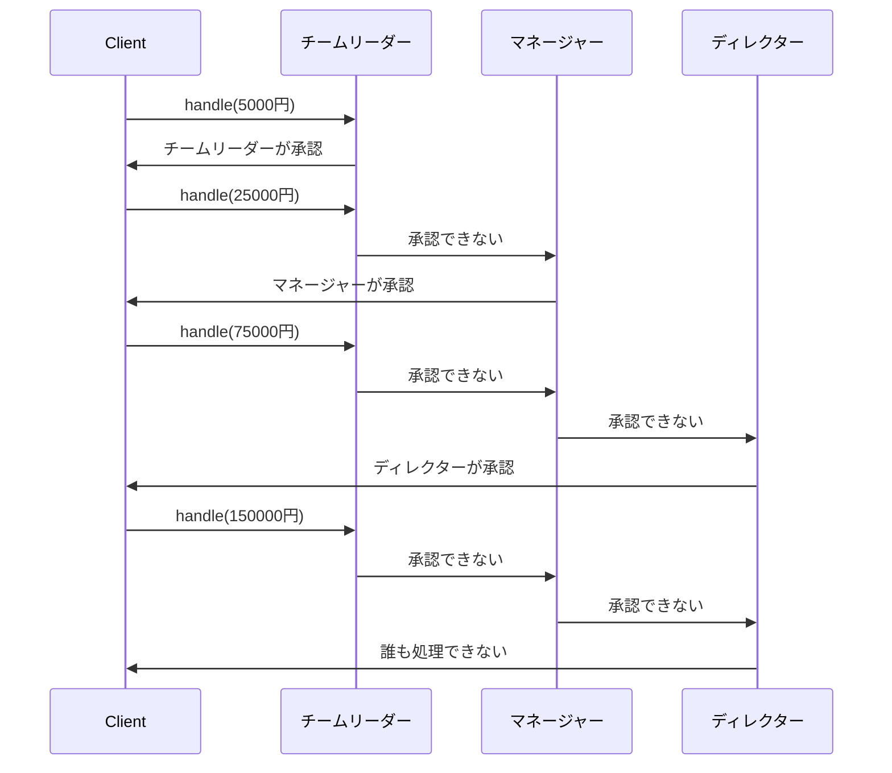

# Chain of Responsibilityパターン とは？

## 一言で言うと、

複数のオブジェクトをつなげて、順番に処理を試みるパターンです。

## 詳しく言うと、

いくつかの人や物が一列に並んでいて、最初の人から順番に仕事をお願いしていくようなものです。できる人がその仕事をやって、できない人は次の人に渡します。このように、仕事を順番に回していって、誰かが処理できるまで続けるやり方です。

# 日常での具体例

**カスタマーサポート**
お客様の問い合わせに対して、まず一般オペレーターが対応します。解決できない場合は専門スタッフに、さらに難しい問題は管理者に引き継がれます。


# Chain of Responsibilityパターンのメリット

## 1. 柔軟な処理の振り分け
説明: 処理を行う順番や条件を簡単に変更できます。
例: カスタマーサポートで、新しい専門チームを追加する際に、既存のコードをほとんど変更せずに対応できます。

## 2. 責任の分散
説明: それぞれの処理者が自分の担当範囲だけを考えればよくなります。
例: 学校の相談システムで、各先生は自分の権限内の問題だけに集中できます。

# Chain of Responsibilityパターンのデメリット

## 1. 処理が保証されない可能性
説明: チェーンの最後まで行っても誰も処理できない場合があります。
例: カスタマーサポートで、どの担当者も解決できない特殊な問い合わせが来た場合、対応漏れになる可能性があります。

## 2. デバッグの難しさ
説明: 処理がどこで行われたのか追跡するのが難しくなることがあります。
例: 大規模なシステムで、エラーが発生した際に、どの処理者で問題が起きたのか特定するのに時間がかかる場合があります。

# 他のデザインパターンとの関連性

- Commandパターン：Chain of Responsibilityパターンと組み合わせて使うことで、複雑な処理の連鎖を実現できます。
- Compositeパターン：ツリー構造の責任連鎖を作る際に使用されることがあります。

# Chain of Responsibilityパターンをコードで説明

### 今回、想定するケース

社内の経費申請システムを考えます。金額に応じて、承認者が変わるシステムを実装します。

## クラス図



## サンプルコード

```typescript
abstract class Handler {
    private nextHandler: Handler | null = null;

    public setNext(handler: Handler): Handler {
        this.nextHandler = handler;
        return handler;
    }

    public handle(request: Request): string {
        if (this.nextHandler) {
            return this.nextHandler.handle(request);
        }
        return "誰も処理できませんでした";
    }
}

class TeamLeader extends Handler {
    public handle(request: Request): string {
        if (request.amount <= 10000) {
            return `チームリーダーが${request.amount}円の経費を承認しました`;
        }
        return super.handle(request);
    }
}

class Manager extends Handler {
    public handle(request: Request): string {
        if (request.amount <= 50000) {
            return `マネージャーが${request.amount}円の経費を承認しました`;
        }
        return super.handle(request);
    }
}

class Director extends Handler {
    public handle(request: Request): string {
        if (request.amount <= 100000) {
            return `ディレクターが${request.amount}円の経費を承認しました`;
        }
        return super.handle(request);
    }
}

class Request {
    constructor(public amount: number) {}
}

// 使用例
const teamLeader = new TeamLeader();
const manager = new Manager();
const director = new Director();

teamLeader.setNext(manager).setNext(director);

console.log(teamLeader.handle(new Request(5000)));
console.log(teamLeader.handle(new Request(25000)));
console.log(teamLeader.handle(new Request(75000)));
console.log(teamLeader.handle(new Request(150000)));
```

## シーケンス図



## コードの解説

1. Handler クラス
   - 抽象クラスで、すべての具体的なハンドラーの基底クラスです。
   - `setNext` メソッドで次のハンドラーを設定します。
   - `handle` メソッドは、自分で処理できない場合に次のハンドラーに処理を委譲します。

2. TeamLeader, Manager, Director クラス
   - Handler クラスを継承し、それぞれの権限内で経費を承認します。
   - 自分の権限を超える場合は、親クラスの `handle` メソッドを呼び出して次のハンドラーに処理を委譲します。

3. Request クラス
   - 経費申請の金額を保持するシンプルなクラスです。

4. 使用例
   - ハンドラーのチェーンを作成し、様々な金額の経費申請を処理します。

# Chain of Responsibilityパターンが用いられるケース

## 1. 複数の処理者が順番に処理を試みる必要がある場合
具体例: ログインシステムで、ローカル認証、LDAP認証、OAuth認証など、複数の認証方法を順番に試す場合

## 2. 処理の順序や条件を動的に変更したい場合
具体例: Webアプリケーションのミドルウェア（認証、ログ記録、エラーハンドリングなど）を柔軟に組み合わせる場合

# まとめ

Chain of Responsibilityパターンは、複数の処理者をつなげて順番に処理を試みるパターンです。このパターンを使うことで、処理の振り分けを柔軟に行え、各処理者の責任を明確に分離できます。ただし、処理が保証されない可能性やデバッグの難しさには注意が必要です。適切に使用することで、拡張性と保守性の高いシステムを設計することができます。

# 参考サイト
https://refactoring.guru/ja/design-patterns/chain-of-responsibility

https://www.techscore.com/tech/DesignPattern/ChainOfResponsibility

https://qiita.com/mk777/items/7a8f23d3e58d77486fe4

