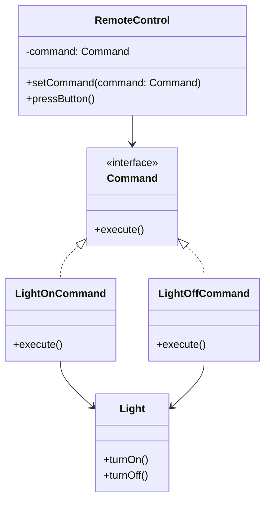
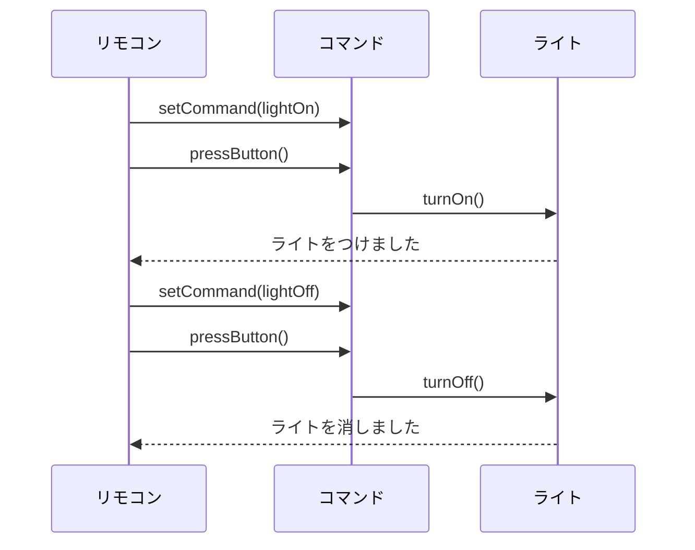

# **Commandパターン とは？**
## **一言で言うと、**
操作をオブジェクトとして扱う方法です。


## **詳しく言うと、**
オブジェクトの操作を「コマンド」というオブジェクトとしてカプセル化するデザインパターンです。このパターンを使うことで、操作を遅延実行したり、操作の履歴を管理したり、操作をキューに保存して順番に実行したりできます。

# **日常での具体例**
**テレビのリモコン**
リモコンのボタンは、各ボタンに割り当てられたコマンドを実行します。ボタンを押すとテレビがその指示に従って動作します。


# **Commandパターンのメリット**

## 1. **コマンドの抽象化により柔軟性が向上する**  
コマンド（操作）をオブジェクトとして抽象化することで、操作自体を柔軟に扱えるようになります。たとえば、異なる種類のコマンドを同じインターフェースで扱えるため、コードの拡張性や保守性が向上します。  
   **例:** スマートホームアプリで「ライトをつける」「エアコンをつける」などの操作をそれぞれCommandクラスとして実装することで、共通のリモコンで操作を切り替え可能。

## 2. **操作の履歴管理や再実行が容易**  
実行されたコマンドを記録することで、操作の履歴を管理したり、Undo/Redo機能を実装することが簡単になります。  
   **例:** テキストエディタで「文字を入力」「削除」などの操作をCommandオブジェクトにすることで、Undo機能を簡単に実装可能。

# **Commandパターンのデメリット**

## 1. **クラス数が増加する**  
各操作に対応するCommandクラスを作成する必要があるため、コード量が増え、クラス設計が複雑になることがあります。  
   **例:** 家電製品をコントロールするアプリで、家電ごとに「オン」「オフ」のコマンドを個別に作成すると、クラスが増えて管理が難しくなる。

## 2. **単純な操作には過剰設計になる**  
操作が少なくシンプルな場合、Commandパターンを採用することで逆にコードが複雑化し、開発効率が低下することがあります。  
   **例:** 単純にライトをオン・オフするだけのアプリでCommandパターンを採用すると、コード量が増えるだけでメリットが得られにくい。

# 他のデザインパターンとの関連性
- Observerパターン：Commandパターンと組み合わせて、コマンドの実行を監視したり、通知したりすることができます。
- Mementoパターン：Commandパターンと組み合わせて、操作の履歴管理やUndo/Redo機能を実装する際に使用されることがあります。


# **Commandパターンをコードで説明**

### 今回、想定するケース

シンプルな家電制御システムを考えます。ライトのON/OFF操作をCommandパターンで実装します。

### 今回のケースのポイント
#### 1. 操作の抽象化: 
Commandインターフェースを介して操作を抽象化しているため、リモコンは具体的なライトやその操作方法に依存しません。

#### 2. 高い柔軟性: 
別のデバイス（エアコンやテレビなど）の操作コマンドを同じインターフェースを通じて扱えます。

## **クラス図**



## サンプルコード

```typescript
interface Command {
  execute(): void;
}

class Light {
  turnOn(): void {
    console.log("ライトをつけました");
  }

  turnOff(): void {
    console.log("ライトを消しました");
  }
}

class LightOnCommand implements Command {
  private light: Light;

  constructor(light: Light) {
    this.light = light;
  }

  execute(): void {
    this.light.turnOn();
  }
}

class LightOffCommand implements Command {
  private light: Light;

  constructor(light: Light) {
    this.light = light;
  }

  execute(): void {
    this.light.turnOff();
  }
}

class RemoteControl {
  private command: Command;

  setCommand(command: Command): void {
    this.command = command;
  }

  pressButton(): void {
    this.command.execute();
  }
}

// 使用例
const light = new Light();
const lightOn = new LightOnCommand(light);
const lightOff = new LightOffCommand(light);

const remote = new RemoteControl();

remote.setCommand(lightOn);
remote.pressButton(); // 出力: ライトをつけました

remote.setCommand(lightOff);
remote.pressButton(); // 出力: ライトを消しました
```

# シーケンス図




## **コードの解説**

#### 1. **Commandインターフェース**
```typescript
interface Command {
  execute(): void;
}
```
- **目的**: 全てのコマンドの共通インターフェースを定義。
- **メソッド**: `execute`メソッドが定義されており、全てのコマンドがこのメソッドを実装します。


#### 2. **Lightクラス**
```typescript
class Light {
  turnOn(): void {
    console.log("ライトをつけました");
  }

  turnOff(): void {
    console.log("ライトを消しました");
  }
}
```
- **目的**: 実際に操作される「ライト」を表現するクラス。
- **メソッド**:
  - `turnOn()`: ライトをオンにする。
  - `turnOff()`: ライトをオフにする。


#### 3. **LightOnCommandクラスとLightOffCommandクラス**
```typescript
class LightOnCommand implements Command {
  private light: Light;

  constructor(light: Light) {
    this.light = light;
  }

  execute(): void {
    this.light.turnOn();
  }
}

class LightOffCommand implements Command {
  private light: Light;

  constructor(light: Light) {
    this.light = light;
  }

  execute(): void {
    this.light.turnOff();
  }
}
```
- **目的**: 各コマンド（ライトのオン/オフ）を実装する具体的なコマンドクラス。
- **構造**:
  - `LightOnCommand`は、`execute`メソッドで`light.turnOn()`を呼び出します。
  - `LightOffCommand`は、`execute`メソッドで`light.turnOff()`を呼び出します。
- **依存性注入**: コンストラクタで`Light`インスタンスを受け取り、そのインスタンスを操作します。


#### 4. **RemoteControlクラス**
```typescript
class RemoteControl {
  private command: Command;

  setCommand(command: Command): void {
    this.command = command;
  }

  pressButton(): void {
    this.command.execute();
  }
}
```
- **目的**: 操作（コマンド）を呼び出すリモコンを表現するクラス。
- **機能**:
  - `setCommand(command: Command)`: 実行するコマンドを設定。
  - `pressButton()`: 現在設定されたコマンドの`execute`メソッドを呼び出します。
- **利点**: コマンドが抽象化されているため、リモコンの実装はコマンドの具体的な中身に依存しません。


#### 5. **使用例**
```typescript
const light = new Light();
const lightOn = new LightOnCommand(light);
const lightOff = new LightOffCommand(light);

const remote = new RemoteControl();

remote.setCommand(lightOn);
remote.pressButton(); // 出力: ライトをつけました

remote.setCommand(lightOff);
remote.pressButton(); // 出力: ライトを消しました
```
1. **ライトのインスタンスを作成**:
   - `Light`クラスでライトを表現。
2. **オン/オフコマンドを作成**:
   - `LightOnCommand`と`LightOffCommand`を作成し、それぞれ`light`インスタンスを操作するように設定。
3. **リモコンにコマンドを設定**:
   - `setCommand`でリモコンにコマンドを登録。
4. **ボタンを押して実行**:
   - `pressButton`で現在設定されているコマンドを実行。


### コードの動作フロー
1. ユーザーがリモコンに操作（コマンド）を登録。
2. リモコンのボタンを押すと、登録された操作（コマンド）が実行される。
3. 実際の動作（ライトのオン/オフ）はコマンドを通じて呼び出される。

# **Commandパターンが用いられるケース**

## 1. GUIアプリケーションでの操作の実装
具体例: テキストエディタでの編集操作（コピー、ペースト、元に戻す）をCommandパターンで実装することで、操作の履歴管理やUndo/Redo機能を簡単に実現できます。

## 2. 非同期処理や遅延実行が必要な場合
具体例: バッチ処理システムで、複数の処理をキューに入れて順番に実行する場合、各処理をCommandオブジェクトとして扱うことで、柔軟な実行制御が可能になります。

# まとめ

Commandパターンは、操作をオブジェクトとしてカプセル化することで、操作の柔軟な管理や拡張を可能にします。このパターンを使用することで、操作の履歴管理、Undo/Redo機能の実装、非同期処理の制御などが容易になります。ただし、単純な操作に対しても適用すると複雑になる可能性があるため、適切な場面で使用することが重要です。

# 参考サイト

- [Refactoring.Guru - Command](https://refactoring.guru/ja/design-patterns/command)
- [Game Programming Patterns - Command](http://gameprogrammingpatterns.com/command.html)
