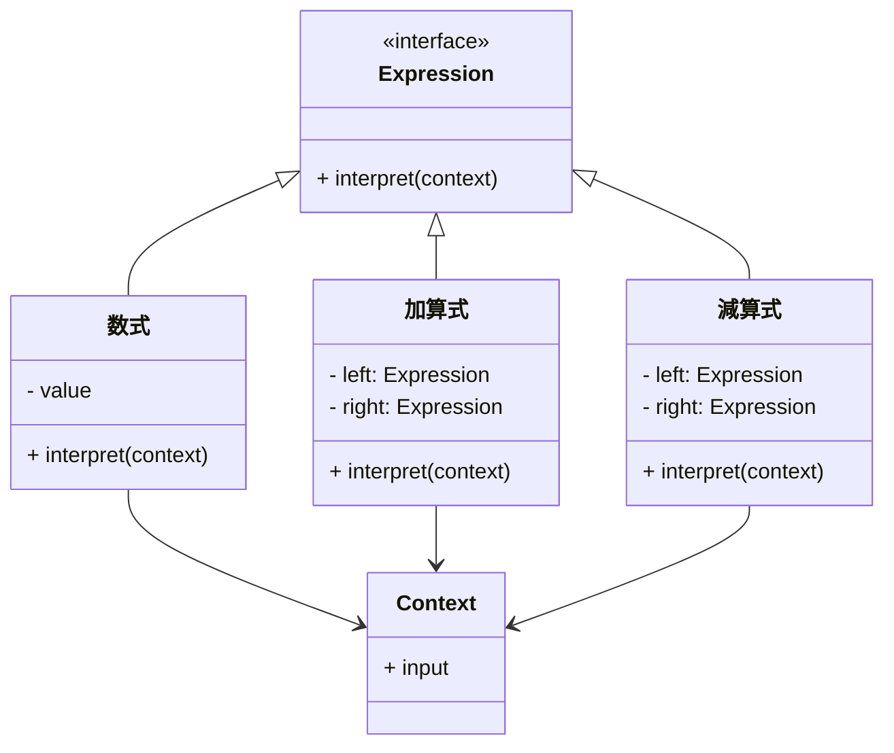
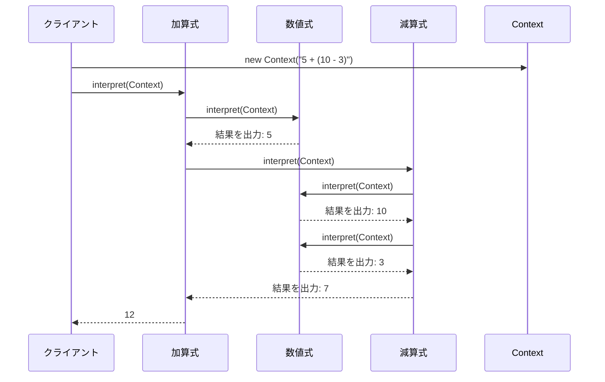

# Interpreterパターン とは？

## 一言で言うと、

複雑な文法を解釈し、簡単な式に変換する仕組みです

## 詳しく言うと、

簡単な言葉や式を理解して、その意味を解釈するための方法です。例えば、計算機のように、「2+3」という式を入力すると、それを理解して「5」という答えを出すような仕組みを作るときに使います。

# 日常での具体例

**交通標識の理解**
道路標識を見て、その意味（速度制限、一時停止など）を解釈し、適切な運転行動をとる過程。


# Interpreterパターンのメリット

## 1. 新しい表現を簡単に追加
例: 計算機アプリに新しい演算（べき乗など）を追加する際、既存のコードをほとんど変更せずに実装できます。

## 2. 文法のルールを明確に表現
例: プログラミング言語の文法を、各要素（変数、関数、制御構造など）ごとにクラスとして表現できます。

# Interpreterパターンのデメリット

## 1. クラスの数が多くなりすぎる
例: 高度なプログラミング言語の全ての文法要素をInterpreterパターンで実装すると、膨大な数のクラスが必要になります。

## 2. パフォーマンスが低下する可能性
例: 大規模な式や文を解釈する際、再帰的な処理が多用されるため、処理速度が遅くなることがあります。

# 他のデザインパターンとの関連性

- Compositeパターン：Interpreterパターンは、式の構造を表現するためにCompositeパターンを使用することがあります。
- Visitorパターン：複雑な文法構造を持つ言語の解釈に、Visitorパターンを組み合わせて使用することがあります。

# Interpreterパターンをコードで説明

### 今回、想定するケース

簡単な数式（加算と減算のみ）を解釈し、計算するシステムを実装します。

## クラス図



## サンプルコード

```typescript
interface Expression {
    interpret(context: Context): number;
}

class NumberExpression implements Expression {
    constructor(private value: number) {}

    interpret(context: Context): number {
        return this.value;
    }
}

class AddExpression implements Expression {
    constructor(private left: Expression, private right: Expression) {}

    interpret(context: Context): number {
        return this.left.interpret(context) + this.right.interpret(context);
    }
}

class SubtractExpression implements Expression {
    constructor(private left: Expression, private right: Expression) {}

    interpret(context: Context): number {
        return this.left.interpret(context) - this.right.interpret(context);
    }
}

class Context {
    constructor(public input: string) {}
}

// 使用例
const expression = new AddExpression(
    new NumberExpression(5),
    new SubtractExpression(
        new NumberExpression(10),
        new NumberExpression(3)
    )
);

const context = new Context("5 + (10 - 3)");
const result = expression.interpret(context);

console.log(`式 "${context.input}" の結果: ${result}`);
```

## シーケンス図



## コードの解説

## 1. **インターフェース `Expression`**
```typescript
interface Expression {
    interpret(context: Context): number;
}
```
- `Expression` は、式を解釈するためのインターフェースです。
- このインターフェースには、`interpret` メソッドが定義されており、`Context` を入力として受け取り、計算結果を返します。

## 2. **数値を表すクラス `NumberExpression`**
```typescript
class NumberExpression implements Expression {
    constructor(private value: number) {}

    interpret(context: Context): number {
        return this.value;
    }
}
```
- `NumberExpression` は単一の数値（リテラル）を表します。
- コンストラクタで渡された数値（`value`）を保持します。
- `interpret` メソッドでは、保持している数値をそのまま返します。

## 3. **加算を表すクラス `AddExpression`**
```typescript
class AddExpression implements Expression {
    constructor(private left: Expression, private right: Expression) {}

    interpret(context: Context): number {
        return this.left.interpret(context) + this.right.interpret(context);
    }
}
```
- `AddExpression` は加算を表すクラスです。
- 左側（`left`）と右側（`right`）に別の `Expression` オブジェクトを持ちます。
- `interpret` メソッドでは、`left` と `right` の `interpret` を呼び出し、その結果を加算して返します。

## 4. **減算を表すクラス `SubtractExpression`**
```typescript
class SubtractExpression implements Expression {
    constructor(private left: Expression, private right: Expression) {}

    interpret(context: Context): number {
        return this.left.interpret(context) - this.right.interpret(context);
    }
}
```
- `SubtractExpression` は減算を表すクラスです。
- 左側（`left`）と右側（`right`）に別の `Expression` オブジェクトを持ちます。
- `interpret` メソッドでは、`left` と `right` の `interpret` を呼び出し、その結果を減算して返します。

## 5. **コンテキストを表すクラス `Context`**
```typescript
class Context {
    constructor(public input: string) {}
}
```
- `Context` は式全体の情報を保持します。
- この例では、`input` に数式（文字列）を保持するだけで、特に計算に使用されていません。

## 6. **使用例**
```typescript
const expression = new AddExpression(
    new NumberExpression(5),
    new SubtractExpression(
        new NumberExpression(10),
        new NumberExpression(3)
    )
);

const context = new Context("5 + (10 - 3)");
const result = expression.interpret(context);

console.log(`式 "${context.input}" の結果: ${result}`);
```

### 処理の流れ
1. **式の構造を構築**
   - 以下のような式を表現しています：
     ```
     5 + (10 - 3)
     ```
   - この式は、以下のような構造のオブジェクトで表されています：
     - `AddExpression`
       - 左：`NumberExpression(5)`
       - 右：`SubtractExpression`
         - 左：`NumberExpression(10)`
         - 右：`NumberExpression(3)`

2. **解釈と計算**
   - `interpret` メソッドを再帰的に呼び出し、以下のように計算が進みます：
     1. `SubtractExpression` の `interpret` を呼ぶ：
        - `10 - 3 = 7`
     2. `AddExpression` の `interpret` を呼ぶ：
        - `5 + 7 = 12`

3. **結果を出力**
   - 計算結果（`12`）をコンソールに出力します。

## 7. **ポイント**
- **インタプリターパターン**：
  - 式を構文ツリーとしてオブジェクトで表現し、計算処理をツリー全体で行います。
  - 追加の演算（乗算、除算など）が必要な場合、新しいクラスを作成するだけで拡張可能です。
- **再帰的な処理**：
  - `interpret` メソッドが再帰的に呼び出されることで、式全体を順次計算します。


必要に応じて、式のパースや変数の置き換え機能を追加することも可能です。

# Interpreterパターンが用いられるケース

## 1. 簡単な言語や文法の解釈が必要な場合
具体例: 設定ファイルの独自フォーマットを解析するパーサーの実装

## 2. 頻繁に新しい文法規則を追加する必要がある場合
具体例: カスタマイズ可能なクエリ言語の実装（データベース検索など）

# まとめ

Interpreterパターンは、特定の言語や文法を解釈し実行するための効果的な方法を提供します。簡単な言語や頻繁に変更が必要な文法の実装に適していますが、複雑な言語では扱いづらくなる可能性があります。適切に使用することで、柔軟で拡張性の高い言語処理システムを構築できます。

# 参考サイト

1. [**cstechブログ: Interpreterパターンとは｜GoFデザインパターンの解説**](https://cs-techblog.com/technical/interpreter-pattern/?utm_source=chatgpt.com)

2. [**tamotechブログ**](https://tamotech.blog/2024/10/19/Interpreter/?utm_source=chatgpt.com)

3. [**プログラミングTIPS!: Java : Interpreter パターン (図解/デザインパターン)**](https://programming-tips.jp/archives/a3/57/index.html?utm_source=chatgpt.com)

