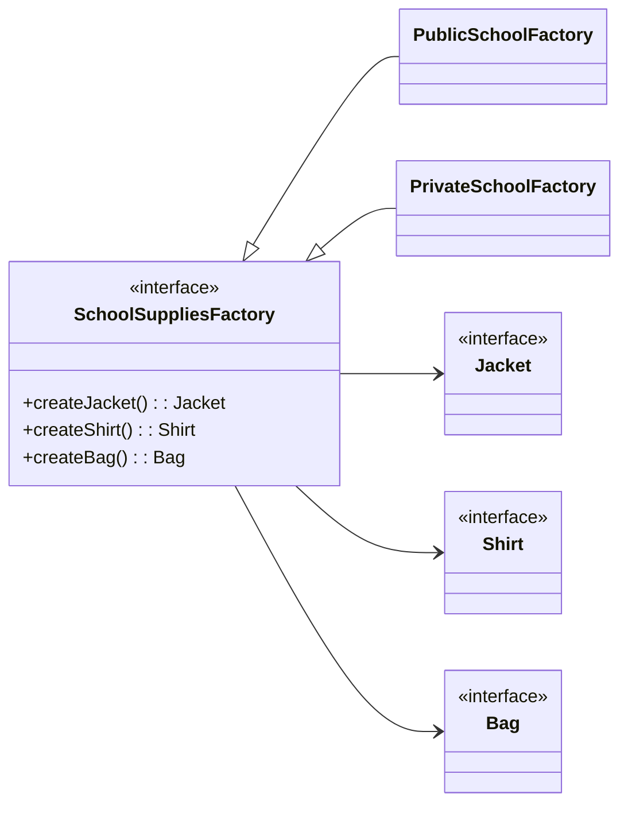

# **Abstract Factoryパターン とは？**

## **一言で言うと、**
大枠のカテゴリー（分類）を作る方法

## **詳しく言うと、**
Abstract Factory パターンは、**「セットで使う関連するものを作る仕組み」** です。
具体的な種類（クラス）に頼らず、いろいろな関連アイテムをまとめて作れるようにする方法です。
例えば、家具セット（椅子、テーブル、ソファ）や食事セット（前菜、メイン、デザート）などの〇〇セットを、一貫性を保って簡単に作成できます。
Abstract Factory パターンは、**「セットで関連するオブジェクトを一貫性を持って作成する」** 必要がある場合に非常に有効です。

# **日常での具体例**
**「学校の制服とバッグ」**
学校の制服(ジャケット、シャツ）やバッグは、学校ごとに統一されたデザインで作られます。

たとえば、公立学校用の工場では「公立用ジャケット、シャツ、バッグ」を作り、私立学校用の工場では「私立用ジャケット、シャツ、バッグ」を作ります。これにより、各学校のデザインがバラバラになることを防ぎ、一貫性を保ちながら簡単に新しい学校用のアイテムを追加できます。

つまり、「ある学校のセットをまるごと作る工場を使う仕組み」がAbstract Factory パターンです。


# **Abstract Factoryパターンのメリット**

### 1. 一貫性を保てる
関連するアイテム（例: ジャケット、シャツ、バッグなど）をセットとして統一したデザインで作れるので、ばらばらなものが混ざる心配がありません。
例:
公立学校用のアイテムを作る工場が、間違えて私立学校用のバッグを作ることを防げます。

### 2. 柔軟に拡張できる
新しいセット（例: インターナショナルスクール用の制服とバッグ）を追加したい場合でも、既存のコードにほとんど手を加えずに対応できます。
例:
新しい学校用の工場を追加するだけで、アイテムの一式が作れるようになります。

### 3. 変更に強い
クライアント（使う側）は具体的なクラスに依存しないため、内部の実装を変えてもクライアントコードを変える必要がありません。
例:
公立学校用のバッグのデザインが変わっても、工場の中だけで修正すれば済みます。

### 4. 再利用しやすい
工場や製品を抽象化しているので、部品やロジックを他のプロジェクトでも簡単に使い回せます。
例:
他の製品ライン（例えば「スポーツ用品セット」など）に同じ設計を応用できます。

# **Abstract Factoryパターンのデメリット**

### 1. コードが複雑になる
製品（例: ジャケット、シャツ、バッグ）や工場を抽象化し、それぞれ具体的なクラスを作る必要があるので、クラスやコードの量が増えて複雑になります。
例:
公立学校用と私立学校用のアイテムが増えるたびに、それぞれのクラスを作らないといけないので、管理が面倒になることがあります。

### 2. 変更が多い場合には適さない
新しい製品カテゴリ（例: 靴や帽子など）が頻繁に追加される場合、抽象クラスや既存の工場インターフェースを修正する必要があり、柔軟性が下がります。
例:
「新しく靴もセットに加えたい」となると、全ての工場や製品に靴を追加する作業が必要になります。

### 3. 小規模なプロジェクトではオーバーエンジニアリングになる
このパターンは、製品群が多く、複雑なシステムに適しています。単純なシステムや小規模プロジェクトでは、かえって手間が増えるだけです。
例:
学校が1つしかなく、そのセット（ジャケット、シャツ、バッグ）が固定なら、わざわざ抽象化する必要はありません。

# **Abstract Factoryパターンをコードで説明**

**想定**
私立と公立の生徒がおり、私立の生徒には私立の学校用のジャケット・シャツ・バッグを提供する。公立の生徒には公立の学校用のジャケット・シャツ・バッグを提供する。

## **クラス図**



## **コードと解説**

### 1. Abstract Factory（抽象的な工場）
各学校の制服とバッグを作成するためのインターフェースを定義します。

```typescript
// 抽象的な工場
interface SchoolSuppliesFactory {
    createJacket(): Jacket; // ジャケットを作る
    createShirt(): Shirt;   // シャツを作る
    createBag(): Bag;       // バッグを作る
}
```

### 2. Concrete Factory（具体的な工場）
公立学校と私立学校用の具体的な工場を実装します。

```typescript
// 公立学校用の工場
class PublicSchoolFactory implements SchoolSuppliesFactory {
    createJacket(): Jacket {
        return new PublicSchoolJacket();
    }
    createShirt(): Shirt {
        return new PublicSchoolShirt();
    }
    createBag(): Bag {
        return new PublicSchoolBag();
    }
}

// 私立学校用の工場
class PrivateSchoolFactory implements SchoolSuppliesFactory {
    createJacket(): Jacket {
        return new PrivateSchoolJacket();
    }
    createShirt(): Shirt {
        return new PrivateSchoolShirt();
    }
    createBag(): Bag {
        return new PrivateSchoolBag();
    }
}
```

### 3. Abstract Product（抽象的な製品）
ジャケット、シャツ、バッグの共通インターフェースを定義します。

```typescript
// 抽象的な製品
interface Jacket {
    wear(): void; // ジャケットを着る動作
}

interface Shirt {
    wear(): void; // シャツを着る動作
}

interface Bag {
    carry(): void; // バッグを持つ動作
}
```

### 4. Concrete Product（具体的な製品）
各学校の具体的なジャケット、シャツ、バッグを実装します。

```typescript
// 公立学校用の製品
class PublicSchoolJacket implements Jacket {
    wear() {
        console.log("公立学校用ジャケットを着ます。");
    }
}

class PublicSchoolShirt implements Shirt {
    wear() {
        console.log("公立学校用シャツを着ます。");
    }
}

class PublicSchoolBag implements Bag {
    carry() {
        console.log("公立学校用バッグを持ちます。");
    }
}

// 私立学校用の製品
class PrivateSchoolJacket implements Jacket {
    wear() {
        console.log("私立学校用ジャケットを着ます。");
    }
}

class PrivateSchoolShirt implements Shirt {
    wear() {
        console.log("私立学校用シャツを着ます。");
    }
}

class PrivateSchoolBag implements Bag {
    carry() {
        console.log("私立学校用バッグを持ちます。");
    }
}
```

### 5. Client（クライアント）
クライアントコードは、具体的な工場を意識せずに、一貫して制服とバッグを作成できます。

```typescript
function getSchoolSupplies(factory: SchoolSuppliesFactory) {
    const jacket = factory.createJacket();
    const shirt = factory.createShirt();
    const bag = factory.createBag();

    jacket.wear();
    shirt.wear();
    bag.carry();
}

// 公立学校の制服とバッグを取得
console.log("公立学校の制服とバッグ:");
const publicSchoolFactory = new PublicSchoolFactory();
getSchoolSupplies(publicSchoolFactory);

// 私立学校の制服とバッグを取得
console.log("\n私立学校の制服とバッグ:");
const privateSchoolFactory = new PrivateSchoolFactory();
getSchoolSupplies(privateSchoolFactory);
```

実行結果
このコードを実行すると、以下のような出力が得られます：

```plaintext
公立学校の制服とバッグ:
公立学校用ジャケットを着ます。
公立学校用シャツを着ます。
公立学校用バッグを持ちます。

私立学校の制服とバッグ:
私立学校用ジャケットを着ます。
私立学校用シャツを着ます。
私立学校用バッグを持ちます。
```

### コードのポイント

- 一貫性のある生成
公立学校用のアイテムと私立学校用のアイテムがそれぞれ一貫したデザインで作成されます。

- 柔軟性
新しい学校用工場（例: インターナショナルスクール用）を追加しても、既存のコードを変更せずに対応できます。

- 抽象化の利点
クライアントコード（getSchoolSupplies）は具体的な製品（PublicSchoolJacket や PrivateSchoolBag）に依存せず、統一された方法で利用できます。

このように、Abstract Factory パターンは「一貫性が必要な関連オブジェクト群」を管理する場合に特に有効です。
