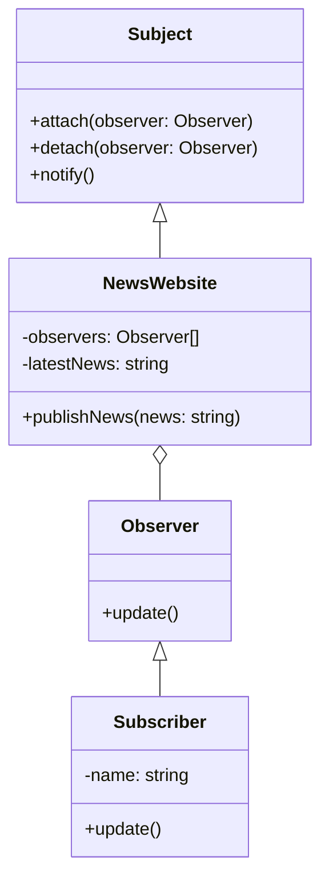
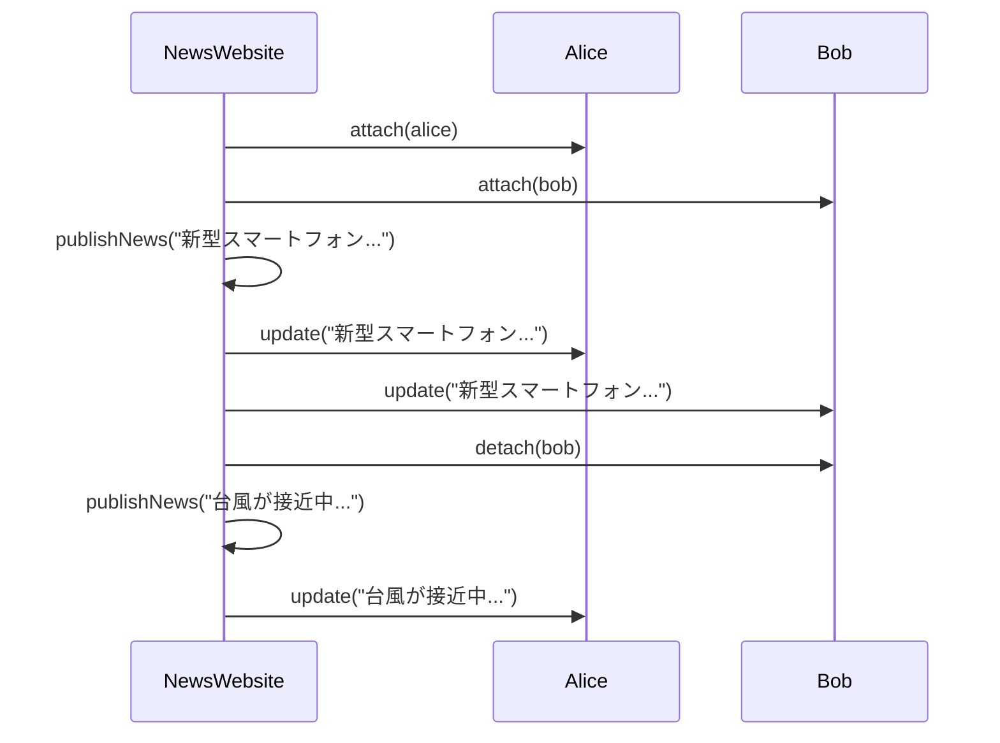

# Observerパターン とは？

## 一言で言うと、

オブジェクトの状態変化を他のオブジェクトに自動的に通知するパターンです。

## 詳しく言うと、

お気に入りのYouTuberのチャンネルを登録するようなものです。YouTuberが新しい動画を投稿すると、登録者全員に通知が届きます。登録者は好きな時に登録したり解除したりできます。このように、何かが変わったときに、それに興味がある人たちに自動的に知らせる仕組みです。

# 日常での具体例

**SNSのフォロー機能**
友達の投稿を自動的に見られるように、その人をフォローします。新しい投稿があると通知が来ます。


# Observerパターンのメリット

## 1. オブジェクト間の結合度を下げれる
例: YouTuberは登録者のことを知らなくても、新しい動画の通知を送れます。

## 2. 柔軟に通知先を追加・削除できる
例: ニュースレターの購読者は、いつでも登録・解除ができます。

# Observerパターンのデメリット

## 1. パフォーマンスに影響が出る可能性
例: 何百万人もの登録者がいるYouTuberが頻繁に動画を投稿すると、通知システムに負荷がかかります。

## 2. 通知の順序が保証されないため、予期せぬ動作につながる
例: SNSで複数の投稿を同時にした場合、フォロワーに届く通知の順序が不定になることがあります。

# 他のデザインパターンとの関連性

- Mediatorパターン：複数のオブジェクト間の通信を管理するという点で似ていますが、Mediatorは中央集権的な制御を行います。
- Commandパターン：Observerパターンと組み合わせて、イベント駆動型のシステムを構築することができます。

# Observerパターンをコードで説明

### 今回、想定するケース

ニュースサイトの購読システムを実装します。ニュースサイトが新しい記事を公開すると、すべての購読者に通知が送られます。

## クラス図



## サンプルコード

```typescript
interface Subject {
    attach(observer: Observer): void;
    detach(observer: Observer): void;
    notify(): void;
}

interface Observer {
    update(news: string): void;
}

class NewsWebsite implements Subject {
    private observers: Observer[] = [];
    private latestNews: string = "";

    attach(observer: Observer): void {
        this.observers.push(observer);
    }

    detach(observer: Observer): void {
        const index = this.observers.indexOf(observer);
        if (index !== -1) {
            this.observers.splice(index, 1);
        }
    }

    notify(): void {
        for (const observer of this.observers) {
            observer.update(this.latestNews);
        }
    }

    publishNews(news: string): void {
        this.latestNews = news;
        console.log(`ニュースサイト: 新しい記事「${news}」を公開しました。`);
        this.notify();
    }
}

class Subscriber implements Observer {
    constructor(private name: string) {}

    update(news: string): void {
        console.log(`${this.name}: 新しい記事「${news}」の通知を受け取りました。`);
    }
}

// 使用例
const newsWebsite = new NewsWebsite();
const alice = new Subscriber("Alice");
const bob = new Subscriber("Bob");

newsWebsite.attach(alice);
newsWebsite.attach(bob);

newsWebsite.publishNews("新型スマートフォンが発表されました");

newsWebsite.detach(bob);

newsWebsite.publishNews("台風が接近中です");
```

## シーケンス図



## コードの解説

### **1. `Subject`インターフェース**
- **役割**: 観察対象となるオブジェクトのインターフェースです。
- メソッドの詳細:
  - `attach(observer: Observer): void`: Observer（通知を受ける側）を登録します。
  - `detach(observer: Observer): void`: Observerの登録を解除します。
  - `notify(): void`: 登録されているすべてのObserverに通知を送ります。


### **2. `Observer`インターフェース**
- **役割**: Subjectから通知を受け取るオブジェクトのインターフェースです。
- メソッドの詳細:
  - `update(news: string): void`: Subjectから送られる情報を受け取ります。


### **3. `NewsWebsite`クラス（Subjectの具体実装）**
- **役割**: ニュースを発信するクラスです。
- 主なプロパティとメソッド:
  - `observers: Observer[]`: 登録されているObserver（購読者）を管理します。
  - `latestNews: string`: 最新のニュースを保持します。
  - `attach(observer: Observer): void`: Observerを`observers`リストに追加します。
  - `detach(observer: Observer): void`: Observerを`observers`リストから削除します。
  - `notify(): void`: 登録されているすべてのObserverに最新ニュースを通知します。
  - `publishNews(news: string): void`: 新しいニュースを公開し、それを通知します。

#### **動作例**
- ニュースサイトが新しい記事を公開すると、購読者に通知が送られます。


### **4. `Subscriber`クラス（Observerの具体実装）**
- **役割**: ニュースを購読する個々の購読者を表します。
- 主なプロパティとメソッド:
  - `name: string`: 購読者の名前です。
  - `update(news: string): void`: Subjectから送られてきたニュースを受け取り、名前とともに通知を表示します。

#### **動作例**
- 購読者は、ニュースが公開されると自動的に通知を受け取ります。


### **5. 実行部分**
```typescript
const newsWebsite = new NewsWebsite(); // ニュースサイトを作成
const alice = new Subscriber("Alice"); // 購読者Aliceを作成
const bob = new Subscriber("Bob");     // 購読者Bobを作成

newsWebsite.attach(alice); // Aliceを購読リストに追加
newsWebsite.attach(bob);   // Bobを購読リストに追加

// ① 初回のニュース公開:
newsWebsite.publishNews("新型スマートフォンが発表されました");
// ニュースが公開されると、AliceとBobに通知されます。

newsWebsite.detach(bob); // Bobを購読リストから解除

// ② Bobが購読解除後のニュース公開:
newsWebsite.publishNews("台風が接近中です");
// 今回はAliceだけが通知を受け取ります。
```


### **コードの動作結果**
① 初回のニュース公開:

```
ニュースサイト: 新しい記事「新型スマートフォンが発表されました」を公開しました。
Alice: 新しい記事「新型スマートフォンが発表されました」の通知を受け取りました。
Bob: 新しい記事「新型スマートフォンが発表されました」の通知を受け取りました。
```

② Bobが購読解除後のニュース公開:

```
ニュースサイト: 新しい記事「台風が接近中です」を公開しました。
Alice: 新しい記事「台風が接近中です」の通知を受け取りました。
```

### **ポイント**
1. **疎結合**: Subject（ニュースサイト）とObserver（購読者）の間に直接的な依存関係がありません。
2. **拡張性**: Observerを増やしたり減らしたりするのが簡単です。
3. **自動通知**: Subjectが変化するたびに、すべてのObserverに自動的に通知されます。


# Observerパターンが用いられるケース

## 1. 複数のオブジェクトが他のオブジェクトの状態変化に反応する必要がある場合
具体例: グラフィカルユーザーインターフェース（GUI）での、ボタンクリックなどのイベント処理

## 2. オブジェクト間の依存関係を低く保ちたい場合
具体例: 大規模なシステムでの、モジュール間の疎結合な通信

# まとめ

Observerパターンは、オブジェクト間の柔軟な通知システムを実現します。このパターンを使用することで、オブジェクト間の結合度を下げつつ、効率的に状態変化を伝達できます。ただし、多数の通知が発生する場合のパフォーマンスには注意が必要です。適切に使用することで、拡張性と保守性の高いシステムを設計することができます。

# 参考サイト

https://refactoring.guru/design-patterns/observer

https://www.geeksforgeeks.org/observer-pattern-set-1-introduction/

https://java-design-patterns.com/patterns/observer/

