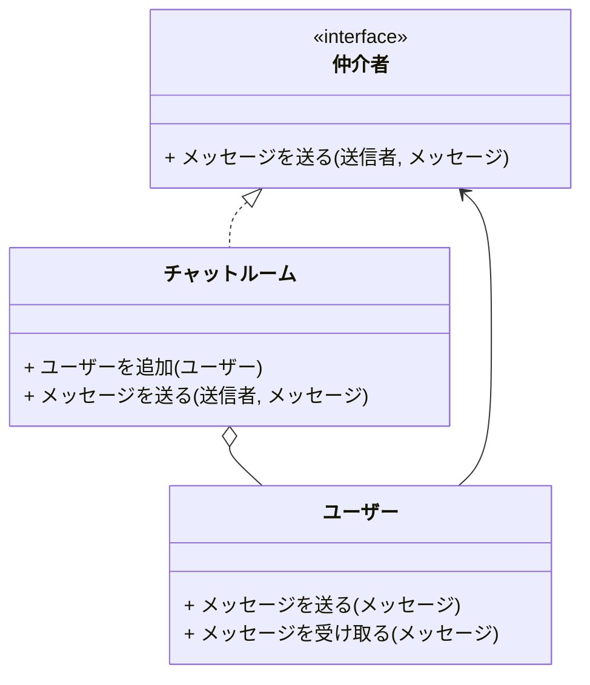
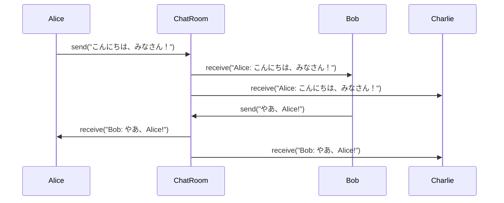

# Mediatorパターン とは？

## 一言で言うと、

オブジェクト間の通信を一つの仲介役オブジェクトに集中させるパターンです。

## 詳しく言うと、

たくさんの友達がいる教室を想像してください。みんなが直接話すと、とても騒がしくなります。Mediatorパターンは、先生役（仲介役）を置いて、生徒たちは先生を通じて連絡を取り合うようにします。これにより、教室が整然となり、生徒同士の直接のやりとりが減ります。

# 日常での具体例

**イベント司会者**
パーティーなどで、司会者がゲスト同士のコミュニケーションを取り持ち、スムーズな進行を実現します。


# Mediatorパターンのメリット

## 1. オブジェクト間の結合度を下げる
説明: 各オブジェクトが他のオブジェクトを直接知る必要がなくなります。
例: チャットアプリで、ユーザーがMediatorを通じてメッセージをやり取りすることで、ユーザー同士の直接の依存関係がなくなります。

## 2. 集中管理によるコード整理
説明: 複雑な相互作用をMediator内にまとめることで、コードが整理されます。
例: GUIアプリケーションで、各UIコンポーネントの相互作用をMediator内で管理することで、個々のコンポーネントのコードがシンプルになります。

# Mediatorパターンのデメリット

## 1. Mediatorの複雑化
説明: システムの規模が大きくなると、Mediatorが肥大化し複雑になる可能性があります。
例: 大規模なチャットシステムで、Mediatorが全ての種類のメッセージ処理を担当すると、コードが複雑になりすぎる可能性があります。

## 2. パフォーマンスへの影響
説明: 全ての通信がMediator経由になるため、処理速度が低下する可能性があります。
例: リアルタイムゲームで、全てのプレイヤー間の通信をMediator経由にすると、レスポンス時間が増加する可能性があります。

# 他のデザインパターンとの関連性

- Observerパターン：MediatorパターンはしばしばObserverパターンと組み合わせて使用されます。Mediatorがパブリッシャーとなり、コンポーネントがサブスクライバーとなります。
- Facadeパターン：両方ともサブシステムの複雑さを隠蔽しますが、Mediatorはより動的で双方向の通信を扱います。

# Mediatorパターンをコードで説明

### 今回、想定するケース

チャットルームを例に、ユーザー間のメッセージのやり取りをMediatorパターンで実装します。

#### 今回のケースのポイント
- 個々のUserオブジェクトが他のユーザーを直接参照する必要がなく、各オブジェクト間の依存関係が減り、疎結合になります。
- メッセージの送信ロジックを`ChatRoom`に集約することで、コードの保守性が向上します。

## クラス図



## サンプルコード

```typescript
interface Mediator {
    sendMessage(sender: User, message: string): void;
}

class ChatRoom implements Mediator {
    private users: User[] = [];

    addUser(user: User): void {
        this.users.push(user);
    }

    sendMessage(sender: User, message: string): void {
        for (const user of this.users) {
            if (user !== sender) {
                user.receive(`${sender.name}: ${message}`);
            }
        }
    }
}

class User {
    constructor(public name: string, private chatroom: Mediator) {}

    send(message: string): void {
        console.log(`${this.name}が送信: ${message}`);
        this.chatroom.sendMessage(this, message);
    }

    receive(message: string): void {
        console.log(`${this.name}が受信: ${message}`);
    }
}

// 使用例
const chatroom = new ChatRoom();

const user1 = new User("Alice", chatroom);
const user2 = new User("Bob", chatroom);
const user3 = new User("Charlie", chatroom);

chatroom.addUser(user1);
chatroom.addUser(user2);
chatroom.addUser(user3);

user1.send("こんにちは、みなさん！");
user2.send("やあ、Alice!");
```

## シーケンス図



## コードの解説

1. Mediatorインターフェース
   - `sendMessage`メソッドを定義し、メッセージの送信を抽象化します。

2. ChatRoomクラス
   - Mediatorインターフェースを実装し、実際のメッセージのやり取りを管理します。
   - `addUser`メソッドでユーザーを追加し、`sendMessage`メソッドで全ユーザーにメッセージを配信します。

3. Userクラス
   - `send`メソッドでメッセージを送信し、`receive`メソッドでメッセージを受信します。
   - Mediatorを介してメッセージをやり取りするため、他のUserを直接知る必要がありません。

# Mediatorパターンが用いられるケース

フロントエンド開発で **Mediatorパターン** が用いられるケースとしては、**コンポーネント間の複雑な相互作用を管理** する場合が挙げられます。このパターンを使うと、コンポーネント間の直接的な依存を避け、コードの保守性と再利用性を向上させることができます。

---

### **具体的なケース**

#### 1. **フォームの状態管理**
   - **例**: フォーム内の複数のフィールドが連動して動作する場合。
     - 入力フィールドAが変わると、フィールドBやCの値や状態も更新される。
     - Mediatorが各フィールドのロジックを統一的に管理し、フィールド間の相互作用を調整する。

#### 2. **UIコンポーネント間の通信**
   - **例**: モーダルやサイドバー、ボタンなどのUIコンポーネントが相互に影響を及ぼす場合。
     - ボタンをクリックするとモーダルを開き、サイドバーを閉じる。
     - Mediatorがそれぞれのコンポーネントの状態を一元管理して、通信を調整する。

#### 3. **チャットアプリのメッセージハンドリング**
   - **例**: チャットルームに複数のユーザーがいる場合、Mediatorを使ってメッセージの送信と受信を調整。
     - 各ユーザーがMediatorを通じてチャットに参加し、メッセージを受け取る。

#### 4. **コンポーネントライブラリやフレームワークでの状態同期**
   - **例**: ReactやVueのアプリケーションで、グローバルな状態管理（ReduxやVuexなど）がMediatorの役割を果たす。
     - コンポーネント間で直接通信するのではなく、状態管理ライブラリを介して間接的にデータを共有。


# まとめ

Mediatorパターンは、オブジェクト間の通信を一つの仲介役オブジェクトに集中させることで、システムの複雑さを軽減し、オブジェクト間の結合度を下げるデザインパターンです。このパターンを適切に使用することで、コードの保守性と拡張性が向上しますが、Mediator自体が複雑化する可能性があるため、適用する際はバランスを考慮することが重要です。

# 参考サイト

https://refactoring.guru/ja/design-patterns/mediator

https://qiita.com/aki27_/items/14366202757cfb7120d5

https://ja.wikipedia.org/wiki/Mediator_%E3%83%91%E3%82%BF%E3%83%BC%E3%83%B3

