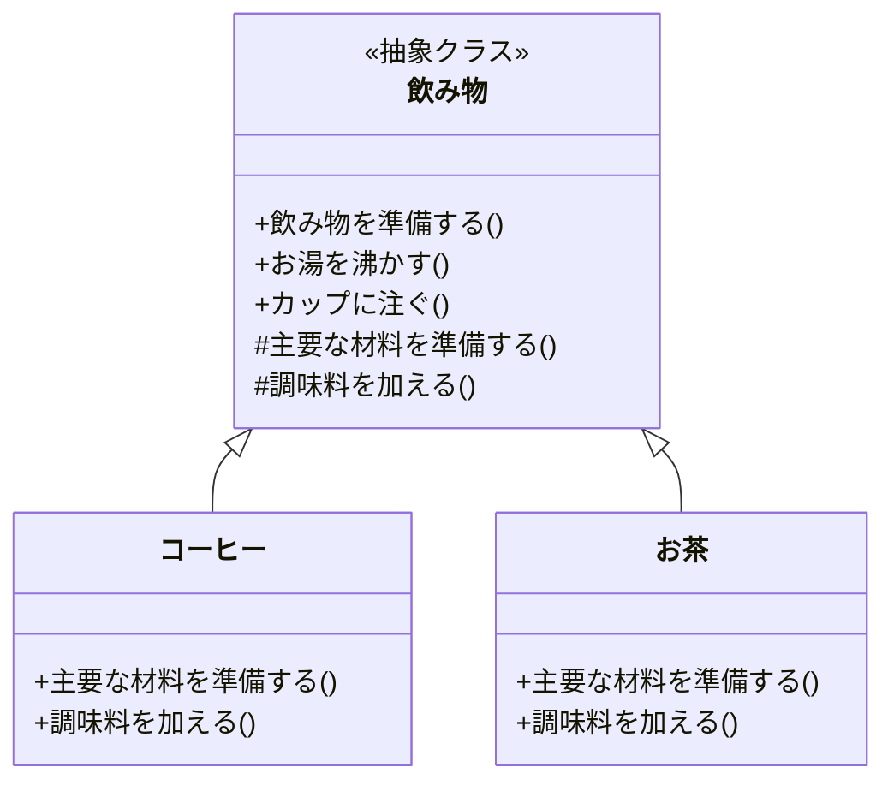
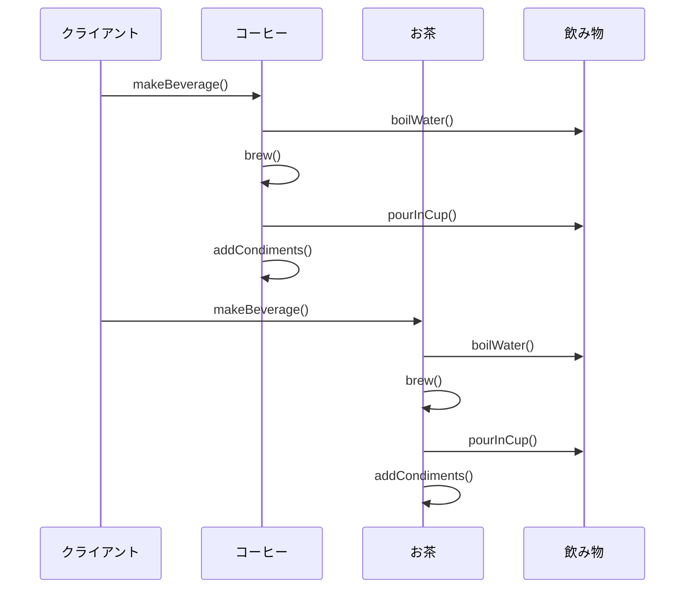

# Template Methodパターン とは？

## 一言で言うと、

処理の枠組みを定義し、一部の具体的な処理をサブクラスに委ねるパターンです。

## 詳しく言うと、

Template Methodパターンは、「**やることの順番を決めた上で、細かいところは変えられる仕組み** 」のことです。
プログラムに例えると、全体の流れ（順番）は「親クラス」という設計図で決めておきます。でも、その中の細かい部分は「子クラス」で自由に作れるようにします。例えば、「飲み物を作る」というプログラムなら、親クラスで「お湯を沸かす→飲み物を準備する→カップに注ぐ」という順番を決めます。でも、「コーヒー」か「お茶」かで作り方は違うので、その部分は子クラスで決める仕組みです。

# 日常での具体例

**喫茶店でのドリンク提供**
「お湯を沸かす」「飲み物を準備する」「カップに注ぐ」「調味料を加える」という流れは同じですが、具体的な手順は異なります。


# Template Methodパターンのメリット

## 1. コードの再利用性
例: 複数のゲームで、「初期化」「プレイ」「終了」という共通の流れを持つ場合、この流れを親クラスで定義し、各ゲーム固有の処理だけを子クラスで実装できます。

## 2. 処理の一貫性
例: Webアプリケーションで、データの取得、加工、表示という流れを親クラスで定義することで、新しい機能を追加する際も同じ流れを保つことができます。

# Template Methodパターンのデメリット

## 1. 継承を使うため、親クラスの変更が子クラスに影響を与える
例: 親クラスの処理順序を変更すると、すべての子クラスの動作に影響が出る可能性があります。

## 2. 柔軟性が制限される
例: 親クラスで定義された処理の流れを大きく変更したい場合、新しい親クラスを作成する必要が出てくる可能性があります。

# 他のデザインパターンとの関連性

- Factory Methodパターン：Template Methodパターンの特殊なケースとして、オブジェクトの生成プロセスを定義します。
- Strategyパターン：Template Methodパターンが継承を使うのに対し、Strategyパターンはコンポジションを使います。

# Template Methodパターンをコードで説明

### 今回、想定するケース

コーヒーとお茶を作るプロセスを実装します。両者とも「お湯を沸かす」「飲み物を準備する」「カップに注ぐ」「調味料を加える」という共通の手順がありますが、具体的な実装は異なります。

## クラス図



## サンプルコード

```typescript
// 抽象クラス: 飲み物作りのテンプレート
abstract class Beverage {
  // Template Method
  prepareBeverage(): string {
    const steps: string[] = [];
    steps.push(this.boilWater());
    steps.push(this.prepareMainIngredient());
    steps.push(this.pourInCup());
    steps.push(this.addCondiments());
    return steps.join("\n");
  }

  // 共通の手順
  boilWater(): string {
    return "お湯を沸かします";
  }

  pourInCup(): string {
    return "カップに注ぎます";
  }

  // 抽象メソッド（具体的なクラスで実装）
  abstract prepareMainIngredient(): string;
  abstract addCondiments(): string;
}

// コーヒーを作るクラス
class Coffee extends Beverage {
  prepareMainIngredient(): string {
    return "コーヒー粉をフィルターにセットして抽出します";
  }

  addCondiments(): string {
    return "砂糖とミルクを加えます";
  }
}

// お茶を作るクラス
class Tea extends Beverage {
  prepareMainIngredient(): string {
    return "茶葉を急須に入れてお湯を注ぎます";
  }

  addCondiments(): string {
    return "レモンを加えます";
  }
}

// 使用例
const coffee = new Coffee();
console.log("コーヒーを作ります:\n" + coffee.prepareBeverage());

console.log("\nお茶を作ります:\n" + new Tea().prepareBeverage());
```

## シーケンス図



## コードの解説

### 1. **抽象クラス `Beverage`**
- **役割**: 飲み物作りの共通プロセス（テンプレート）を定義し、具体的な部分はサブクラスに委ねる。
- **メソッド**:
  - `prepareBeverage()`: 
    - **Template Method**。飲み物を作る流れを定義。
    - 手順（お湯を沸かす、材料を準備する、カップに注ぐ、調味料を加える）を順に呼び出して、それらを結合して結果を返します。
    - **ポイント**: 全体の流れは固定されており、変更できません。
  - `boilWater()`:
    - **共通処理**。すべての飲み物で同じ手順（お湯を沸かす）を実行します。
  - `pourInCup()`:
    - **共通処理**。作った飲み物をカップに注ぐ手順です。
  - 抽象メソッド `prepareMainIngredient()` と `addCondiments()`:
    - **サブクラスで実装が必要**なメソッド。飲み物ごとの材料準備や調味料の追加処理を記述します。

---

### 2. **コーヒーを作るクラス `Coffee`**
- **親クラス `Beverage` を継承**し、抽象メソッドを実装しています。
- **実装内容**:
  - `prepareMainIngredient()`: コーヒー粉をフィルターにセットして抽出する具体的な処理。
  - `addCondiments()`: 砂糖とミルクを加える処理。

---

### 3. **お茶を作るクラス `Tea`**
- **親クラス `Beverage` を継承**し、抽象メソッドを実装しています。
- **実装内容**:
  - `prepareMainIngredient()`: 茶葉を急須に入れてお湯を注ぐ処理。
  - `addCondiments()`: レモンを加える処理。

---

### 4. **使用例**
- `Coffee` と `Tea` クラスのインスタンスを生成し、それぞれの `prepareBeverage()` メソッドを呼び出して、飲み物作りの手順を出力します。

### 実行結果
```plaintext
コーヒーを作ります:
お湯を沸かします
コーヒー粉をフィルターにセットして抽出します
カップに注ぎます
砂糖とミルクを加えます

お茶を作ります:
お湯を沸かします
茶葉を急須に入れてお湯を注ぎます
カップに注ぎます
レモンを加えます
```

### **Template Methodパターンのポイント**
1. **共通の手順（テンプレート）**:
   - `prepareBeverage()` で全体の流れを統一し、変更を防止。
   - 飲み物作りにおける一貫性を保ちます。

2. **カスタマイズの柔軟性**:
   - `prepareMainIngredient()` や `addCondiments()` をサブクラスで実装することで、具体的な処理を変更できます。

3. **再利用性**:
   - 共通の処理（`boilWater`, `pourInCup`）は親クラスにまとめることで、コードの重複を削減。

4. **型の統一**:
   - 各メソッドは文字列を返し、最終的に `prepareBeverage()` が統一されたフォーマットの結果を返します。

# Template Methodパターンが用いられるケース

## 1. フレームワークの設計
具体例: Webアプリケーションフレームワークで、リクエスト処理の流れ（受信、認証、処理、レスポンス生成）を定義し、具体的な処理は開発者が実装できるようにする。

## 2. アプリケーションの初期化処理
具体例: ゲームエンジンで、ゲームの初期化プロセス（設定読み込み、リソース読み込み、画面設定）の流れを定義し、具体的な処理は各ゲームで実装する。

# まとめ

Template Methodパターンは、アルゴリズムの骨組みを定義し、一部の手順をサブクラスに委ねるデザインパターンです。このパターンを使用することで、コードの再利用性が高まり、処理の一貫性を保ちやすくなります。ただし、継承を使用するため、親クラスの変更が子クラスに影響を与える可能性があることに注意が必要です。適切に使用することで、柔軟で拡張性の高いシステムを設計することができます。

# 参考サイト
https://refactoring.guru/ja/design-patterns/template-method

https://qiita.com/yoshinori_hisakawa/items/4f19c9cc6a5dccafe053

https://zenn.dev/chiki0320/articles/template_method_pattern

