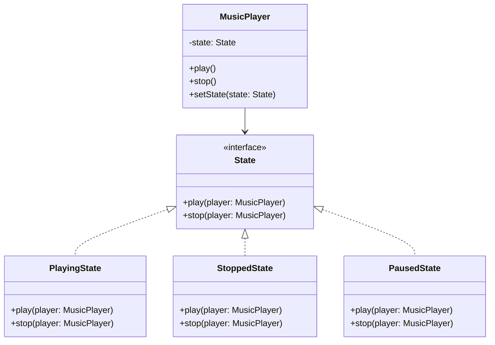
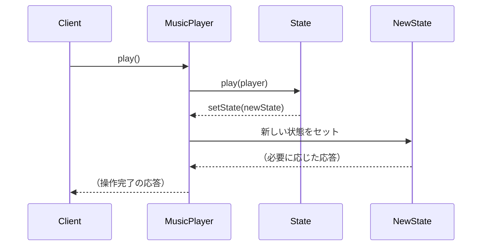

# **Stateパターン とは？**

## **一言で言うと、**

状態に応じて振る舞いを変更するパターンです。

## **詳しく言うと、**

Stateパターンは、オブジェクトが持つ状態を別のクラスとして表現し、その状態に応じて動作を変えるデザインパターンです。例えば、自動販売機のボタンは、お金が入っているかどうかで押したときの動作が変わります。このように、同じ操作でも状態によって異なる動作をする場合に使います。
このように現在の状態から別の状態に移る状態遷移を管理し、状態ごとに適切な振る舞いを定義する際にStateパターンが使われます。

# **日常での具体例**

**信号機**
赤、黄、青の状態によって、車や歩行者の行動が変わります。


# **Stateパターンのメリット**

## 1. コードの保守性と可読性が向上
状態ごとの処理を別々のクラスに分けることで、コードが整理されます。
状態ごとに異なる処理を独立したクラスに分割することで、責務が分かれ、コードが整理され、保守性と可読性が向上します。
例: 自動販売機の各状態（お金なし、お金あり、商品なし）の処理を別々のクラスに分けられます。

## 2. 新しい状態の追加が容易
新しい状態を追加する際に、既存のコードを変更せずに新しいクラスを追加するだけで済みます。
例: 自動販売機に「メンテナンス中」という新しい状態を追加する場合、新しいクラスを作成するだけです。

# **Stateパターンのデメリット**

## 1. クラス数の増加
状態の数だけクラスが必要になるため、クラスの数が増えます。
例: 自動販売機の状態が5つあれば、少なくとも5つのクラスが必要になります。

## 2. 状態遷移の管理が複雑になる可能性
状態の数が多くなると、状態間の遷移を管理するのが難しくなる場合があります。
例: 自動販売機の状態が10個以上になると、どの状態からどの状態に遷移できるかの管理が複雑になります。

# 他のデザインパターンとの関連性

Stateパターンは、Strategyパターンと構造が似ています。どちらもコンテキストオブジェクトが別のオブジェクトに処理を委譲しますが、Stateパターンでは状態に応じて自動的に振る舞いが変わるのに対し、Strategyパターンではクライアントが明示的に戦略を選択します。

# **Stateパターンをコードで説明**

### 今回、想定するケース

シンプルな音楽プレーヤーを考えます。再生中、停止中、一時停止中の3つの状態があり、それぞれの状態で再生ボタンと停止ボタンの動作が異なります。

## **クラス図**



## サンプルコード

```typescript
interface State {
    play(player: MusicPlayer): void;
    stop(player: MusicPlayer): void;
}

class PlayingState implements State {
    play(player: MusicPlayer): void {
        console.log("すでに再生中です");
    }
    stop(player: MusicPlayer): void {
        console.log("停止します");
        player.setState(new StoppedState());
    }
}

class StoppedState implements State {
    play(player: MusicPlayer): void {
        console.log("再生を開始します");
        player.setState(new PlayingState());
    }
    stop(player: MusicPlayer): void {
        console.log("すでに停止しています");
    }
}

class PausedState implements State {
    play(player: MusicPlayer): void {
        console.log("再生を再開します");
        player.setState(new PlayingState());
    }
    stop(player: MusicPlayer): void {
        console.log("停止します");
        player.setState(new StoppedState());
    }
}

class MusicPlayer {
    private state: State;

    constructor() {
        this.state = new StoppedState();
    }

    play(): void {
        this.state.play(this);
    }

    stop(): void {
        this.state.stop(this);
    }

    setState(state: State): void {
        this.state = state;
    }
}

// 使用例
const player = new MusicPlayer();
player.play();  // 出力: 再生を開始します
player.play();  // 出力: すでに再生中です
player.stop();  // 出力: 停止します
player.stop();  // 出力: すでに停止しています
```

## シーケンス図



## **コードの解説**

### 1. State インターフェース:
   ```typescript
   interface State {
       play(player: MusicPlayer): void;
       stop(player: MusicPlayer): void;
   }
   ```
   このインターフェースは、全ての状態クラスが実装すべきメソッドを定義します。

### 2. 具体的な状態クラス（PlayingState, StoppedState, PausedState）:
   ```typescript
   class PlayingState implements State {
       play(player: MusicPlayer): void {
           console.log("すでに再生中です");
       }
       stop(player: MusicPlayer): void {
           console.log("停止します");
           player.setState(new StoppedState());
       }
   }
   ```
   各状態クラスは、その状態での具体的な振る舞いを実装します。

### 3. MusicPlayer クラス:
   ```typescript
   class MusicPlayer {
       private state: State;

       constructor() {
           this.state = new StoppedState();
       }

       play(): void {
           this.state.play(this);
       }

       stop(): void {
           this.state.stop(this);
       }

       setState(state: State): void {
           this.state = state;
       }
   }
   ```
   このクラスは現在の状態を保持し、操作をその状態に委譲します。

# **Stateパターンが用いられるケース**

### オブジェクトの振る舞いが状態によって大きく変わる場合
オブジェクトの振る舞いがその時点の「状態」に依存する場合に適しています。特に、状態によって動作が複雑に変化する場合や、状態ごとに異なるロジックを実装する必要がある場合に役立ちます。

具体例: ゲームキャラクターの状態（通常、攻撃中、ダメージ中）によって、同じ操作でも異なる動作をする場合

### 状態遷移が複雑で、条件分岐が多い場合
オブジェクトが複数の状態を持ち、それに応じて動作が変わる場合に役立ちます。特に、状態が多く、状態ごとに異なる動作が必要で、さらに状態間の遷移が複雑になると、条件分岐（if-elseやswitch-case）が増えてしまい、コードが読みづらく、保守が困難になります。Stateパターンを使うと、各状態を独立したクラスとして分離することで、動作や遷移のロジックを分かりやすく整理できます。

具体例: ワークフロー管理システムで、タスクの状態（未着手、進行中、レビュー中、完了）によって可能な操作が変わる場合

## Reactにおけるstate
Reactのstateは、コンポーネントの状態を管理するための仕組みです。コンポーネントの状態が変化すると、ReactはUIを再レンダリングして変更を反映します。

### 主な特徴:
- 状態（データ）をコンポーネント内で保持。
- 状態の変更がコンポーネントの再レンダリングを引き起こす。
- 状態は関数コンポーネントでは`useState`で管理される。

### Stateパターンとの関係
共通点:
- 状態（state）によって挙動が変わる。
- 状態管理をコードの中心的な仕組みとして扱う。

相違点:
- Stateパターンはオブジェクト指向プログラミングでの**動的な状態遷移や振る舞いの切り替え**に焦点を当てる。
- Reactのstateは**UIの状態**を管理し、状態変化に応じてビューを更新することに焦点を当てる。


# まとめ

Stateパターンは、オブジェクトの状態に応じて振る舞いを変更するためのデザインパターンです。このパターンを使用することで、状態ごとの処理を別々のクラスに分離し、コードの整理と保守性の向上を図ることができます。ただし、状態の数が多くなると、クラス数が増加し、状態遷移の管理が複雑になる可能性があるため、適切な使用が求められます。

# 参考サイト

https://refactoring.guru/ja/design-patterns/state

https://qiita.com/AsahinaKei/items/ce8e5d7bc375af23c719
